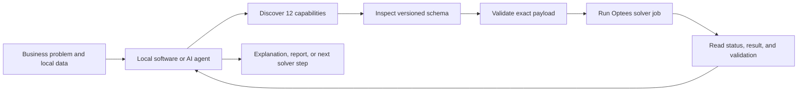

# Optees

<p align="center">
  
</p>

<p align="center">
  <strong>A local optimization workbench and solver platform for people, software, and AI agents.</strong><br />
  Model visually, expose versioned solvers through REST or MCP, and inspect every result without sending business data to a solver cloud.
</p>

<p align="center">
  <a href="https://github.com/Pablo-gitub/optees/releases"></a>
  <a href="https://github.com/Pablo-gitub/optees/blob/main/LICENSE"></a>
  
  
  
  
</p>

<p align="center">
  <a href="https://optees.it">Website</a> ·
  <a href="https://github.com/Pablo-gitub/optees/releases">Download desktop builds</a> ·
  <a href="docs/AGENTS_SERVICE_CONFIG.md">Connect an agent</a> ·
  <a href="docs/PROJECT_ROADMAP.md">Roadmap</a> ·
  <a href="docs/ALGORITHMS.md">Algorithms</a>
</p>

Optees gives the same tested optimization core two interfaces. People can
formulate problems in a guided bilingual desktop application, visualize the
solution, and study the mathematics. Scripts and compatible AI agents can
discover 12 versioned capabilities, inspect their exact schemas, validate a
formulation, execute a job, and retrieve a structured result without driving
the GUI.

| Desktop workbench | Local solver platform |
| --- | --- |
| Guided LP, MILP, Knapsack, NLP, graph, ML, and 3D Packing workflows | Capability discovery through CLI, authenticated loopback REST, and private MCP stdio |
| Examples, mathematical descriptions, JSON import, diagnostics, and solution visualizations | Versioned problem/result contracts, exact-payload validation, asynchronous jobs, cancellation where supported, and structured failures |
| Deterministic bilingual Modeling Assistant with no LLM or cloud dependency | Local agents can compose atomic solvers while Optees remains responsible for validation and calculation |

## Built For Local Agent Workflows

An agent does not need to guess an Optees payload or calculate the answer
itself. The integration contract requires it to inspect the live capability,
validate the exact formulation, and only then submit a solver job.



- **Authenticated local REST API:** start a loopback-only server from Settings
  for scripts, IDE tools, and local applications.
- **Private MCP stdio server:** compatible desktop agents can launch Optees,
  discover tools, validate formulations, execute jobs, and orchestrate multiple
  capabilities without receiving a REST bearer token.
- **Agent-safe sequencing:** descriptor inspection and successful validation of
  the unchanged payload are required before execution.
- **Structured guarantees:** job lifecycle, mathematical status, solver
  diagnostics, and independent validation availability are reported as
  separate fields rather than compressed into one success flag.
- **Composable methods:** an agent can use Regression, MILP, Packing, Graph, or
  other registered capabilities in sequence while each atomic calculation
  remains reproducible and inspectable.

Claude Desktop/Cowork and the experimental Ollama harness have completed local
vertical tests. See the [agent service configuration guide](docs/AGENTS_SERVICE_CONFIG.md)
and the [agent benchmark protocol](docs/AGENT_BENCHMARKS.md). Native release
artifacts include a dedicated MCP stdio entry point; clean-machine client
acceptance remains required before each stable release.

## Why Optees

- **One solver core, several clients:** the GUI, CLI, REST service, and MCP
  server reuse the same application services and versioned contracts.
- **Ready for assisted problem solving:** agents can move from natural-language
  requirements to a validated mathematical formulation instead of inventing a
  result from prose.
- **Local solver core:** formulations and solver jobs are processed on the
  machine. The built-in Modeling Assistant is rule-based and sends no prompt
  outside the app; an optional external agent remains subject to that client's
  own data and model policy.
- **Honest result views:** an LP optimum, a feasible MILP incumbent, an NLP
  local numerical candidate, and a predictive ML fit are deliberately not
  presented as the same kind of guarantee.
- **Educational by design:** examples, mathematical explanations, result
  contracts, diagnostics, and visualizations make assumptions visible.
- **Structured workflows:** use formulation screens, versioned JSON, or public
  service contracts rather than maintaining ad-hoc scripts around each solver.
- **English and Italian:** the application, its explanations, and its local
  assistant support both languages.

## See It In Action

<p align="center">
  
</p>

<p align="center"><em>Choose a workflow from Linear Optimization, Nonlinear Programming, Graph Theory, or AI &amp; Machine Learning.</em></p>

| LP solution analysis | Binary classification diagnostics |
| --- | --- |
|  |  |
| Inspect objective behaviour, alternative-optimum ranges, and the feasible region. | Inspect held-out metrics, class errors, probabilities, and a two-dimensional decision boundary. |

More real application screens and platform downloads are available on the
[Optees website](https://optees-1acac.web.app).

## Available Workflows

| Family | What Optees provides |
| --- | --- |
| **Linear Programming (LP)** | Continuous LP through SciPy/HiGHS, feasibility and status reporting, optimal-solution ranges when multiple optima exist, JSON import, and 2D/3D educational views where applicable. |
| **Mixed-Integer Linear Programming (MILP)** | Continuous, integer, and binary variables through OR-Tools, solver controls, and educational formulation/result views. |
| **Knapsack** | 0/1, Bounded, Unbounded, Fractional, and Multi-dimensional variants with capacity and item visualizations. |
| **Single-container 3D Packing** | Orthogonal box placement with per-item rotation policies, optional scalar capacities, selectable loading and gravity policies, maximum-feasible recovery, and an inspectable 3D result. |
| **Continuous Nonlinear Programming (NLP)** | Safe scalar expressions, optional box bounds, BFGS/Nelder-Mead/L-BFGS-B, objective plots, and a clear local-candidate contract. |
| **Graph Theory** | Dijkstra shortest paths on directed or undirected graphs with finite, non-negative weights, route reconstruction, and graph visualization. |
| **Linear Regression** | Local OLS and Ridge regression for numeric tables, deterministic train/test splits, residuals, metrics, and a one-feature fit chart. |
| **Binary Classification** | Local logistic regression for two labels, stratified held-out evaluation, accuracy/precision/recall/F1, confusion matrices, probabilities, and an optional 2D decision boundary. |
| **Modeling Assistant** | English/Italian local rule-based recommendations for solver families. It drafts validated LP, MILP, Knapsack, Regression, and Binary Classification JSON only from explicit structured data; it never invents observations from prose. |

## Download And Run

Prebuilt desktop packages for macOS Apple Silicon, Windows x64, and Linux x86_64
are published on [GitHub Releases](https://github.com/Pablo-gitub/optees/releases).
Each release includes `SHA256SUMS` for verification.

On macOS, current packages are ad-hoc signed because the project does not use
an Apple Developer ID. Gatekeeper may require you to explicitly open the app
after download. See the [release procedure](docs/RELEASING.md) for the precise
installation, verification, signing, and tag workflow.

### Run From Source

Optees requires Python 3.12 or later.

```bash
git clone https://github.com/Pablo-gitub/optees.git
cd optees
conda create -n optees python=3.12
conda activate optees
python -m pip install -e ".[plot,local-service,mcp,test]"
python -m optees.main
```

To develop or use the optional local solver API, install the dedicated extra:

```bash
python -m pip install -e ".[plot,local-service]"
```

To connect a local MCP client such as Claude Desktop or Cowork, install the
`mcp` extra and follow the [agent service configuration guide](docs/AGENTS_SERVICE_CONFIG.md).
The guide also records the experimental Ollama workflow, the future OpenAI GPT
compatibility test, a discovery check, and reviewed single-solver and
regression-to-MILP examples.

Run the complete test suite from a source checkout:

```bash
PYTHONPATH=src python -m pytest -q
```

## Reliability And Scope

The project keeps executable tests and reference data close to each solver
family. LP uses LPnetlib; MILP uses a bounded MIPLIB subset; Knapsack uses
Burkardt and OR-Library cases; NLP, regression, classification, and graph
workflows use documented analytic or deterministic reference cases. The full
source and provenance are described in [Datasets](docs/DATASETS.md) and the
test strategy in [Testing](docs/TESTING.md).

Optees is an educational and decision-support tool, not a guarantee that every
model is suitable for a consequential real-world decision. In particular:

- NLP returns a local numerical candidate unless a stronger guarantee is
  explicitly stated.
- Heuristic, global-optimization, clustering, and broader graph workflows are
  planned rather than advertised as available.
- Regression and classification describe fitted predictive relationships; they
  do not establish causality, fairness, or future performance.

## Documentation

- [Documentation index](docs/README.md)
- [Architecture](docs/ARCHITECTURE.md)
- [Algorithms](docs/ALGORITHMS.md)
- [Project roadmap](docs/PROJECT_ROADMAP.md)
- [Documentation, website, release, and demonstration roadmap](docs/DOCUMENTATION_WEBSITE_RELEASE_ROADMAP.md)
- [Documentation truth audit](docs/DOCUMENTATION_AUDIT.md)
- [Datasets and formats](docs/DATASETS.md)
- [Testing strategy](docs/TESTING.md)
- [Local solver service](docs/local-agent/server-process-and-desktop.md)
- [Agent service configuration](docs/AGENTS_SERVICE_CONFIG.md)
- [Local MCP stdio server](docs/local-agent/mcp-stdio.md)
- [Agent benchmark protocol](docs/AGENT_BENCHMARKS.md)
- [Experimental Ollama agent harness](docs/local-agent/ollama-d0-harness.md)
- [Release procedure](docs/RELEASING.md)
- [Website deployment](docs/WEBSITE_DEPLOYMENT.md)

## License

Optees is released under the [Apache License 2.0](LICENSE).
