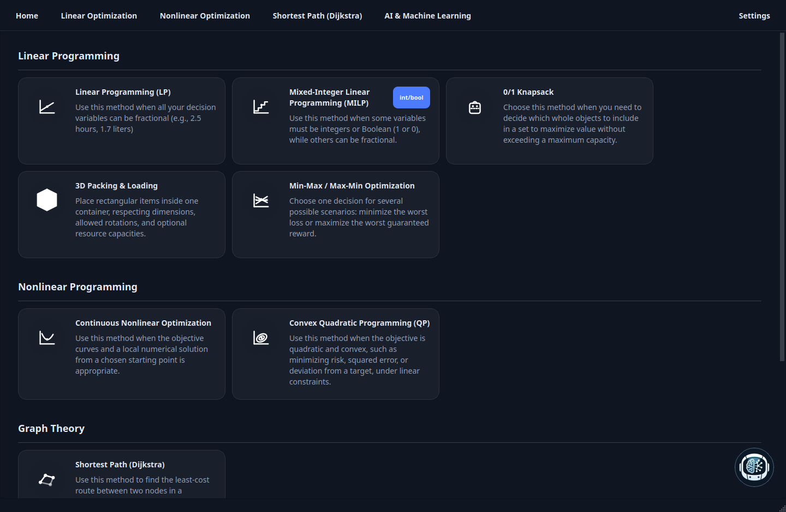
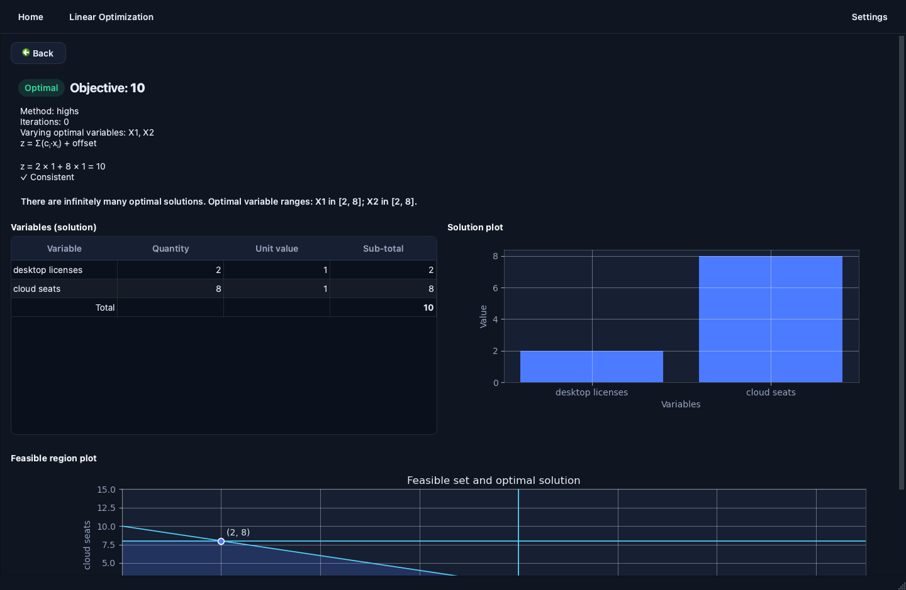
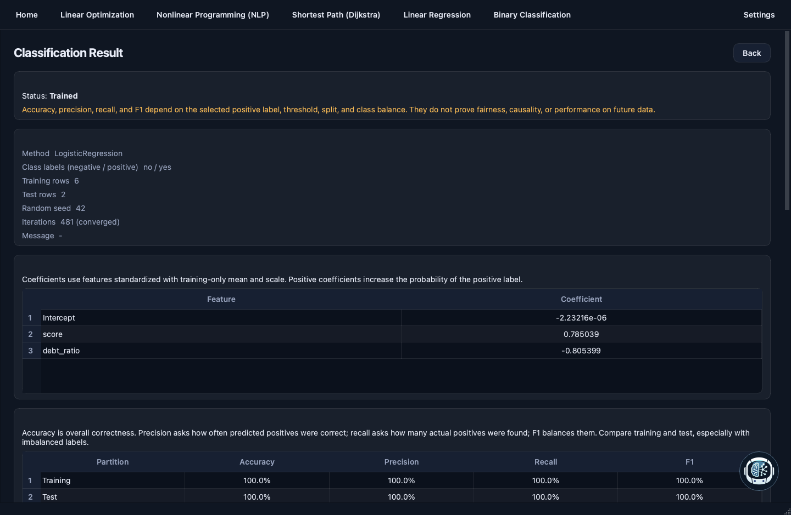

# Optees

<p align="center">
  
</p>

<p align="center">
  <strong>Model, solve, and understand optimization problems locally.</strong><br />
  An open-source desktop workbench for operations research and educational machine learning.
</p>

<p align="center">
  <a href="https://github.com/Pablo-gitub/optees/releases"></a>
  <a href="https://github.com/Pablo-gitub/optees/blob/main/LICENSE"></a>
  
  
</p>

<p align="center">
  <a href="https://optees.it">Website</a> ·
  <a href="https://github.com/Pablo-gitub/optees/releases">Download desktop builds</a> ·
  <a href="docs/PROJECT_ROADMAP.md">Roadmap</a> ·
  <a href="docs/ALGORITHMS.md">Algorithms</a>
</p>

Optees turns mathematical models into an inspectable desktop workflow. Build a
model in a guided interface, solve it locally with an appropriate engine, then
read an explanation of the result instead of receiving only a number. It is
for students learning the methods and for practitioners who need transparent,
reproducible optimization tools without sending data to a cloud service.

## Why Optees

- **Local and private:** formulations, datasets, and solver runs stay on the
  machine. The Modeling Assistant is rule-based and sends no prompt outside
  the app.
- **Educational by design:** examples, mathematical explanations, result
  contracts, diagnostics, and visualizations make assumptions visible.
- **Honest result views:** an LP optimum, a feasible MILP incumbent, an NLP
  local numerical candidate, and a predictive ML fit are deliberately not
  presented as the same kind of guarantee.
- **Structured workflows:** use the formulation screens or import versioned
  JSON rather than maintaining ad-hoc scripts for every small model.
- **English and Italian:** the application, its explanations, and its local
  assistant support both languages.
- **Local solver API:** packaged builds can start an authenticated loopback
  service from Settings, allowing local scripts and software agents to discover
  and execute the same versioned solver contracts without driving the GUI.

## See It In Action

<p align="center">
  
</p>

<p align="center"><em>Choose a workflow from Linear Optimization, Nonlinear Programming, Graph Theory, or AI &amp; Machine Learning.</em></p>

| LP solution analysis | Binary classification diagnostics |
| --- | --- |
|  |  |
| Inspect objective behaviour, alternative-optimum ranges, and the feasible region. | Inspect held-out metrics, class errors, probabilities, and a two-dimensional decision boundary. |

More real application screens and platform downloads are available on the
[Optees website](https://optees-1acac.web.app).

## Available Workflows

| Family | What Optees provides |
| --- | --- |
| **Linear Programming (LP)** | Continuous LP through SciPy/HiGHS, feasibility and status reporting, optimal-solution ranges when multiple optima exist, JSON import, and 2D/3D educational views where applicable. |
| **Mixed-Integer Linear Programming (MILP)** | Continuous, integer, and binary variables through OR-Tools, solver controls, and educational formulation/result views. |
| **Knapsack** | 0/1, Bounded, Unbounded, Fractional, and Multi-dimensional variants with capacity and item visualizations. |
| **Continuous Nonlinear Programming (NLP)** | Safe scalar expressions, optional box bounds, BFGS/Nelder-Mead/L-BFGS-B, objective plots, and a clear local-candidate contract. |
| **Graph Theory** | Dijkstra shortest paths on directed or undirected graphs with finite, non-negative weights, route reconstruction, and graph visualization. |
| **Linear Regression** | Local OLS and Ridge regression for numeric tables, deterministic train/test splits, residuals, metrics, and a one-feature fit chart. |
| **Binary Classification** | Local logistic regression for two labels, stratified held-out evaluation, accuracy/precision/recall/F1, confusion matrices, probabilities, and an optional 2D decision boundary. |
| **Modeling Assistant** | English/Italian local rule-based recommendations for solver families. It drafts validated LP, MILP, Knapsack, Regression, and Binary Classification JSON only from explicit structured data; it never invents observations from prose. |

## Download And Run

Prebuilt desktop packages for macOS Apple Silicon, Windows x64, and Linux x86_64
are published on [GitHub Releases](https://github.com/Pablo-gitub/optees/releases).
Each release includes `SHA256SUMS` for verification.

On macOS, current packages are ad-hoc signed because the project does not use
an Apple Developer ID. Gatekeeper may require you to explicitly open the app
after download. See the [release procedure](docs/RELEASING.md) for the precise
installation, verification, signing, and tag workflow.

### Run From Source

Optees requires Python 3.12 or later.

```bash
git clone https://github.com/Pablo-gitub/optees.git
cd optees
conda create -n optees python=3.12
conda activate optees
python -m pip install -e ".[plot,local-service,mcp,test]"
python -m optees.main
```

To develop or use the optional local solver API, install the dedicated extra:

```bash
python -m pip install -e ".[plot,local-service]"
```

Run the complete test suite from a source checkout:

```bash
PYTHONPATH=src python -m pytest -q
```

## Reliability And Scope

The project keeps executable tests and reference data close to each solver
family. LP uses LPnetlib; MILP uses a bounded MIPLIB subset; Knapsack uses
Burkardt and OR-Library cases; NLP, regression, classification, and graph
workflows use documented analytic or deterministic reference cases. The full
source and provenance are described in [Datasets](docs/DATASETS.md) and the
test strategy in [Testing](docs/TESTING.md).

Optees is an educational and decision-support tool, not a guarantee that every
model is suitable for a consequential real-world decision. In particular:

- NLP returns a local numerical candidate unless a stronger guarantee is
  explicitly stated.
- Heuristic, global-optimization, clustering, and broader graph workflows are
  planned rather than advertised as available.
- Regression and classification describe fitted predictive relationships; they
  do not establish causality, fairness, or future performance.

## Documentation

- [Architecture](docs/ARCHITECTURE.md)
- [Algorithms](docs/ALGORITHMS.md)
- [Project roadmap](docs/PROJECT_ROADMAP.md)
- [Datasets and formats](docs/DATASETS.md)
- [Testing strategy](docs/TESTING.md)
- [Local solver service](docs/local-agent/server-process-and-desktop.md)
- [Experimental Ollama agent harness](docs/local-agent/ollama-d0-harness.md)
- [Release procedure](docs/RELEASING.md)
- [Website deployment](docs/WEBSITE_DEPLOYMENT.md)

## License

Optees is released under the [Apache License 2.0](LICENSE).
