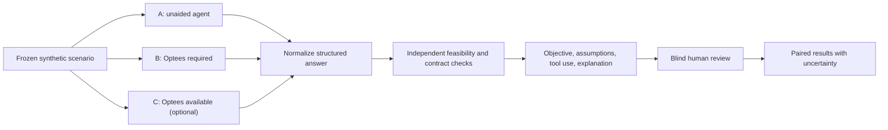

# Agent-Assisted Problem Solving Benchmarks

This document defines how Optees will measure whether access to its validated
solver capabilities improves an AI agent's treatment of realistic business
problems. These experiments are distinct from scientific solver benchmarks:
LPnetlib, MIPLIB, OR-Library, and analytic cases test mathematical
implementations, while this suite tests problem interpretation, tool use,
formulation, and explanation.

No result may be advertised as evidence that one AI provider is universally
better or that Optees guarantees correct business decisions.

## Research Questions

1. Does explicit access to Optees increase the rate of valid mathematical
   formulations and feasible recommendations?
2. Does it reduce objective regret relative to a reviewed reference model?
3. Does it reduce unsupported assumptions and false optimality claims?
4. Can agents discover an appropriate capability when Optees is available but
   not explicitly mandated?
5. Which problem families benefit, fail, or require clarification most often?

## Paired Experimental Design

Every scenario uses the same base business prompt and synthetic dataset. A
model/provider/version combination is evaluated under matched conditions:

- **A - Unaided:** no Optees tool or documentation; the agent may reason and
  calculate freely.
- **B - Optees required:** the same prompt plus access to Optees and an explicit
  instruction to use it for formulation, validation, and solving.
- **C - Optees available (optional):** an optional discovery arm where Optees
  is available but not mentioned in the task instruction.

Condition C separates tool discoverability from the instruction effect, but A
and B remain the minimum publishable paired comparison.



The base prompt, output schema, provider snapshot, temperature, seed when
supported, token budget, timeout, and number of repetitions must be fixed
before a run. Provider settings that cannot be controlled are recorded rather
than guessed.

## Scenario Design

Scenarios represent fictitious companies and contain no real operational or
personal data. Each scenario includes:

- a natural-language request written at a declared expertise level;
- structured synthetic data generated from a committed seed or fixture;
- intentionally relevant and irrelevant fields;
- an objective and hard constraints known to the benchmark authors;
- declared ambiguities that should trigger clarification or explicit
  assumptions;
- a reviewed reference formulation that is hidden from the evaluated agent;
- a deterministic or scientifically verified reference result where possible;
- accepted simplifications and errors that invalidate the answer.

Initial coverage should include production planning LP, threshold/setup MILP,
single and multi-resource Knapsack, shortest-path routing, and 3D packing after
their local-service capabilities are available. NLP and educational ML require
family-specific metrics and must not be scored as exact global optimization.

## Repository Layout

Operational assets live under `benchmarks/agents/`:

```text
benchmarks/agents/
  README.md
  schemas/
    scenario-v1.schema.json
    run-v1.schema.json
  scenarios/
    <scenario-id>/
      manifest.json
      prompt.md
      data/
      reference/
        formulation.json
        evaluation.json
  studies/
    <study-id>/
      manifest.json
      runs/
      summary.json
      report.md
```

Schemas, runners, and the first scenarios are added only when executable; this
document does not create empty placeholders that imply benchmark coverage.

Small sanitized outputs may be committed. Large raw transcripts should use a
versioned external archive with checksums and a committed manifest. API keys,
hidden system prompts belonging to providers, proprietary company data, and
unreviewed personal data must never enter the repository.

## Scenario Manifest

At minimum, `manifest.json` records:

```json
{
  "schema_version": "1",
  "scenario_id": "production-planning-001",
  "title": "Two-product capacity planning",
  "language": "en",
  "expertise_level": "beginner",
  "expected_capability": "lp.continuous",
  "synthetic_data": true,
  "generator_seed": 1042,
  "clarifications_expected": [],
  "reference_commit": "git-commit",
  "tags": ["production", "lp", "exact"]
}
```

Italian and English variants use separate scenario IDs linked by a shared
`scenario_group_id`, so language coverage can be compared without pretending
that translations are identical observations.

## Run Manifest

Every repetition records:

- study, scenario, condition, and repetition identifiers;
- provider, exact model identifier/version, date, and region when relevant;
- temperature, seed, token budget, timeout, and tool permissions;
- hashes of base prompt, condition wrapper, output schema, and Optees
  connection instructions;
- Optees version, commit, API version, and capability contract versions;
- tool calls with timestamps, inputs hashes, statuses, and result hashes;
- final structured answer, elapsed time, token usage when reported, and errors;
- runner version and host metadata that materially affect local execution.

The same model snapshot should run all paired conditions in an interleaved or
randomized order to reduce time-of-day and provider-drift bias.

## Evaluation

Primary outcomes are reported separately rather than hidden inside one score:

1. **Valid formulation rate:** the answer maps to a supported, parseable model.
2. **Feasible recommendation rate:** independent checks satisfy all declared
   hard constraints.
3. **Objective quality:** exact match, optimality gap, or normalized regret
   against the reviewed reference, only when mathematically meaningful.
4. **Modeling error rate:** wrong objective, missing hard constraint, invented
   datum, or inappropriate solver family.

Secondary outcomes include:

- correct capability selection and valid tool-call sequence;
- appropriate clarification questions;
- explicit versus silent assumptions;
- correct distinction between optimal, feasible, local, heuristic, and failed;
- explanation accuracy and traceability to solver output;
- runtime, token usage, number of calls, retries, and failure recovery.

Automated evaluation validates schemas, replays formulations through Optees,
checks feasibility independently where available, recomputes objectives, and
compares reference invariants. Human reviewers score interpretation,
assumptions, and explanation using a pre-registered rubric while blinded to
condition and provider whenever transcript content permits.

A composite score may be published only as a secondary metric with weights
fixed before the study. Invalid or infeasible answers must not receive a high
score because their prose is persuasive.

## Repetition And Reporting

- Run multiple repetitions because model outputs and hosted implementations
  can vary even at nominal temperature zero.
- Report sample size, paired deltas, per-scenario outcomes, dispersion, and
  confidence intervals or bootstrap intervals where appropriate.
- Do not select only successful transcripts.
- Keep failed calls, malformed answers, timeouts, and tool errors in the
  denominator according to the pre-registered protocol.
- Separate exploratory studies from frozen benchmark releases.
- Version scenario, runner, rubric, and report changes independently.

## Validity Threats

- The reference formulation may be wrong; it requires review and regression
  tests before use.
- Evaluating an Optees-generated solution with Optees alone is circular. Use
  independent invariant checks and small analytically understood cases where
  possible.
- Providers change models behind aliases. Record immutable identifiers when
  available and never merge different snapshots silently.
- Explicitly requiring Optees changes the instruction, not only tool access;
  condition C helps quantify this effect.
- Benchmark prompts may leak into model training over time. Date and version
  every published run and maintain private holdout scenarios for internal
  regression testing.

## Publication Gate

An agent benchmark report is publishable only when scenario fixtures,
reference models, evaluation code, run manifests, exclusions, failed runs, and
the exact Optees release are available or checksum-addressed. Marketing claims
must quote the tested scope, models, dates, and conditions.
