# Optees Architecture

Optees has two public roles built on the same application core:

1. a PySide6 desktop workbench for learning, formulating, solving, and
   visualizing mathematical problems;
2. a local solver platform that exposes versioned capabilities to scripts and
   AI agents through a CLI, authenticated loopback REST API, or MCP stdio.

The architecture keeps mathematical execution independent from presentation
and transport concerns. A solver added to the shared capability registry can
therefore be reused by every supported interface without duplicating its
contract or execution logic.

## Design Principles

- **Dependency direction:** presentation, transports, and infrastructure depend
  on application and domain abstractions, not the reverse.
- **Versioned public contracts:** capability descriptors, problem schemas,
  result schemas, execution envelopes, and validation reports are explicit
  JSON contracts.
- **Validate before execution:** clients can validate the exact payload before
  creating a job. The MCP facade additionally enforces discovery and
  validation as protocol steps.
- **Separate statuses:** job lifecycle, mathematical status, termination reason,
  and independent validation status describe different facts.
- **Local-first security:** REST binds to loopback and requires a per-session
  bearer token; MCP communicates over a private stdio subprocess.
- **Honest guarantees:** independent post-solve validation is reported only
  when a validator is registered. It is currently implemented for LP and MILP.

## System Context

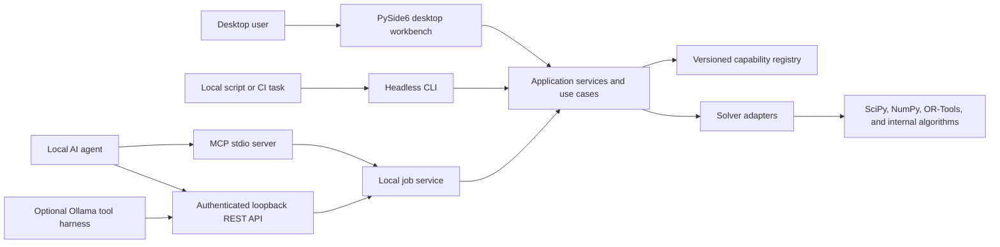

All components shown above execute on the user's computer. Optees does not
host a remote solver service and does not make a cloud agent able to reach
`127.0.0.1`. A remote or sandboxed agent needs an explicitly supported bridge.

## Runtime Surfaces

| Surface | Process boundary | Contract | Primary use |
| --- | --- | --- | --- |
| Desktop GUI | In process | Application use cases and DTOs | Interactive education and visualization |
| `optees-cli` | One local process per command | JSON on stdin/stdout | Scripts, tests, and shell automation |
| `optees-server` | Local HTTP subprocess | REST JSON v1 plus OpenAPI | Long-lived local integrations and tool harnesses |
| `optees-mcp` | Agent-owned stdio subprocess | MCP tools | Native local agent integration |
| `optees-ollama-chat` | Local harness plus REST server | Ollama tools mapped to REST | Experimental local-LLM evaluation |

Python entry points are defined in `pyproject.toml`. Native PyInstaller
artifacts package a dedicated MCP stdio companion on Windows, macOS, and Linux;
release CI initializes it and calls capability discovery on every platform.
The Windows bundle also includes the console-subsystem `optees-server.exe`
REST companion. The GUI launches it without a visible console, while packaging
smoke tests capture deterministic startup diagnostics independently from the
windowed `optees.exe` bootloader.

## Dependency Model

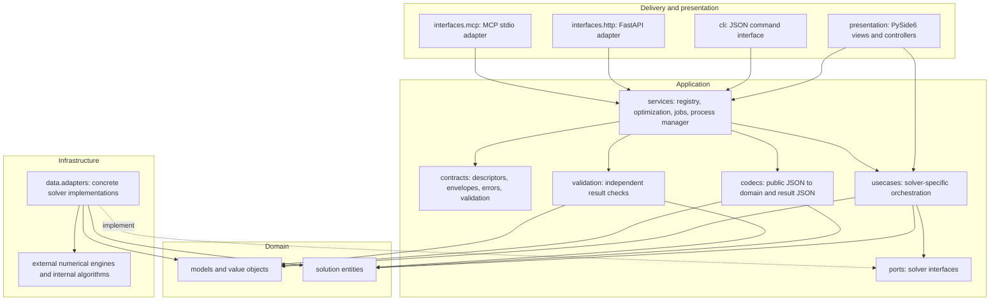

The composition root in `src/optees/composition/local_agent.py` is allowed to
know both application abstractions and concrete adapters. It constructs the
production registry and is the only place where all public capabilities are
wired together.

## Post-Solve Artifacts And Reports

Result artifacts and reports are separate, opt-in workflows layered on a
completed solver job. They use the retained validated problem payload and its
execution envelope; they do not alter the result contract or rerun the solver.

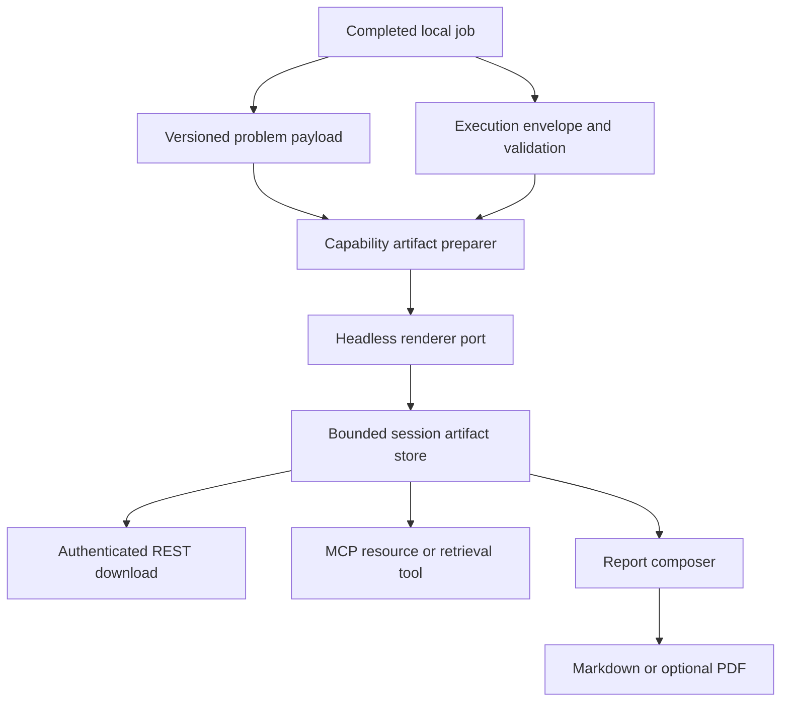

The rendering worker is bounded and independent from the mathematical job
worker, so an expensive chart or document cannot delay solver execution.
Application contracts and lifecycle rules are defined in
`RESULT_ARTIFACTS_CONTRACT.md`; delivery status is tracked in
`RESULT_ARTIFACTS_REPORTING_ROADMAP.md`. Infrastructure renderers must remain
headless and must not import PySide6 or Qt-specific Matplotlib backends.

`ArtifactStoragePort` keeps artifact lifecycle semantics outside HTTP and MCP.
Its local filesystem adapter creates one private temporary directory per
process session and returns only opaque `artifact-*` identifiers. Writes are
atomic, files are readable only by the current user, and every read verifies
the retained byte count and SHA-256 digest. The adapter enforces the frozen
per-file, total-byte, item-count, and lifetime limits. Capacity pressure removes
expired entries first and then the oldest unpinned entries; report composition
can pin inputs so active work is never evicted. Closing the session removes the
entire isolated directory. Neither the application contract nor a future
transport response exposes its absolute path.

`ArtifactGenerationService` owns the asynchronous artifact lifecycle. It reads
an immutable problem/result pair through `ArtifactSourcePort`, validates the
entire batch against registered headless renderers, records public manifest
IDs, delegates bytes to `ArtifactStoragePort`, and maps public IDs to private
storage IDs. The authenticated HTTP adapter only translates DTOs and returns
already verified bytes; it does not select renderers, inspect job repositories,
or access filesystem paths.

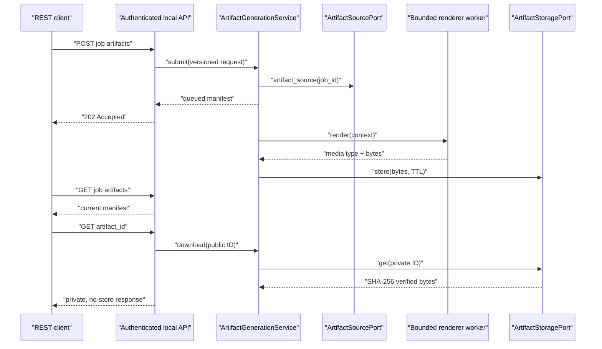

## Source Ownership

```text
src/optees/
  application/
    codecs/          public problem/result serialization
    contracts/       versioned transport-neutral contracts
    dtos/            application data transfer objects
    ports/           solver interfaces implemented by adapters
    services/        registry, synchronous solve, jobs, server process
    usecases/        solver-specific application orchestration
    validation/      independent solution validators
  composition/       production dependency wiring
  core/              version, strings, settings, and shared app services
  data/adapters/     numerical, algorithm, and local filesystem adapters
  domain/
    entities/        solver results
    models/          problem models
    value_objects/   validated domain values
  interfaces/
    agents/          local agent harness support
    http/            authenticated REST adapter
    mcp/             MCP stdio adapter
  presentation/      PySide6 controllers and views
  utility/           format importers and focused numerical helpers
```

## Capability Core

Each `RegisteredCapability` combines one public descriptor with the functions
needed to parse, execute, serialize, and optionally validate or cancel that
capability. This avoids a central solver-specific conditional in the service.

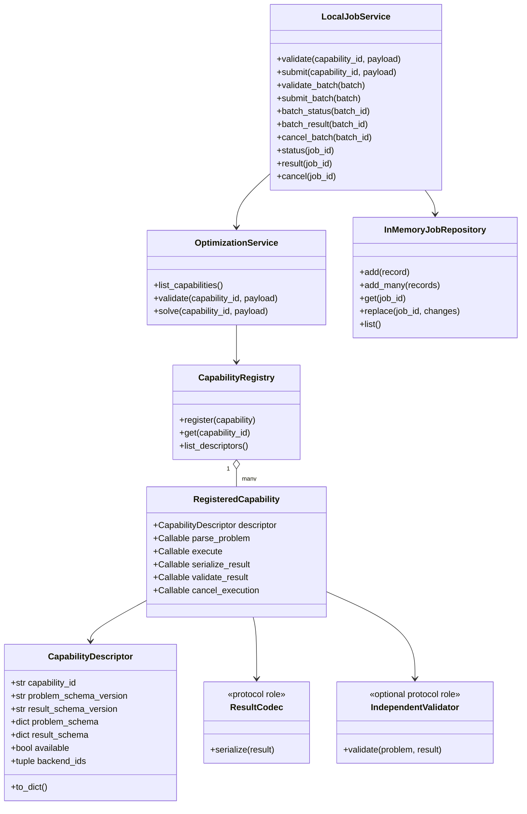

The diagram shows architectural roles, not Python inheritance. Codecs and
validators are supplied as callables on the registration object.

## Capability Inventory

The production composition currently registers 12 capability IDs:

- `lp.continuous`
- `milp.linear`
- `knapsack.zero_one`
- `knapsack.bounded`
- `knapsack.unbounded`
- `knapsack.fractional`
- `knapsack.multi_dimensional`
- `nlp.continuous_local`
- `graph.shortest_path.dijkstra`
- `ml.regression.linear`
- `ml.classification.binary_logistic`
- `packing.single_container_3d`

The runtime descriptor is authoritative for availability, accepted schema,
backend choices, defaults, limits, and cancellation support. Clients should
discover it instead of hardcoding this list.

## Discovery And Execution

The asynchronous service deliberately separates payload validation from job
creation and result retrieval.

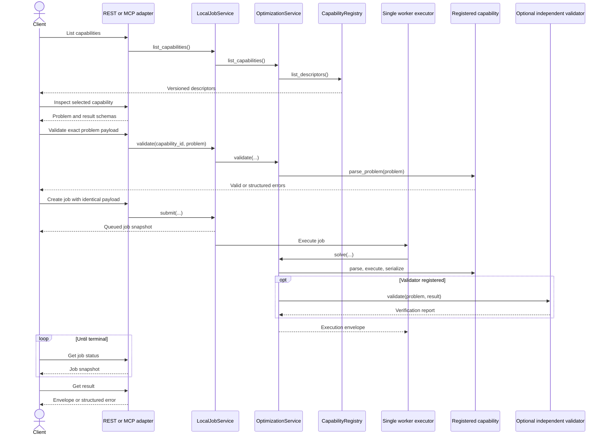

REST accepts validation and submission as separate calls but does not retain a
per-client proof that they are identical. The stateful MCP facade does retain
that proof and rejects job creation until the same capability and normalized
payload have passed validation.

### Bounded Batch Execution

Independent repeated scenarios can be submitted through the versioned batch
contract instead of manually coordinating three calls per problem. A batch:

- contains between 1 and 32 items with unique client-defined identifiers;
- may mix capabilities, provided every descriptor has first been inspected by
  an MCP client;
- validates every item before submission and creates no jobs if any item is
  invalid, unavailable, or cannot fit in the bounded repository;
- retains one ordinary job, execution envelope, mathematical status, and
  independent validation report per item;
- adds only aggregate lifecycle, mathematical-status, and validation-status
  counts.

The MVP remains deliberately single-worker. Batch fan-out is logical and
bounded: it removes agent-side coordination without running numerical backends
concurrently or weakening their individual validation. It is appropriate for
independent regressions, scenarios, or parameter sweeps. It is not workflow
orchestration and must not be used when one result is an input to a later job.

## Status Semantics

Transport lifecycle must not be inferred from mathematical outcome, or vice
versa.

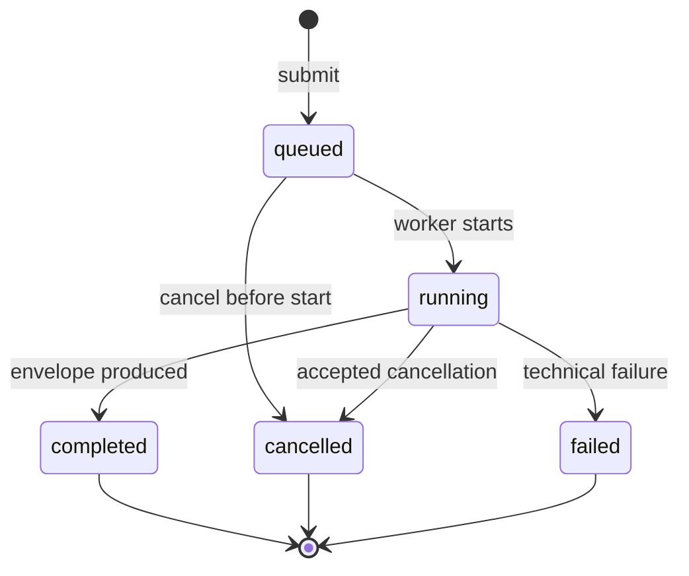

An execution envelope separately reports:

- **job status:** `completed`, `cancelled`, or `failed` at terminal time;
- **mathematical status:** `optimal`, `feasible`, `infeasible`, `unbounded`, or
  `not_solved`;
- **termination reason:** completion, time/iteration limit, cancellation,
  dependency failure, or internal error;
- **solution validation:** `verified`, `partial`, `failed`, or `not_available`.

For example, a technically completed job may be mathematically infeasible. A
feasible solution may terminate at a time limit. A solver-reported optimum may
still have independent validation marked `not_available`.

## Runtime Boundaries

### Desktop Direct Invocation

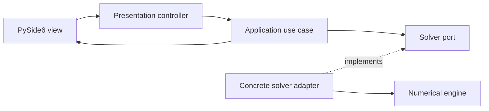

Interactive views use focused use cases and DTOs directly. They do not make an
HTTP round trip to the local server.

### Authenticated Loopback REST

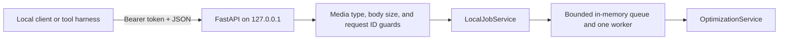

The desktop starts this server as a subprocess from Settings. A fresh token is
generated for each server session and is copied only through an explicit user
action. The unprotected `/health` endpoint exposes no solver data; API v1 and
its OpenAPI document require authentication.

### MCP Stdio

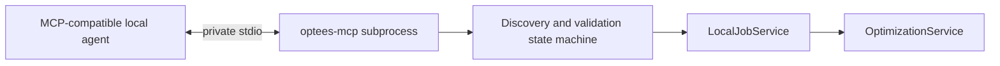

MCP needs neither a TCP port nor a bearer token because the client launches
and owns the private subprocess. It exposes tools to list and inspect
capabilities, validate a problem, create a job, inspect status, retrieve a
result, and cancel a job.

## Independent Solution Validation

Independent validation recomputes selected mathematical properties from the
problem and returned candidate rather than trusting only the solver status.
The validation contract records checks, measurements, violations, tolerances,
and limitations.

Current production registrations provide independent validators for:

- `lp.continuous`: candidate vector, bounds, linear constraints, and objective
  consistency;
- `milp.linear`: the corresponding checks plus integrality where applicable.
- `ml.regression.linear`: finite public parameters, complete prediction rows,
  prediction and residual arithmetic, train/test split accounting, and
  recomputed metrics.

Other capabilities explicitly return `not_available` until a dedicated
validator is implemented. Passing these checks verifies the recorded
properties; it is not, by itself, a second proof of global optimality.

Capability availability is also a runtime property. The production composition
imports the concrete optional backend API, and continuous LP additionally runs
a trivial HiGHS health problem before advertising itself as available. Native
release smoke tests execute that same LP through the packaged MCP companion so
missing compiled modules are detected before publication.

## Composed Agent Workflows

Optees capabilities are intentionally atomic. An external agent may compose
them, but it remains responsible for translating outputs into the next
versioned input, declaring assumptions, and requesting confirmation when the
business meaning changes.

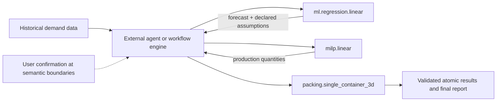

Each capability validates only its own contract and result. Optees does not
currently certify the semantic correctness of the complete composed workflow.

## Extending The Platform

To add a public solver capability:

1. define or reuse domain problem and result types;
2. define an application solver port and use case;
3. implement the concrete adapter;
4. add strict public problem and result codecs;
5. create a `CapabilityDescriptor` with versioned schemas and honest limits;
6. optionally implement independent result validation and cancellation;
7. register the assembled `RegisteredCapability` in the composition root;
8. test contracts, service execution, transports, and relevant GUI flows;
9. update the algorithm and agent-integration documentation.

No REST or MCP route should need solver-specific branching when this extension
path is followed.

## Mermaid Convention

Architecture, state, sequence, and data-flow diagrams are Mermaid fenced
blocks in Markdown. GitHub renders them natively and their source remains
reviewable.

- Keep Mermaid source authoritative; do not commit duplicate images by
  default.
- Use quoted labels when punctuation or parentheses are present.
- Do not send internal schemas to online rendering services.
- Export SVG, PNG, or PDF only for a release artifact or offline document.
