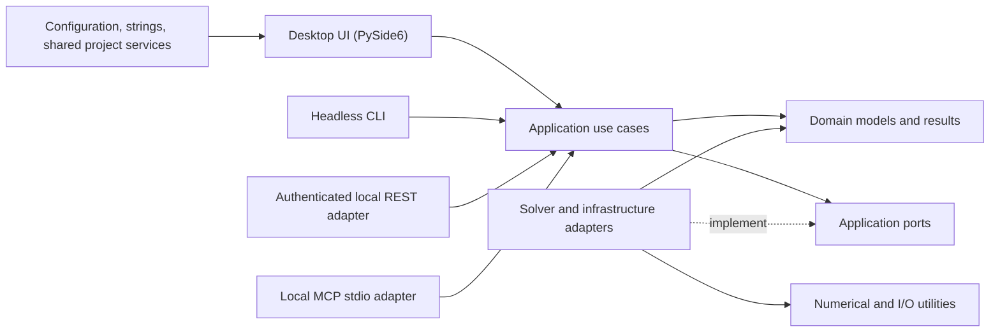

# Optees Architecture

Optees is a desktop, open-source tool to help technical and non-technical staff solve optimization problems with a clean, testable, and scalable architecture.

## Goals
- Clear separation of concerns (Clean Architecture)
- Easy to test (TDD), easy to extend
- Source-agnostic core (files, GUI, adapters)
- Prefer robust, well-maintained libraries; don’t reinvent the wheel

## Layered Model (6 layers)



Arrows represent source-level dependencies or calls. Planned adapters remain
outside the desktop presentation layer and reuse the same application core.

### Responsibilities

* **Domain**
  Pure business logic & domain entities (Entities & Managers). No I/O, no library APIs.

* **Application**
  Use Cases orchestrate flows (parse → preprocess → solve → analyze → format). Services wrap solver calls (LP, MILP, Knapsack…). No UI or file format knowledge.

* **Data**
  Repositories + Adapters handling external resources: CSV/XLSX, MPS/MAT, Burkardt text, etc. Convert into *canonical dicts* for the Application layer.

* **Presentation**
  PySide6 GUI views/controllers. Only talks to Application Use Cases and maps
  DTOs to and from UI widgets.

* **Core**
  Project-specific shared utilities: logging, string management, configuration & constants, error types.

* **Utility**
  Generic, reusable helpers: numerical routines, small algorithms. No project coupling.

### Canonical LP Problem (example)

Adapters should convert external data into:

```python
problem = {
  "sense": "min" | "max",
  "c": [...],
  "A_ub": [[...], ...], "b_ub": [...],     # optional
  "A_eq": [[...], ...], "b_eq": [...],     # optional
  "bounds": [[lb, ub], ...],               # optional; default (0, +inf)
  "var_names": ["x0","x1",...],            # optional
  "obj_offset": 0.0                        # optional
}
```

### Canonical Knapsack (0/1) schema

```python
knapsack = {
  "values": [v1, v2, ...],     # floats
  "weights": [w1, w2, ...],    # non-negative ints
  "capacity": int,             # non-negative
  # optional:
  "var_names": ["i0","i1",...]
}

```
### Actually folders

```
assets/
src/optees/
  application/
  core/
  data/
    adapters/
    repositories/
  domain/
  presentation/
  utility/
    io_lpnetlib.py
    io_knapsack.py
    lp_utils.py
    knapsack_utils.py
tests/
  application/
  data/
  utility/
docs/
```

## Diagram Convention

Architecture, state, sequence, and data-flow diagrams are written as Mermaid
fenced blocks directly in Markdown. GitHub renders them natively, while the
text remains reviewable and diffable.

- Keep the Mermaid source authoritative; do not commit a duplicate image by
  default.
- Use quoted node labels when punctuation or parentheses are present.
- Do not send internal schemas to online rendering services.
- Export SVG, PNG, or PDF only when a release artifact or offline document
  requires it. A reproducible local `mermaid-cli` pipeline may be added when
  that need exists.
