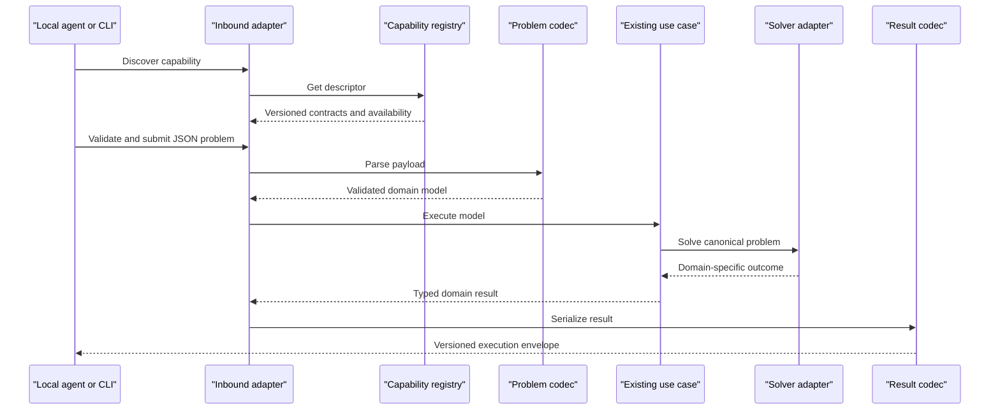

# Optees Local Solver Service Roadmap

This document defines the cross-cutting refactoring that makes the optimization
capabilities already implemented in Optees available to the desktop UI, a
headless CLI, local applications, and local AI agents through the same
application core.

The first delivery is deliberately smaller than a workflow-orchestration
platform. It exposes existing, tested capabilities through versioned JSON and a
local job API. Independent solution validation, semantic modeling assistance,
agent-oriented documentation, MCP, and composite optimization workflows are
sequential post-MVP phases.

## Product Boundary

Optees remains open source, local-first, offline-capable, and desktop-first.
The optional service listens on the local machine and does not turn Optees into
a hosted or multi-user platform.

The product surfaces have distinct responsibilities:

```text
Optees Desktop       educational formulation, visualization, and audit
Optees CLI           headless local execution and contract verification
Local Solver Service local automation and agent integration
Future MCP adapter   agent-native access to the same application services
```

The server is an inbound adapter. It must not duplicate solver logic or call Qt
widgets. Desktop, CLI, REST, and future MCP interfaces invoke the same use cases
and domain models.

The planned headless execution path is:



## Terminology

The public API distinguishes concepts that must not be conflated:

- **Capability:** a mathematical workflow exposed to clients, such as
  `lp.continuous` or `packing.single_container_3d`.
- **Problem schema:** the versioned JSON contract accepted by a capability.
- **Backend:** the concrete implementation selected by Optees, such as SciPy
  HiGHS, OR-Tools SCIP, or an internal dynamic-programming adapter.
- **Job status:** execution lifecycle: queued, running, completed, cancelled,
  or failed.
- **Mathematical status:** optimal, feasible, infeasible, unbounded, or not
  solved.
- **Termination reason:** normal completion, time limit, iteration limit, user
  cancellation, dependency failure, or internal error.

An agent selects a capability and submits a problem. Optees selects an
available backend and reports it in diagnostics.

## Architectural Constraints

- Preserve the current `domain`, `application`, `data/adapters`, and
  `presentation` boundaries; do not reorganize the repository wholesale.
- Keep domain and application modules independent of PySide6, FastAPI,
  Pydantic, and Uvicorn.
- Reuse current model constructors, JSON importers, use cases, ports, and solver
  adapters.
- Add dictionary/payload codecs alongside file-based JSON helpers instead of
  parsing temporary files.
- Keep domain-specific result types. Wrap them in a common public execution
  envelope rather than replacing them with a lowest-common-denominator model.
- Version public problem, result, and API contracts independently.
- Migrate one capability at a time with contract and regression tests.
- Keep existing desktop behavior and JSON files backward compatible.

## Existing Capability Baseline

Phase 0 must verify, rather than assume, the exact availability and contract of
these currently implemented workflows:

| Proposed capability ID | Current workflow |
| --- | --- |
| `lp.continuous` | Continuous linear programming and optimal-face ranges |
| `milp.linear` | Mixed-integer linear programming |
| `knapsack.zero_one` | 0/1 Knapsack |
| `knapsack.bounded` | Bounded Knapsack |
| `knapsack.unbounded` | Unbounded Knapsack |
| `knapsack.fractional` | Fractional Knapsack |
| `knapsack.multi_dimensional` | Multi-dimensional Knapsack |
| `nlp.continuous_local` | Continuous local nonlinear optimization |
| `graph.shortest_path.dijkstra` | Non-negative weighted shortest path |
| `ml.regression.linear` | Educational linear regression |
| `ml.classification.binary_logistic` | Educational binary classification |
| `packing.single_container_3d` | Orthogonal single-container 3D packing |

The Modeling Assistant is not a solver capability. It may consume the registry
and semantic-analysis services in a later phase.

## Public Contract Direction

### Capability Descriptor

Every registered capability eventually publishes:

```json
{
  "id": "packing.single_container_3d",
  "contract_version": "1",
  "title": "Single-container 3D packing",
  "problem_type": "packing",
  "input_schema": {},
  "result_schema": {},
  "default_options": {},
  "available": true,
  "backend_candidates": ["ortools.scip", "ortools.cbc"],
  "supports_time_limit": true,
  "supports_cancellation": true
}
```

Educational and semantic fields such as `use_when`, `do_not_use_when`,
`questions_to_ask`, assumptions, and limitations are added during post-MVP
guidance hardening. The MVP descriptor contains only information verified by
code and tests.

### Execution Envelope

Domain-specific results remain typed. Their JSON representation is returned in
the `result` field of a common envelope:

```json
{
  "contract_version": "1",
  "job_id": "job-7d23",
  "capability_id": "packing.single_container_3d",
  "job_status": "completed",
  "mathematical_status": "optimal",
  "termination_reason": "completed",
  "result": {},
  "diagnostics": {
    "backend_id": "ortools.scip",
    "elapsed_seconds": 4.82,
    "best_bound": 42,
    "relative_gap": 0
  },
  "validation": {
    "status": "not_available",
    "checks": [],
    "violations": []
  },
  "warnings": [],
  "metadata": {
    "optees_version": "x.y.z",
    "api_version": "v1",
    "problem_schema_version": "1",
    "result_schema_version": "1"
  }
}
```

Feasibility and optimality booleans are derived from mathematical status rather
than stored independently. Missing bound, gap, progress, or cancellation
support is represented by `null` or capability metadata, never invented.

## MVP Roadmap

### Phase 0 - Current Contract Inventory

- [x] Create the historical
  `docs/local-agent/pre-service-capability-inventory.md` baseline.
- [x] Record each capability's domain input, JSON importer, use case, port,
  adapter, result type, statuses, diagnostics, dependency requirements, and
  tests.
- [x] Identify file-only importers that need an in-memory payload entry point.
- [x] Identify outputs that are not directly JSON serializable.
- [x] Record cancellation and time-limit support without assuming uniformity.
- [x] Confirm capability IDs and avoid exposing backend names as problem types.

**Completion:** every existing workflow has a factual inventory entry and no
production code has changed.

### Phase 1 - Versioned Result Codecs

- [x] Define shared job, mathematical-status, and termination-reason enums.
- [x] Define the common execution envelope and structured API error contract.
- [x] Define a serializer protocol for domain-specific results.
- [x] Select `lp.continuous` as the first pilot because its statuses,
  diagnostics, optimal ranges, and scientific regression cases exercise a
  meaningful contract.
- [x] Add an LP result codec without replacing the existing LP domain result.
- [x] Test JSON serialization, missing diagnostics, non-finite-number rejection,
  and status mapping.
- [x] Keep the LP desktop workflow visibly unchanged.

**Explicitly excluded:** CLI, HTTP, job queues, semantic analysis, and migration
of additional capabilities.

### Phase 2 - Capability Registry And Execution Facade

- [x] Implement a `CapabilityRegistry` in the application layer.
- [x] Register the LP pilot through an explicit composition root.
- [x] Implement an `OptimizationService` that validates a payload, creates the
  existing domain model, invokes the existing use case, and serializes the
  result.
- [x] Report unavailable optional dependencies through capability metadata and
  structured errors.
- [x] Keep backend selection internal to the registered capability.
- [x] Add application tests with fake ports and one real LP integration test.

The implementation lives in `application/services` and is assembled by
`composition/local_agent.py`. Capability discovery exposes stable mathematical
IDs and versioned JSON schemas, while executable callables and concrete backend
selection remain private to the registry. The production LP composition checks
SciPy availability and imports no presentation module.

**Completion:** LP can be executed in process without importing PySide6 or
interacting with a widget.

### Phase 3 - Headless CLI Proof

- [x] Add commands equivalent to `list-capabilities`, `validate`, and `solve`.
- [x] Accept existing versioned JSON from stdin or an explicit file path.
- [x] Emit only the versioned result or error envelope on stdout.
- [x] Send human diagnostics to stderr without leaking complete datasets.
- [x] Define stable exit codes for success, invalid input, unavailable
  capability, infeasibility, cancellation, and technical failure.
- [x] Add subprocess-level tests.

The `optees-cli` entry point and `python -m optees.cli` module are documented in
`docs/local-agent/headless-cli.md`. Operational commands emit one compact JSON
document on stdout. Infeasible, unbounded, and not-solved executions retain
their mathematical result envelope and use distinct process exit codes.

**Completion:** the LP pilot can be validated and solved without starting Qt.

### Phase 4 - Migrate Existing Capabilities

Migrate one capability per atomic step. Every migration requires:

- [ ] payload-to-domain codec using the existing validated importer contract;
- [ ] domain-result-to-JSON codec;
- [ ] registry descriptor and dependency availability check;
- [ ] explicit status and diagnostics mapping;
- [ ] one deterministic or scientific reference case;
- [ ] contract tests and an in-process execution test;
- [ ] unchanged desktop behavior.

Suggested order:

1. [x] 0/1 Knapsack;
2. [x] Bounded Knapsack;
3. [x] Unbounded Knapsack;
4. [x] Fractional Knapsack;
5. [x] Multi-dimensional Knapsack;
6. [x] MILP;
7. [x] Dijkstra;
8. [x] NLP;
9. [x] Regression and Binary Classification;
10. [x] Single-container 3D Packing as the long-running, time-limited case.

The Unbounded Knapsack contract preserves integer quantities and reports a
mathematical `unbounded` outcome when a positive-value, zero-weight item can be
selected indefinitely. Its production facade is covered by the deterministic
reference cases already shared with the desktop workflow.

The Fractional Knapsack contract preserves decimal capacities, weights, and
selection fractions. It exposes the exact density-ordered greedy backend and
does not coerce continuous decisions into integer quantities.

The Multi-dimensional Knapsack capability preserves the desktop workflow's
four decision domains. Binary models use the internal exact branch-and-bound;
bounded and unbounded integers, plus continuous fractional quantities, are
routed through the existing linear mixed-integer solver formulation. The
binary integration is checked against the included OR-Library `mknap1`
scientific benchmark.

`milp.linear` reuses the desktop schema-v1 importer and preserves continuous,
integer, and binary variables, solver limits, feasible incumbents, bounds, and
relative-gap diagnostics. The public boundary rejects duplicate variable names
and non-finite numeric data before invoking OR-Tools.

`graph.shortest_path.dijkstra` reuses the desktop graph importer and the
deterministic non-negative shortest-path solver. Its public result includes the
path, total distance, hop count, and settled-node trace. An unreachable
destination maps to `infeasible` because no source-to-destination path satisfies
the requested graph problem.

`nlp.continuous_local` reuses the safe-expression parser, schema-v1 importer,
and SciPy methods used by the desktop NLP workflow. A converged result is
reported as a local `feasible` candidate rather than a globally `optimal`
solution. Iteration limits and failures remain explicit in diagnostics and
warnings.

`ml.regression.linear` and `ml.classification.binary_logistic` reuse the
desktop schema-v1 datasets, deterministic train/test splits, and transparent
NumPy implementations. Their results expose coefficients, held-out metrics,
and row-level predictions. Binary classification also exposes the training-only
feature scaling and decision threshold required to reproduce predictions. A
trained model maps to `feasible`; warnings state that split metrics neither
establish causality nor guarantee future predictive performance.

`packing.single_container_3d` reuses the schema-v1 packing importer, exact
OR-Tools formulation, orthogonal rotation policies, scalar capacities, and
simple-gravity post-processing used by the desktop workflow. The public result
keeps an infeasible all-items request separate from its optional
maximum-feasible recovery, so the recovery is never mislabelled as satisfying
the original request. Time limits and MIP-gap diagnostics are public. The
backend's cooperative cancellation hook will be exposed only through the
Phase 5 job lifecycle; the current synchronous capability therefore declares
`supports_cancellation: false`.

`knapsack.zero_one` reuses the shared schema-v1 Knapsack importer through an
application-owned mapper, the existing `SolveKnapsackUseCase`, and the exact
dynamic-programming adapter. Its result codec preserves selected indices and
names, total value and weight, residual capacity, and DP diagnostics. The
in-process and CLI paths are covered by fake-port tests and the Burkardt `p01`
and `p02` reference instances.

`knapsack.bounded` preserves the complete integer quantity vector and selected
item quantities in its result contract. Its production integration is checked
against the versioned `inventory_mix` and `limited_stock` deterministic
reference cases, in addition to fake-port, codec, and CLI tests.

**Completion:** all capabilities listed in the baseline are serializable and
invocable through the same in-process service and CLI.

### Phase 5 - Local Job Service

- [x] Define job entities separately from mathematical solver status.
- [x] Add an in-memory job repository with bounded retention.
- [x] Run at most one heavy job concurrently in the MVP.
- [x] Queue additional accepted jobs explicitly.
- [x] Preserve backend time limits and cancellation only where genuinely
  supported.
- [x] Return a feasible incumbent when available after a time limit or
  cancellation, without labelling it optimal.
- [x] Prevent new work during controlled shutdown.
- [x] Add lifecycle, concurrency, cancellation, and retention tests.

`LocalJobService` wraps the synchronous execution facade with one local worker,
an explicit FIFO queue, bounded in-memory retention, and immutable public job
snapshots. Operational lifecycle, mathematical outcome, and termination reason
remain separate. Queued work can always be cancelled; running cancellation is
advertised only for `packing.single_container_3d`, whose cooperative interrupt
callback is bound in composition. A retained incumbent after cancellation is
reported conservatively as `feasible`. The service has no network listener or
persistent state. The network boundary is introduced in Phase 6; persistent
jobs remain explicitly outside the local-service MVP.

**Explicitly excluded:** Redis, Celery, external queues, distributed workers,
and persistent jobs.

### Phase 6 - Local REST API

- [x] Add FastAPI, Pydantic, and Uvicorn behind a dedicated project dependency
  extra. Release-build integration remains an explicit Phase 7 task.
- [x] Listen on `127.0.0.1` only.
- [x] Require a session bearer token for every endpoint except health.
- [x] Disable permissive CORS and enforce JSON content type and request-size
  limits.
- [x] Expose:

```text
GET  /health
GET  /api/v1/info
GET  /api/v1/capabilities
GET  /api/v1/capabilities/{capability_id}
POST /api/v1/problems/validate
POST /api/v1/jobs
GET  /api/v1/jobs
GET  /api/v1/jobs/{job_id}
GET  /api/v1/jobs/{job_id}/result
POST /api/v1/jobs/{job_id}/cancel
```

- [x] Generate and contract-test OpenAPI.
- [x] Use structured error responses with request IDs.
- [x] Never accept arbitrary executable code or unrestricted filesystem paths.
- [x] Add a full server integration test from health check through result.

The HTTP adapter lives in `optees.interfaces.http` and imports the application
job service without introducing FastAPI into domain or presentation modules.
The default FastAPI documentation routes are disabled; the OpenAPI document is
available through the authenticated `/api/v1/openapi.json` endpoint. Mutating
routes accept bounded JSON bodies only, and the provided server runner rejects
all bind addresses except `127.0.0.1`. Process management, token generation,
desktop controls, and release packaging remain Phase 7 responsibilities.

### Phase 7 - Server Process, Desktop Settings, And Packaging

- [x] Run the REST server in a subprocess, not the Qt event loop.
- [x] Provide the same server entry point to the desktop manager and headless
  CLI.
- [x] Implement port validation, automatic fallback, startup health check,
  controlled shutdown, and failure reporting.
- [x] Generate a new token for each server session; do not commit, log, or show
  it without an explicit user action.
- [x] Add a localized **Local Solver Service** section to Settings with status,
  actual URL, start, stop, copy URL, copy configuration, and open API docs.
- [x] Stop the child service when the desktop application closes.
- [x] Update PyInstaller configuration and release CI for server dependencies
  and the headless entry point.
- [x] Test occupied ports, invalid custom ports, failed startup, restart,
  shutdown, and invalid tokens.

`LocalServerProcessManager` owns one child process and generates a new token
for every successful start attempt. The token is passed through the child
environment rather than process arguments. A Qt controller performs startup
and health checking outside the UI thread, while Settings exposes credentials
only through an explicit copy action. The release matrix installs the optional
service dependencies and smoke-tests the packaged executable against health
and authenticated capability discovery before creating each installer.

The implementation is complete. Acceptance criterion 8 remains open until a
tagged GitHub Actions run verifies the packaged behavior on macOS, Windows,
and Linux.

## MVP Acceptance Criteria

The MVP is complete only when:

1. [x] every currently registered capability has versioned input and output
   JSON contracts;
2. [x] all capabilities can run without Qt through the execution facade and
   CLI;
3. [x] the local authenticated REST service exposes capability discovery,
   validation, jobs, status, result, and cancellation;
4. [x] mathematical status remains distinct from job lifecycle and termination
   reason;
5. [x] the desktop can start and stop the service without blocking;
6. [x] existing GUI and JSON behavior remains compatible;
7. [x] OpenAPI matches the tested endpoints;
8. [ ] packaged macOS, Windows, and Linux builds include the service entry
   point;
9. [x] deterministic and scientific regressions continue to pass;
10. [x] limitations and unavailable diagnostics are explicit.

## Post-MVP Phase A - Independent Solution Validation

### A0 - Validation Contract And Orchestration

- [x] Define typed `verified`, `partial`, `failed`, and `not_available` states.
- [x] Record named absolute, relative, integrality, and geometry tolerances when
  applicable.
- [x] Record every executed check, its pass/fail state, measurements, and every
  violation with a stable code and JSON path.
- [x] Attach validators to capability registrations, after result serialization
  and independently from backend diagnostics.
- [x] Preserve mathematical status, job lifecycle, termination reason, and
  validation status as separate concepts.
- [x] Convert an unavailable or internally failed validator into an explicit
  `not_available` report without discarding a solver result.

The versioned validation contract is implemented in the application layer and
is serialized inside every execution envelope. Validators receive the parsed
model and the already serialized public result; they do not inspect backend
residuals or alter solver and job statuses.

### A1 - Linear And Mixed-Integer Models

- [x] For continuous LP candidates, verify the complete variable vector,
  bounds, every linear constraint, and the recomputed objective.
- [x] Extend the same checks to MILP and additionally verify integrality and
  binary domains.
- [x] Test LP feasible, tolerance-boundary, objective-mismatch, bound-violation,
  constraint-violation, infeasible, and unbounded outcomes.
- [x] Test the corresponding MILP outcomes and integer-domain failures.

The MILP validator composes the independent LP checks for the shared linear
polyhedron and objective, then verifies general-integer and binary domains from
the serialized incumbent with a separately recorded integrality tolerance. It
does not inspect backend residuals, bounds, gaps, or optimality claims.

### A1.5 - D0 Local Agent Loop Proof

Do not wait for the complete MCP phase before testing whether an actual local
agent can use Optees correctly. Once the LP validation path is stable, build a
small provider-specific experiment around Ollama's tool-calling API. This is an
early end-to-end proof of the agent workflow, not a second execution backend and
not a production chat feature.

- [x] Add a minimal local chat harness for an Ollama model that advertises the
  `tools` capability; freeze the first experiment on `qwen2.5-coder:7b` and
  record its exact model digest.
- [x] Expose an allowlisted tool facade for capability listing, descriptor
  retrieval, problem validation, job creation, job status, result retrieval,
  and cancellation.
- [x] Keep the Optees base URL and bearer token inside the harness. Never place
  the token in model messages, tool results, transcripts, or benchmark output.
- [x] Require capability discovery and successful problem validation before
  job creation; return structured Optees errors without silently repairing or
  retrying the model's payload.
- [x] Bound tool-call count, execution time, and polling; preserve cancellation
  and job semantics from the existing application services.
- [x] Add deterministic tests with fake Ollama and Optees transports.
- [x] Complete an end-to-end test against a local model that emits native
  structured `message.tool_calls`.
- [x] Prove one small LP workflow from an English natural-language prompt.
- [ ] Prove one clarification workflow with materially missing data.
- [x] Repeat the frozen LP workflow with a smaller tool-capable model suitable
  for ordinary office hardware and record its correctness outcome.
- [ ] Add automated latency measurements to the formal comparative benchmark.
- [x] Record prompt, frozen model identity, tool calls, redacted arguments,
  Optees contract versions, validation report, and final response so the run is
  reproducible and suitable for the later agent benchmark runner.

The harness may initially be terminal-based. The standard Ollama chat UI is not
an integration surface because selecting a tool-capable model there does not
register Optees tools. This proof validates local orchestration and the Optees
REST/application contracts; it does not by itself validate MCP or hosted-agent
connectivity. Setup, security boundaries, and the first frozen prompt are
documented in `docs/local-agent/ollama-d0-harness.md`.

The first live compatibility probe froze `qwen2.5-coder:7b` at digest
`dae161e27b0e90dd1856c8bb3209201fd6736d8eb66298e75ed87571486f4364`.
Although Ollama advertises its `tools` capability, both the Optees prompt and a
single-tool minimal probe returned a JSON-looking request inside
`message.content` without a structured `message.tool_calls` field. The harness
correctly executed no tool. Text is not silently promoted to an executable tool
call; the complete live LP and clarification proofs remain open for a model
with reliable native tool calling or a separately reviewed compatibility mode.

The subsequent `qwen3.5:9b` probe, digest
`6488c96fa5faab64bb65cbd30d4289e20e6130ef535a93ef9a49f42eda893ea7`,
completed the native structured-tool loop: capability discovery, descriptor
inspection, exact payload validation, job creation, status polling, result
retrieval, and independent-validation reporting. It selected `lp.continuous`
for a continuous production mix and returned `product_a = 4`,
`product_b = 2.5`, and objective `220`, with mathematical status `optimal` and
independent validation `verified`. After the result-contract correction, it
also reported `optimal_face.analysis_status = computed`, no alternate optimum,
dimension zero, and therefore correctly identified the solution as unique.
The formal comparative benchmark rerun must still enable the opt-in transcript
and automated latency measurement.

The office-hardware probe with `granite3.3:2b`, digest
`07bd1f170855240f9e162bf54ea494a8bc1c73d8cbd1365d7fccbeb7d2504947`,
did not emit native tool calls. It rendered JSON-looking calls as assistant
text, selected MIP despite explicitly fractional production quantities, and
invented a non-contract payload. The harness executed zero tools, which is the
required safe failure. The redacted run is preserved in
`benchmarks/agents/runs/granite3.3-2b-lp-optimal-face.jsonl`; this model is not
compatible with the D0 workflow for the frozen LP scenario.

### A1.6 - Minimal MCP Vertical Slice

After D0 proves the workflow, expose the same allowlisted facade through a
minimal local MCP server so compatible desktop and IDE clients can invoke
Optees without custom Ollama code.

- [x] Implement capability discovery, validation, job creation, status, result,
  and cancellation as thin MCP tools over the existing application services.
- [x] Reuse the same tool names, schemas, redaction policy, and orchestration
  invariants exercised by D0; do not call the REST API internally when direct
  application services are available.
- [x] Add MCP protocol and schema tests plus one local end-to-end smoke test.
- [x] Document stdio/local-process configuration separately from the REST
  connection configuration.
- [x] State explicitly that this vertical slice proves local tool access but
  does not yet provide the complete agent guidance, compatibility, packaging,
  and client matrix assigned to Phase D.

The vertical slice is implemented by `optees-mcp`, a private stdio process that
wraps `LocalJobService` directly. It opens no port, needs no REST bearer token,
and preserves the D0 requirement to inspect the full capability descriptor and
validate the exact payload before creating a job. Protocol tests negotiate a
real MCP session, inspect all seven published schemas, and complete the frozen
continuous-LP workflow through a subprocess. Setup and current limitations are
documented in `docs/local-agent/mcp-stdio.md`. Native installer inclusion,
client-specific guidance, and the complete compatibility matrix remain Phase D
work rather than implicit claims of this proof.

### A2 - Knapsack Family

- [ ] Verify 0/1, Bounded, Unbounded, and Fractional quantity domains,
  selection consistency, capacity use, residual capacity, and objective.
- [ ] Verify every capacity dimension and quantity mode for Multi-dimensional
  Knapsack.
- [ ] Use the existing Burkardt and OR-Library cases as independent regression
  inputs without treating a known objective alone as a feasibility proof.

### A3 - Graph And Packing

- [ ] Verify Dijkstra path endpoints, continuity, edge existence, direction,
  and recomputed distance.
- [ ] Verify Packing containment, allowed orientations, scalar capacities,
  pairwise non-overlap, loaded/excluded partition, and objective consistency.
- [ ] Keep geometric tolerances distinct from scalar objective tolerances.

### A4 - NLP And Educational ML

- [ ] For NLP candidates, verify finite values, declared bounds, and objective
  recomputation while explicitly declining any independent global-optimality
  claim.
- [ ] For Regression and Classification, verify reproducible dimensions,
  finite parameters, prediction/metric consistency, and split accounting.
- [ ] Never present these checks as evidence of causality, fairness,
  generalization, or production suitability.

### A5 - Public Failure Semantics And Documentation

- [ ] Treat failed checks as a distinct `validation.status = failed` outcome;
  do not relabel the solver's mathematical status or job lifecycle.
- [ ] Surface failed validation prominently in REST, CLI, and agent guidance.
- [ ] Add one verified and one failed validation example per capability.
- [ ] Contract-test OpenAPI and document tolerance/version compatibility.

Independent feasibility validation does not create an independent proof of
optimality. A `verified` report means that all checks implemented and listed in
that report passed at the recorded tolerances. It does not mean that omitted
checks passed, that the backend's optimality certificate was independently
reproduced, or that the model correctly represents the user's business intent.

## Post-MVP Phase B - Semantic Modeling Guidance

- [ ] Extend descriptors with `use_when`, `do_not_use_when`, required data,
  supported objectives, limitations, and `questions_to_ask`.
- [ ] Add a versioned problem-template registry.
- [ ] Reuse and extend deterministic Modeling Assistant rules.
- [ ] Add `/api/v1/problems/analyze` with blocking errors, warnings,
  recommended capability, and a human-readable summary.
- [ ] Distinguish scalar-capacity allocation from geometric packing.
- [ ] Represent assumptions explicitly with source and confirmation state.
- [ ] Introduce `safe`, `review_recommended`, `confirmation_required`, and
  `blocked` review levels.
- [ ] Bind acknowledgements to an analysis ID, canonical problem hash, and
  acknowledged warning codes rather than trusting a standalone boolean.
- [ ] Never invent missing business data or silently convert a preference into
  a hard constraint.

Perfect correspondence between human intent and a mathematical model cannot be
guaranteed automatically. The service validates the received model and applies
deterministic safeguards; the user or calling agent remains responsible for
the interpretation.

## Post-MVP Phase C - Local Desktop Agent And Integration

### C0 - Local Ollama Desktop Module

Promote the successful D0 terminal proof into an actual Optees desktop module.
The first supported provider is Ollama running on the same computer. This is a
local LLM-assisted workflow and must remain visibly distinct from the existing
deterministic, rule-based Modeling Assistant.

- [ ] Extract the provider-neutral conversation loop from the terminal harness
  into an application service that does not depend on Qt or terminal input.
- [ ] Reuse `LocalJobService` directly inside the desktop process instead of
  requiring the user to start the REST server and copy a bearer token.
- [ ] Add a dedicated **Local Agent** view with conversation history, model
  selector, connection status, stop action, and concise tool-progress events.
- [ ] Discover locally installed Ollama models and show whether each model
  advertises native tool support; do not imply that advertised support
  guarantees correct tool calls.
- [ ] Keep the model endpoint loopback-only by default and never include Optees
  credentials, hidden instructions, or unrelated application state in model
  messages.
- [ ] Execute model and solver work outside the Qt UI thread with bounded
  turns, tool calls, polling, timeout, and cooperative cancellation.
- [ ] Require capability inspection and exact-payload validation before every
  job, preserving the same state machine and safe failure used by D0 and MCP.
- [ ] Make transcript persistence opt-in, warn that prompts may contain
  business data, and redact credentials and internal transport details.
- [ ] Add English and Italian UI strings, provider setup guidance, empty/error
  states, and explicit statements about local-model quality limitations.
- [ ] Add deterministic fake-provider tests, GUI flow tests, and one real
  opt-in Ollama smoke test outside the default CI suite.
- [ ] Include the module and its runtime imports in PyInstaller builds, then
  test the complete workflow from installed macOS, Windows, and Linux
  artifacts.
- [ ] Do not bundle Ollama or a language model with Optees initially; detect a
  missing Ollama service and provide platform-appropriate setup guidance.

Current launch matrix:

| Distribution | Current command | Status |
| --- | --- | --- |
| Source checkout | `PYTHONPATH=src python -m optees.ollama_chat --model qwen3.5:9b` | Available for development |
| Python package installed with `pip` | `optees-ollama-chat --model qwen3.5:9b` | Available through the console entry point |
| Native PyInstaller release | None | Not yet packaged; use the future desktop module |

The native-release gap is intentional documentation of current behavior, not
an instruction to unpack an installer and search for internal Python modules.
The desktop module is the supported product direction for users who install a
DMG, Windows installer/ZIP, or Linux package.

### C1 - Agent Documentation And External Integration

- [ ] Generate technical API documentation from tested Pydantic models and
  FastAPI endpoints.
- [ ] Add one request and result example per capability.
- [ ] Document status, bound, gap, timeout, cancellation, exclusions, and
  validation semantics.
- [ ] Publish agent instructions that require discovery and validation before
  job creation and prohibit inventing missing values.
- [ ] Add privacy, security, troubleshooting, and version-compatibility pages.
- [ ] Add a desktop action that copies a local connection configuration without
  writing the token to logs.
- [ ] Explain that hosted agents generally cannot reach the user's localhost;
  the REST service targets local clients, IDEs, scripts, and desktop agents.
- [ ] Update the website only after packaged service behavior is verified.

## Post-MVP Phase D - MCP Adapter Hardening And Full Coverage

- [ ] Harden the A1.6 MCP vertical slice and expose every stable capability.
- [ ] Keep MCP as a thin adapter over the same application services.
- [ ] Do not duplicate registry, validation, or execution logic.
- [ ] Test tool schemas and behavior against the REST contracts.
- [ ] Add packaged-build acceptance tests and a documented compatibility matrix
  for supported local MCP clients.
- [ ] Test and document an OpenAI GPT integration through a currently supported
  OpenAI local-client or MCP surface. Record the exact client, model, transport,
  authentication boundary, and limitations instead of assuming that ChatGPT
  can launch local stdio servers or reach localhost.
- [ ] Add an OpenAI-specific discovery smoke test equivalent to the Claude
  check: the agent must call `optees_list_capabilities` and report the returned
  contracts rather than answer from memorized knowledge.
- [ ] Preserve a reviewed GPT configuration example and at least one complete
  synthetic solver run only after the integration works from a clean setup.
- [ ] Integrate the semantic guidance and agent documentation produced by
  Phases B and C without changing the underlying solver contracts.

## Post-MVP Phase E - Agent Effectiveness Benchmarks

The benchmark protocol and repository layout are defined in
`docs/AGENT_BENCHMARKS.md`. These experiments measure assisted modeling and
tool use; they do not replace scientific solver regressions.

- [x] Define paired unaided and Optees-assisted conditions, with an optional
  tool-available discovery condition.
- [x] Define scenario, run-manifest, evaluation, privacy, and publication
  requirements.
- [ ] Add versioned JSON schemas and a deterministic experiment runner.
- [ ] Create reviewed synthetic business scenarios in Italian and English.
- [ ] Implement automated formulation, feasibility, objective, and tool-use
  evaluators without relying only on the solver being evaluated.
- [ ] Define and pilot a blinded human-review rubric for assumptions and
  explanation quality.
- [ ] Run repeated paired studies across multiple frozen model/provider
  versions and publish failures as well as successes.
- [ ] Maintain private holdout scenarios for regression and contamination
  checks.

## Future - Composite Optimization Workflows

Solver cascades are a separate feature, not part of the local-service
refactoring. They require stable, versioned capability contracts first.

A future `OPTIMIZATION_WORKFLOWS_ROADMAP.md` may define:

- declarative steps and versioned input/output mappings;
- conditions, stopping criteria, retries, and infeasibility handling;
- audit records for intermediate models and results;
- explicit human approval before material model changes;
- deterministic feedback loops, such as capacity allocation followed by 3D
  packing verification;
- comparison and rollback between workflow runs.

Initially, the calling agent orchestrates atomic Optees capabilities. Optees
must not silently modify a previous mathematical model after a downstream
failure.

## Security And Operational Non-Goals

The MVP does not include:

- public or cloud hosting;
- binding to `0.0.0.0` or local-network exposure;
- multi-user authentication or authorization;
- database access or arbitrary spreadsheet/CSV discovery;
- unrestricted filesystem reads;
- persistent background service after desktop shutdown;
- distributed jobs, external queues, or remote workers;
- automatic LLM providers;
- workflow orchestration;
- production safety or business-correctness certification.

## Verification Strategy

- Unit tests for enums, codecs, registry, errors, ports, and lifecycle rules.
- Contract tests for every capability payload and result.
- Existing domain and benchmark tests remain the mathematical regression base.
- CLI subprocess tests prove Qt independence.
- API tests verify authentication, schemas, HTTP status codes, limits, and
  OpenAPI.
- Process tests verify port selection, health checks, restart, and shutdown.
- One end-to-end test starts the local service, discovers a capability,
  validates an input, creates a job, polls it, retrieves the result, and stops
  the service.
- The complete repository suite runs before each milestone is merged.

Each milestone ends with code, focused tests, updated documentation, an explicit
list of deferred behavior, and no production mocks.
