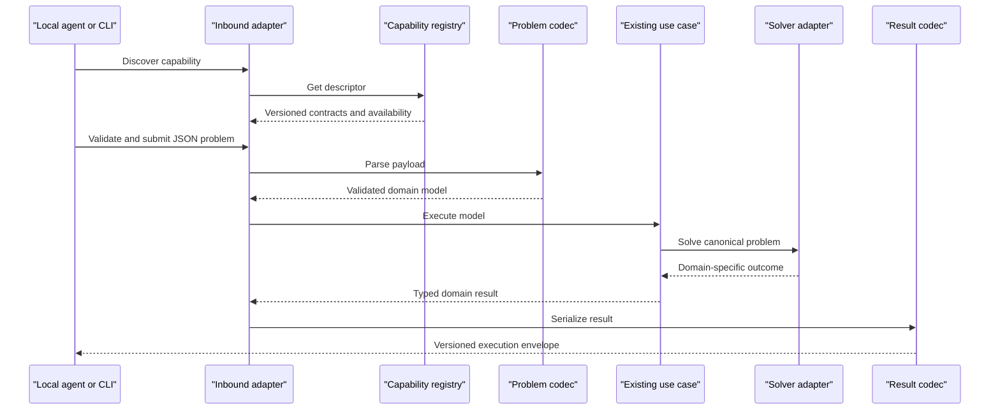

# Optees Local Solver Service Roadmap

This document defines the cross-cutting refactoring that makes the optimization
capabilities already implemented in Optees available to the desktop UI, a
headless CLI, local applications, and local AI agents through the same
application core.

The first delivery is deliberately smaller than a workflow-orchestration
platform. It exposes existing, tested capabilities through versioned JSON and a
local job API. Independent solution validation, semantic modeling assistance,
agent-oriented documentation, MCP, and composite optimization workflows are
sequential post-MVP phases.

## Product Boundary

Optees remains open source, local-first, offline-capable, and desktop-first.
The optional service listens on the local machine and does not turn Optees into
a hosted or multi-user platform.

The product surfaces have distinct responsibilities:

```text
Optees Desktop       educational formulation, visualization, and audit
Optees CLI           headless local execution and contract verification
Local Solver Service local automation and agent integration
Future MCP adapter   agent-native access to the same application services
```

The server is an inbound adapter. It must not duplicate solver logic or call Qt
widgets. Desktop, CLI, REST, and future MCP interfaces invoke the same use cases
and domain models.

The planned headless execution path is:



## Terminology

The public API distinguishes concepts that must not be conflated:

- **Capability:** a mathematical workflow exposed to clients, such as
  `lp.continuous` or `packing.single_container_3d`.
- **Problem schema:** the versioned JSON contract accepted by a capability.
- **Backend:** the concrete implementation selected by Optees, such as SciPy
  HiGHS, OR-Tools SCIP, or an internal dynamic-programming adapter.
- **Job status:** execution lifecycle: queued, running, completed, cancelled,
  or failed.
- **Mathematical status:** optimal, feasible, infeasible, unbounded, or not
  solved.
- **Termination reason:** normal completion, time limit, iteration limit, user
  cancellation, dependency failure, or internal error.

An agent selects a capability and submits a problem. Optees selects an
available backend and reports it in diagnostics.

## Architectural Constraints

- Preserve the current `domain`, `application`, `data/adapters`, and
  `presentation` boundaries; do not reorganize the repository wholesale.
- Keep domain and application modules independent of PySide6, FastAPI,
  Pydantic, and Uvicorn.
- Reuse current model constructors, JSON importers, use cases, ports, and solver
  adapters.
- Add dictionary/payload codecs alongside file-based JSON helpers instead of
  parsing temporary files.
- Keep domain-specific result types. Wrap them in a common public execution
  envelope rather than replacing them with a lowest-common-denominator model.
- Version public problem, result, and API contracts independently.
- Migrate one capability at a time with contract and regression tests.
- Keep existing desktop behavior and JSON files backward compatible.

## Existing Capability Baseline

Phase 0 must verify, rather than assume, the exact availability and contract of
these currently implemented workflows:

| Proposed capability ID | Current workflow |
| --- | --- |
| `lp.continuous` | Continuous linear programming and optimal-face ranges |
| `milp.linear` | Mixed-integer linear programming |
| `knapsack.zero_one` | 0/1 Knapsack |
| `knapsack.bounded` | Bounded Knapsack |
| `knapsack.unbounded` | Unbounded Knapsack |
| `knapsack.fractional` | Fractional Knapsack |
| `knapsack.multi_dimensional` | Multi-dimensional Knapsack |
| `nlp.continuous_local` | Continuous local nonlinear optimization |
| `graph.shortest_path.dijkstra` | Non-negative weighted shortest path |
| `ml.regression.linear` | Educational linear regression |
| `ml.classification.binary_logistic` | Educational binary classification |
| `packing.single_container_3d` | Orthogonal single-container 3D packing |

The Modeling Assistant is not a solver capability. It may consume the registry
and semantic-analysis services in a later phase.

## Public Contract Direction

### Capability Descriptor

Every registered capability eventually publishes:

```json
{
  "id": "packing.single_container_3d",
  "contract_version": "1",
  "title": "Single-container 3D packing",
  "problem_type": "packing",
  "input_schema": {},
  "result_schema": {},
  "default_options": {},
  "available": true,
  "backend_candidates": ["ortools.scip", "ortools.cbc"],
  "supports_time_limit": true,
  "supports_cancellation": true
}
```

Educational and semantic fields such as `use_when`, `do_not_use_when`,
`questions_to_ask`, assumptions, and limitations are added during post-MVP
guidance hardening. The MVP descriptor contains only information verified by
code and tests.

### Execution Envelope

Domain-specific results remain typed. Their JSON representation is returned in
the `result` field of a common envelope:

```json
{
  "contract_version": "1",
  "job_id": "job-7d23",
  "capability_id": "packing.single_container_3d",
  "job_status": "completed",
  "mathematical_status": "optimal",
  "termination_reason": "completed",
  "result": {},
  "diagnostics": {
    "backend_id": "ortools.scip",
    "elapsed_seconds": 4.82,
    "best_bound": 42,
    "relative_gap": 0
  },
  "validation": {
    "status": "not_available",
    "checks": [],
    "violations": []
  },
  "warnings": [],
  "metadata": {
    "optees_version": "x.y.z",
    "api_version": "v1",
    "problem_schema_version": "1",
    "result_schema_version": "1"
  }
}
```

Feasibility and optimality booleans are derived from mathematical status rather
than stored independently. Missing bound, gap, progress, or cancellation
support is represented by `null` or capability metadata, never invented.

## MVP Roadmap

### Phase 0 - Current Contract Inventory

- [x] Create `docs/local-agent/current-capability-inventory.md`.
- [x] Record each capability's domain input, JSON importer, use case, port,
  adapter, result type, statuses, diagnostics, dependency requirements, and
  tests.
- [x] Identify file-only importers that need an in-memory payload entry point.
- [x] Identify outputs that are not directly JSON serializable.
- [x] Record cancellation and time-limit support without assuming uniformity.
- [x] Confirm capability IDs and avoid exposing backend names as problem types.

**Completion:** every existing workflow has a factual inventory entry and no
production code has changed.

### Phase 1 - Versioned Result Codecs

- [x] Define shared job, mathematical-status, and termination-reason enums.
- [x] Define the common execution envelope and structured API error contract.
- [x] Define a serializer protocol for domain-specific results.
- [x] Select `lp.continuous` as the first pilot because its statuses,
  diagnostics, optimal ranges, and scientific regression cases exercise a
  meaningful contract.
- [x] Add an LP result codec without replacing the existing LP domain result.
- [x] Test JSON serialization, missing diagnostics, non-finite-number rejection,
  and status mapping.
- [x] Keep the LP desktop workflow visibly unchanged.

**Explicitly excluded:** CLI, HTTP, job queues, semantic analysis, and migration
of additional capabilities.

### Phase 2 - Capability Registry And Execution Facade

- [x] Implement a `CapabilityRegistry` in the application layer.
- [x] Register the LP pilot through an explicit composition root.
- [x] Implement an `OptimizationService` that validates a payload, creates the
  existing domain model, invokes the existing use case, and serializes the
  result.
- [x] Report unavailable optional dependencies through capability metadata and
  structured errors.
- [x] Keep backend selection internal to the registered capability.
- [x] Add application tests with fake ports and one real LP integration test.

The implementation lives in `application/services` and is assembled by
`composition/local_agent.py`. Capability discovery exposes stable mathematical
IDs and versioned JSON schemas, while executable callables and concrete backend
selection remain private to the registry. The production LP composition checks
SciPy availability and imports no presentation module.

**Completion:** LP can be executed in process without importing PySide6 or
interacting with a widget.

### Phase 3 - Headless CLI Proof

- [x] Add commands equivalent to `list-capabilities`, `validate`, and `solve`.
- [x] Accept existing versioned JSON from stdin or an explicit file path.
- [x] Emit only the versioned result or error envelope on stdout.
- [x] Send human diagnostics to stderr without leaking complete datasets.
- [x] Define stable exit codes for success, invalid input, unavailable
  capability, infeasibility, cancellation, and technical failure.
- [x] Add subprocess-level tests.

The `optees-cli` entry point and `python -m optees.cli` module are documented in
`docs/local-agent/headless-cli.md`. Operational commands emit one compact JSON
document on stdout. Infeasible, unbounded, and not-solved executions retain
their mathematical result envelope and use distinct process exit codes.

**Completion:** the LP pilot can be validated and solved without starting Qt.

### Phase 4 - Migrate Existing Capabilities

Migrate one capability per atomic step. Every migration requires:

- [ ] payload-to-domain codec using the existing validated importer contract;
- [ ] domain-result-to-JSON codec;
- [ ] registry descriptor and dependency availability check;
- [ ] explicit status and diagnostics mapping;
- [ ] one deterministic or scientific reference case;
- [ ] contract tests and an in-process execution test;
- [ ] unchanged desktop behavior.

Suggested order:

1. [x] 0/1 Knapsack;
2. [x] Bounded Knapsack;
3. [ ] Unbounded, Fractional, and Multi-dimensional Knapsack;
4. [ ] MILP;
5. [ ] Dijkstra;
6. [ ] NLP;
7. [ ] Regression and Binary Classification;
8. [ ] Single-container 3D Packing as the long-running cancellable case.

`knapsack.zero_one` reuses the shared schema-v1 Knapsack importer through an
application-owned mapper, the existing `SolveKnapsackUseCase`, and the exact
dynamic-programming adapter. Its result codec preserves selected indices and
names, total value and weight, residual capacity, and DP diagnostics. The
in-process and CLI paths are covered by fake-port tests and the Burkardt `p01`
and `p02` reference instances.

`knapsack.bounded` preserves the complete integer quantity vector and selected
item quantities in its result contract. Its production integration is checked
against the versioned `inventory_mix` and `limited_stock` deterministic
reference cases, in addition to fake-port, codec, and CLI tests.

**Completion:** all capabilities listed in the baseline are serializable and
invocable through the same in-process service and CLI.

### Phase 5 - Local Job Service

- [ ] Define job entities separately from mathematical solver status.
- [ ] Add an in-memory job repository with bounded retention.
- [ ] Run at most one heavy job concurrently in the MVP.
- [ ] Queue additional accepted jobs explicitly.
- [ ] Preserve backend time limits and cancellation only where genuinely
  supported.
- [ ] Return a feasible incumbent when available after a time limit or
  cancellation, without labelling it optimal.
- [ ] Prevent new work during controlled shutdown.
- [ ] Add lifecycle, concurrency, cancellation, and retention tests.

**Explicitly excluded:** Redis, Celery, external queues, distributed workers,
and persistent jobs.

### Phase 6 - Local REST API

- [ ] Add FastAPI, Pydantic, and Uvicorn behind a dedicated project dependency
  extra and package them in release builds that expose the service.
- [ ] Listen on `127.0.0.1` only.
- [ ] Require a session bearer token for every endpoint except health.
- [ ] Disable permissive CORS and enforce JSON content type and request-size
  limits.
- [ ] Expose:

```text
GET  /health
GET  /api/v1/info
GET  /api/v1/capabilities
GET  /api/v1/capabilities/{capability_id}
POST /api/v1/problems/validate
POST /api/v1/jobs
GET  /api/v1/jobs
GET  /api/v1/jobs/{job_id}
GET  /api/v1/jobs/{job_id}/result
POST /api/v1/jobs/{job_id}/cancel
```

- [ ] Generate and contract-test OpenAPI.
- [ ] Use structured error responses with request IDs.
- [ ] Never accept arbitrary executable code or unrestricted filesystem paths.
- [ ] Add a full server integration test from health check through result.

### Phase 7 - Server Process, Desktop Settings, And Packaging

- [ ] Run the REST server in a subprocess, not the Qt event loop.
- [ ] Provide the same server entry point to the desktop manager and headless
  CLI.
- [ ] Implement port validation, automatic fallback, startup health check,
  controlled shutdown, and failure reporting.
- [ ] Generate a new token for each server session; do not commit, log, or show
  it without an explicit user action.
- [ ] Add a localized **Local Solver Service** section to Settings with status,
  actual URL, start, stop, copy URL, copy configuration, and open API docs.
- [ ] Stop the child service when the desktop application closes.
- [ ] Update PyInstaller configuration and release CI for server dependencies
  and the headless entry point.
- [ ] Test occupied ports, invalid custom ports, failed startup, restart,
  shutdown, and invalid tokens.

## MVP Acceptance Criteria

The MVP is complete only when:

1. [ ] every currently registered capability has versioned input and output
   JSON contracts;
2. [ ] all capabilities can run without Qt through the execution facade and
   CLI;
3. [ ] the local authenticated REST service exposes capability discovery,
   validation, jobs, status, result, and cancellation;
4. [ ] mathematical status remains distinct from job lifecycle and termination
   reason;
5. [ ] the desktop can start and stop the service without blocking;
6. [ ] existing GUI and JSON behavior remains compatible;
7. [ ] OpenAPI matches the tested endpoints;
8. [ ] packaged macOS, Windows, and Linux builds include the service entry
   point;
9. [ ] deterministic and scientific regressions continue to pass;
10. [ ] limitations and unavailable diagnostics are explicit.

## Post-MVP Phase A - Independent Solution Validation

- [ ] Define `verified`, `partial`, `failed`, and `not_available` validation
  states.
- [ ] Record tolerances and every executed check.
- [ ] Recompute LP/MILP objectives and verify bounds and constraints.
- [ ] Verify Knapsack capacity, quantity, selection, and objective invariants.
- [ ] Verify Dijkstra path continuity, edge existence, and distance.
- [ ] Verify Packing containment, allowed orientations, scalar capacities, and
  pairwise non-overlap.
- [ ] Add appropriate validation for NLP and ML without claiming global
  optimality, causality, fairness, or production suitability.
- [ ] Treat result-validation failure as a distinct structured outcome.

Independent feasibility validation does not create an independent proof of
optimality.

## Post-MVP Phase B - Semantic Modeling Guidance

- [ ] Extend descriptors with `use_when`, `do_not_use_when`, required data,
  supported objectives, limitations, and `questions_to_ask`.
- [ ] Add a versioned problem-template registry.
- [ ] Reuse and extend deterministic Modeling Assistant rules.
- [ ] Add `/api/v1/problems/analyze` with blocking errors, warnings,
  recommended capability, and a human-readable summary.
- [ ] Distinguish scalar-capacity allocation from geometric packing.
- [ ] Represent assumptions explicitly with source and confirmation state.
- [ ] Introduce `safe`, `review_recommended`, `confirmation_required`, and
  `blocked` review levels.
- [ ] Bind acknowledgements to an analysis ID, canonical problem hash, and
  acknowledged warning codes rather than trusting a standalone boolean.
- [ ] Never invent missing business data or silently convert a preference into
  a hard constraint.

Perfect correspondence between human intent and a mathematical model cannot be
guaranteed automatically. The service validates the received model and applies
deterministic safeguards; the user or calling agent remains responsible for
the interpretation.

## Post-MVP Phase C - Agent Documentation And Integration

- [ ] Generate technical API documentation from tested Pydantic models and
  FastAPI endpoints.
- [ ] Add one request and result example per capability.
- [ ] Document status, bound, gap, timeout, cancellation, exclusions, and
  validation semantics.
- [ ] Publish agent instructions that require discovery and validation before
  job creation and prohibit inventing missing values.
- [ ] Add privacy, security, troubleshooting, and version-compatibility pages.
- [ ] Add a desktop action that copies a local connection configuration without
  writing the token to logs.
- [ ] Explain that hosted agents generally cannot reach the user's localhost;
  the REST service targets local clients, IDEs, scripts, and desktop agents.
- [ ] Update the website only after packaged service behavior is verified.

## Post-MVP Phase D - MCP Adapter

- [ ] Expose capability discovery, validation, job creation, status, result,
  and cancellation as MCP tools.
- [ ] Keep MCP as a thin adapter over the same application services.
- [ ] Do not duplicate registry, validation, or execution logic.
- [ ] Test tool schemas and behavior against the REST contracts.

## Post-MVP Phase E - Agent Effectiveness Benchmarks

The benchmark protocol and repository layout are defined in
`docs/AGENT_BENCHMARKS.md`. These experiments measure assisted modeling and
tool use; they do not replace scientific solver regressions.

- [x] Define paired unaided and Optees-assisted conditions, with an optional
  tool-available discovery condition.
- [x] Define scenario, run-manifest, evaluation, privacy, and publication
  requirements.
- [ ] Add versioned JSON schemas and a deterministic experiment runner.
- [ ] Create reviewed synthetic business scenarios in Italian and English.
- [ ] Implement automated formulation, feasibility, objective, and tool-use
  evaluators without relying only on the solver being evaluated.
- [ ] Define and pilot a blinded human-review rubric for assumptions and
  explanation quality.
- [ ] Run repeated paired studies across multiple frozen model/provider
  versions and publish failures as well as successes.
- [ ] Maintain private holdout scenarios for regression and contamination
  checks.

## Future - Composite Optimization Workflows

Solver cascades are a separate feature, not part of the local-service
refactoring. They require stable, versioned capability contracts first.

A future `OPTIMIZATION_WORKFLOWS_ROADMAP.md` may define:

- declarative steps and versioned input/output mappings;
- conditions, stopping criteria, retries, and infeasibility handling;
- audit records for intermediate models and results;
- explicit human approval before material model changes;
- deterministic feedback loops, such as capacity allocation followed by 3D
  packing verification;
- comparison and rollback between workflow runs.

Initially, the calling agent orchestrates atomic Optees capabilities. Optees
must not silently modify a previous mathematical model after a downstream
failure.

## Security And Operational Non-Goals

The MVP does not include:

- public or cloud hosting;
- binding to `0.0.0.0` or local-network exposure;
- multi-user authentication or authorization;
- database access or arbitrary spreadsheet/CSV discovery;
- unrestricted filesystem reads;
- persistent background service after desktop shutdown;
- distributed jobs, external queues, or remote workers;
- automatic LLM providers;
- workflow orchestration;
- production safety or business-correctness certification.

## Verification Strategy

- Unit tests for enums, codecs, registry, errors, ports, and lifecycle rules.
- Contract tests for every capability payload and result.
- Existing domain and benchmark tests remain the mathematical regression base.
- CLI subprocess tests prove Qt independence.
- API tests verify authentication, schemas, HTTP status codes, limits, and
  OpenAPI.
- Process tests verify port selection, health checks, restart, and shutdown.
- One end-to-end test starts the local service, discovers a capability,
  validates an input, creates a job, polls it, retrieves the result, and stops
  the service.
- The complete repository suite runs before each milestone is merged.

Each milestone ends with code, focused tests, updated documentation, an explicit
list of deferred behavior, and no production mocks.
