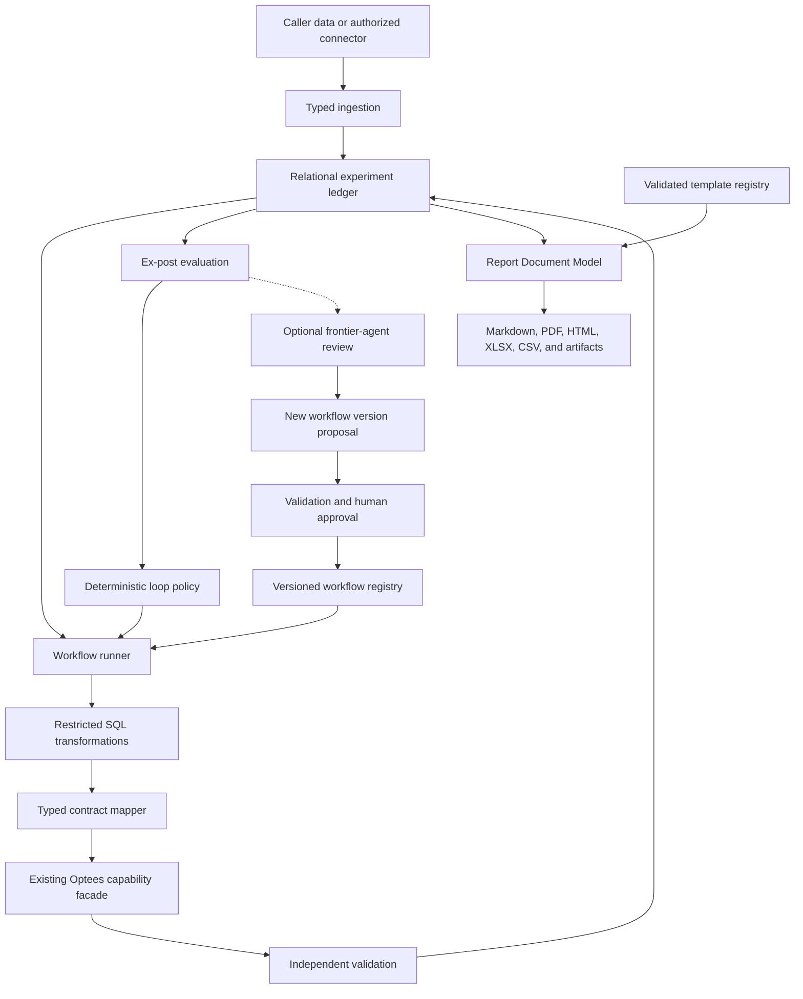

# Optimization Workflows, Experiment Ledger, And Adaptive Loops Roadmap

## Purpose

This roadmap defines the planned layer that turns Optees' atomic capabilities
into repeatable, auditable business workflows without moving orchestration
logic into the solvers.

The target product supports two related use cases:

1. a capable agent designs and validates a workflow once, then a simpler agent
   or application executes the frozen workflow repeatedly without redesigning
   it or spending reasoning tokens;
2. a long-running experiment records forecasts, decisions, later observations,
   and realized outcomes so deterministic policies or an explicitly requested
   agent review can improve later runs.

This area is planned. Current Optees capabilities remain atomic and stateless,
and external agents remain responsible for composition until the relevant
phases below are complete.

## Product Boundary

Optees will own:

- versioned declarative workflow definitions;
- typed mappings between capability inputs and outputs;
- restricted relational transformations;
- immutable execution records and reproducible provenance;
- ex-post evaluation against observations that arrive later;
- deterministic loop policies, comparison, promotion, and rollback;
- validated report templates and repeatable report rendering.

Optees will not:

- infer business meaning silently;
- execute arbitrary Python, shell commands, dynamic SQL, or untrusted browser
  code in the MVP;
- store connector credentials inside workflow definitions;
- claim that a lower prediction error always improves a business objective;
- certify the semantic correctness of a composed workflow merely because each
  individual capability passed validation;
- let a model mutate an approved workflow during routine execution.

## Architectural Principles

1. **Keep capability execution pure.** Existing parse, validate, solve,
   independently validate, and serialize paths remain the source of truth.
2. **Separate design from execution.** A frontier model may propose a workflow,
   but Optees validates, versions, freezes, and later executes it
   deterministically.
3. **Treat mappings as contracts.** Every step consumes and produces declared
   schemas. Existing capability validators remain authoritative.
4. **Make history immutable.** Workflow versions and completed runs are never
   edited in place.
5. **Make semantic boundaries visible.** Assumptions, units, business meaning,
   and required approvals are explicit records.
6. **Use bounded local resources.** Storage, execution time, row counts,
   artifacts, reports, and retention all have configured limits.
7. **Generate every number from recorded data.** Narrative text may be supplied
   by an agent, but numerical report values must resolve from ledger fields or
   validated capability results.

## Target Architecture

## Core Components

### Workflow Registry

A workflow is a versioned declarative graph. It contains:

- a stable workflow identifier and immutable version;
- typed workflow inputs and outputs;
- ordered or dependency-linked steps;
- capability identifiers and exact contract versions;
- SQL transformation references and content hashes;
- typed mappings into capability payloads;
- conditions, bounded retries, stopping criteria, and failure policies;
- required approval points;
- report template identifiers and output formats;
- retention, resource, and security policy references.

The registry stores approved definitions. Drafts and failed proposals remain
separate from executable versions.

### Relational Experiment Ledger

The ledger records enough information to reproduce and audit every run:

- workflow and version;
- input dataset references, schemas, hashes, and ingestion timestamps;
- SQL statements, parameters, policy version, and result hashes;
- capability payloads, results, statuses, and independent validations;
- generated artifacts and reports;
- assumptions, approvals, warnings, and failures;
- observations received after the decision;
- ex-post metrics, policy decisions, and workflow revision lineage.

SQLite is the preferred MVP store because it is local, transactional, easy to
package, and suitable for the expected workload. DuckDB may be evaluated later
for larger analytical datasets, but only after benchmarks demonstrate a real
need.

Structured payloads may remain versioned JSON inside relational records where
normalization would add coupling without improving queries or integrity.

### Restricted SQL Transformation Engine

SQL provides a controlled data-processing language without granting arbitrary
code execution. The MVP may support:

- one `SELECT` statement;
- non-recursive common table expressions;
- joins over approved workflow relations;
- aggregates, window functions, `CASE`, and typed parameters;
- an allowlist of deterministic scalar functions.

The MVP must reject:

- `INSERT`, `UPDATE`, `DELETE`, DDL, and transaction control;
- `ATTACH`, extensions, file and network access;
- multiple statements, recursive queries, and dynamic SQL;
- access to internal ledger tables not exposed as workflow relations;
- nondeterministic or system-level functions.

Agent-proposed SQL follows a controlled lifecycle:

1. parse and policy-check;
2. execute against bounded sample data;
3. validate output schema, row count, and types;
4. display assumptions and transformations for approval;
5. freeze content, parameters, policy version, and hash.

### Typed Contract Mapper

The mapper converts a named SQL relation or workflow input into a versioned
capability payload. It must:

- declare source columns, destination paths, types, units, and null policy;
- reject missing, extra, ambiguous, or incompatible fields;
- call the existing capability validator before execution;
- retain a readable mapping receipt in the ledger.

A technically valid mapping is not automatically semantically correct. The
workflow must retain descriptions, units, assumptions, sample rows, and any
human approval required at a business boundary.

### Loop Controller

The loop controller runs a frozen workflow when new observations arrive and
evaluates previous outputs against realized outcomes. It separates:

- predictive error;
- decision quality;
- regret against a declared comparator;
- operational stability and constraint violations.

Adaptation is initially deterministic: thresholds, rolling windows, method
selection rules, revision triggers, and rollback policies are declared in the
workflow. An optional frontier-agent review may propose a new version when a
trigger fires, but the proposal must pass validation and approval before
promotion.

Solvers remain stateless. Memory belongs to the ledger and loop services.

## Time And Leakage Model

Every temporal record must distinguish:

- **event time**: when the real-world observation occurred;
- **knowledge time**: when the workflow was allowed to know it;
- **execution time**: when Optees ran the workflow.

Transformations, forecasts, evaluations, and reports must use knowledge-time
cutoffs. This prevents later information from leaking into earlier decisions
and makes backtests reproducible.

## Data Sources And Secrets

Initial data sources may include:

- caller-provided JSON;
- CSV and XLSX files in authorized locations;
- previous Optees capability outputs;
- approved local databases;
- explicitly authorized HTTP connectors.

Workflow definitions store connector references, never credentials. Secrets
belong in a local secret store and are resolved only at execution time.
Connector inputs must be bounded, hashed, schema-checked, and recorded without
silently copying sensitive values into logs or reports.

## Report And Template System

### Shared Report Document Model

Markdown, PDF, HTML, XLSX, and CSV outputs should derive from one typed Report
Document Model. It contains ordered sections, text, tables, metrics, artifact
references, provenance, and layout hints. Existing artifact and report
contracts remain authoritative until this model receives its own versioned
public contract.

Agent-authored narrative must record:

- model and provider when available;
- prompt or instruction hash;
- workflow version and run identifier;
- data and artifact references available to the model;
- generation timestamp and approval state.

### Template Registry

Templates are immutable and versioned. A workflow pins:

- template identifier and version;
- typed variable mappings;
- required artifacts;
- output formats;
- rendering policy.

Variables use explicit paths such as `run.forecast.mae`; missing or
type-incompatible values fail rendering rather than being invented.

### Template APIs

The planned API family is:

- `validate_report_template`: validate content without saving or mutating it;
- `preview_report_template`: render bounded sample data and temporary previews;
- `register_report_template`: store only a valid template with its validation
  receipt;
- `render_report_template`: render a registered version for one ledger run.

The same lifecycle applies to Markdown and safe web templates. Preview output
may include HTML plus desktop/mobile screenshots and a structured validation
report.

### Safe Web Reports

The default web output is static and self-contained. It may be downloaded as a
single HTML file or a static folder/ZIP. The safe profile permits sanitized
HTML and CSS but rejects arbitrary JavaScript, remote resources, network
requests, and unsafe URLs. A restrictive Content Security Policy is mandatory.

Later profiles may add approved declarative components such as bounded chart
specifications. Advanced untrusted JavaScript is outside the MVP and would
require a separate isolated runtime.

### Validation Receipts

A successful validation produces a receipt bound to:

- template content hash;
- validator version;
- security policy version;
- variable-schema hash;
- artifact requirements and output target.

Registration must reject a stale or mismatched receipt. Validation errors
should include a stable code, path, line, column, message, and available fields
when relevant.

Validation covers syntax, variables, types, artifact references, required
sections, size limits, recursion, prohibited scripts or remote URLs, PDF
compatibility, heading structure, wide tables, image bounds, overflow, and
basic contrast.

## Versioning And Provenance

Every reproducible run pins:

- workflow version;
- SQL and mapping hashes;
- capability and problem/result schema versions;
- validator and policy versions;
- input and output hashes;
- template and renderer versions;
- approvals and promotion state.

Promotion creates a new active reference; it never rewrites history. Rollback
selects a previously approved immutable version.

## Delivery Plan

### Phase 0 - Contract And Threat Model

- [ ] Freeze terminology and ownership boundaries.
- [ ] Define workflow, run, ledger, transformation, evaluation, and template
  identifiers.
- [ ] Define resource, retention, privacy, and secret-handling policies.
- [ ] Threat-model SQL, connectors, template rendering, artifacts, and agent
  proposals.
- [ ] Define migration and compatibility rules for every persisted contract.

### Phase 1 - Declarative Workflow Registry

- [ ] Define versioned workflow draft and registered-workflow schemas.
- [ ] Support typed inputs, capability steps, dependencies, and outputs.
- [ ] Validate acyclic graphs, compatible contracts, limits, and approvals.
- [ ] Add immutable registration, retrieval, listing, and deprecation.
- [ ] Prove one deterministic Forecasting-to-MILP workflow without SQL.

### Phase 2 - Persistent Experiment Ledger

- [ ] Add the SQLite port and adapter behind application-owned interfaces.
- [ ] Persist workflow runs, step receipts, validations, and provenance.
- [ ] Implement migrations, bounded retention, export, and cleanup.
- [ ] Record event, knowledge, and execution times.
- [ ] Add restart, corruption, concurrent-access, and privacy tests.

### Phase 3 - Restricted SQL And Typed Mapping

- [ ] Define the SQL allowlist and parser-based rejection rules.
- [ ] Expose only approved immutable relations.
- [ ] Add typed parameters, bounded execution, and output-schema validation.
- [ ] Freeze approved SQL with its policy version and hash.
- [ ] Map relations into existing capability contracts and reuse their
  validators.
- [ ] Add injection, traversal, denial-of-service, leakage, and determinism
  tests.

### Phase 4 - Ex-Post Evaluation

- [ ] Link later observations to previous forecasts and decisions.
- [ ] Recompute prediction metrics from immutable recorded values.
- [ ] Define decision-quality, regret, and stability contracts separately.
- [ ] Detect late, corrected, missing, and duplicate observations.
- [ ] Expose evaluation through CLI, REST, MCP, and reports.

### Phase 5 - Deterministic Loop Controller

- [ ] Define schedules, triggers, stopping rules, and bounded retries.
- [ ] Add deterministic adaptation and rollback policies.
- [ ] Compare candidate and active workflow versions on frozen windows.
- [ ] Require approval before promoting a materially changed workflow.
- [ ] Prove restart-safe idempotent execution.

### Phase 6 - Report Document Model And Templates

- [ ] Define the shared versioned Report Document Model.
- [ ] Add typed Markdown/PDF templates and validation receipts.
- [ ] Implement safe static HTML/CSS validation, preview, registration, and
  rendering.
- [ ] Add compact PDF tables plus optional XLSX/CSV companion artifacts.
- [ ] Pin templates and variables to workflow versions and ledger runs.
- [ ] Add desktop/mobile visual regression and PDF overflow tests.

### Phase 7 - Optional Frontier-Agent Review

- [ ] Define revision triggers and the data package visible to the reviewer.
- [ ] Record model, provider, prompt hash, proposal, and rationale.
- [ ] Validate proposed SQL, mappings, workflow changes, and templates.
- [ ] Require explicit approval and create a new immutable version.
- [ ] Compare, promote, or roll back without changing historical runs.

### Phase 8 - External Connectors And Scale Evaluation

- [ ] Add authorized connector contracts and local secret references.
- [ ] Benchmark SQLite limits using realistic synthetic business loops.
- [ ] Evaluate DuckDB only if measured workloads justify it.
- [ ] Define optional installed and versioned transformation plugins only after
  the SQL-only boundary has been validated.

## Verification Strategy

Each phase requires:

- domain and application tests independent of transport;
- contract fixtures and backward-compatibility tests;
- identical behavior through CLI, REST, MCP, and direct application use;
- restart and migration tests for persisted state;
- deterministic replay from recorded hashes and versions;
- adversarial tests for SQL, templates, connectors, paths, resource limits, and
  secret leakage;
- synthetic end-to-end business scenarios with frozen expected receipts;
- explicit tests proving that invalid downstream steps do not mutate prior
  runs or approved workflows.

Agent benchmarks must compare:

1. a frontier agent designing a workflow from atomic capabilities;
2. a simpler agent executing the frozen workflow;
3. repeated loop execution without agent reasoning;
4. an explicitly triggered revision after observed degradation.

Accuracy, decision quality, token use, latency, validation failures, and human
corrections must be reported separately.

The domain-neutral policy competition, virtual-resource accounting, temporal
protocol, and publication rules are specified separately in
`docs/SEQUENTIAL_DECISION_BENCHMARK_ROADMAP.md`. The workflow platform supplies
repeatability and provenance; the benchmark harness owns simulation and
scoring.

## Open Decisions

- The exact boundary between workflow conditions and SQL expressions.
- Whether the first ledger export format is SQLite, JSON Lines, or both.
- Which report variables are universal and which remain capability-specific.
- The minimum approval policy for connector changes and semantic remapping.
- The first deterministic loop policy to expose in the desktop application.
- Whether workflow and template authoring initially ship only through APIs or
  also receive a visual editor.

## Completion Gate

The first production-ready slice is complete only when:

1. a reviewed workflow can be registered once and executed repeatedly without
   an LLM;
2. every step reuses existing versioned capability contracts and independent
   validation;
3. the complete run can be replayed from immutable ledger records;
4. later observations can evaluate prior outputs without temporal leakage;
5. a deterministic policy can trigger, compare, and roll back a new version;
6. a validated Markdown/PDF or safe web template can render the run without
   arbitrary code or invented numeric values;
7. CLI, REST, MCP, packaging, security, and restart tests pass on supported
   platforms;
8. documentation clearly distinguishes mathematical validation, workflow
   reproducibility, and unresolved business-semantic responsibility.
