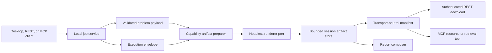

# Result Artifacts And Report Contracts

## Status

This document freezes the version 1 design decisions for result artifacts and
local report composition. Runtime support is delivered incrementally through
`RESULT_ARTIFACTS_REPORTING_ROADMAP.md`; contracts described here must not be
advertised by a release until their implementation is available.

## Boundary And Ownership

Artifact generation is a post-solve application workflow. It consumes the
exact validated problem payload retained by the local job repository together
with its `ExecutionEnvelope`. It never mutates the problem, reruns the solver,
or changes the mathematical and independent-validation statuses.



The application layer owns request validation, artifact metadata, lifecycle,
provenance, renderer ports, and report composition contracts. Infrastructure
adapters own Matplotlib Agg, tabular writers, OBJ/MTL serialization, and the
optional document backend. PySide6 widgets and Qt rendering backends are not
dependencies of this pipeline.

The current desktop widgets remain consumers of solver DTOs. Shared,
headless preparation models may later be reused by the desktop, but artifact
renderers must not call or capture existing widgets.

## Current Representation Inventory

The inventory below records the shipped desktop representations and the first
stable artifact identifiers. An identifier is scoped by the capability
descriptor: clients must discover it instead of assuming that the same name
has identical columns or options for every solver.

| Capability | Desktop representations | Version 1 artifact identifiers |
| --- | --- | --- |
| `lp.continuous` | status and objective, variable table, variable bars, optimal-face ranges, 2D/3D feasible region | `solution_table`, `variable_chart`, `optimal_face_table`, `feasible_region` |
| `milp.linear` | shared LP-style status, variable table and variable bars, solver diagnostics | `solution_table`, `variable_chart`, `validation_summary` |
| `knapsack.zero_one` | status, selection table, capacity bar, value/weight item chart | `selection_table`, `capacity_chart`, `item_chart` |
| `knapsack.bounded` | status, quantity table, capacity bar, value/weight item chart | `selection_table`, `capacity_chart`, `item_chart` |
| `knapsack.unbounded` | status, quantity table, capacity bar, value/weight item chart | `selection_table`, `capacity_chart`, `item_chart` |
| `knapsack.fractional` | status, fractional selection table, capacity bar, value/weight item chart | `selection_table`, `capacity_chart`, `item_chart` |
| `knapsack.multi_dimensional` | status, selection table, one utilization bar per resource, item chart | `selection_table`, `resource_chart`, `item_chart` |
| `graph.shortest_path.dijkstra` | path and distance summary, settled-node table, highlighted graph | `path_table`, `settled_trace_table`, `highlighted_graph` |
| `nlp.continuous_local` | numerical status, execution details, candidate table, convergence history, bounded 2D contour or 3D objective surface | `candidate_table`, `convergence_chart`, `objective_landscape` |
| `ml.regression.linear` | coefficients, metrics and predictions tables, one-feature fit plot | `coefficient_table`, `metrics_table`, `prediction_table`, `fit_chart` |
| `ml.classification.binary_logistic` | coefficients, metrics, confusion and predictions tables, confusion matrix or two-feature decision boundary | `coefficient_table`, `metrics_table`, `confusion_table`, `prediction_table`, `confusion_matrix`, `decision_boundary` |
| `packing.single_container_3d` | status, loaded/excluded/placement/capacity tables, selectable 3D scene | `placement_table`, `capacity_table`, `scene_views`, `scene_model` |

Every capability must eventually advertise and produce at least one tabular
artifact. Rich artifacts may have dimensional or result-state preconditions;
these are declared by discovery and are validated before work is queued.

## Canonical Data And Render-Only Derivations

Canonical source data consists of:

- the normalized, versioned problem payload retained in the `JobRecord`;
- the versioned result and diagnostics in the `ExecutionEnvelope`;
- the independent validation report and execution metadata.

The following values are derived for presentation and are not new solver
results: chart ordering and pagination, colors, labels, graph node layout,
sampling grids, feasible-region polygons or meshes, objective surface samples,
camera matrices, scene materials, and table truncation. Their algorithms and
versions are recorded in artifact provenance.

Render preparation may recompute deterministic values from the problem and
result, but it must not optimize again or strengthen the solver's claim. For
example, a sampled NLP surface explains a local candidate; it does not prove a
global optimum.

## Artifact Discovery

`CapabilityDescriptor` will gain an `available_artifacts` collection. Each
entry has this version 1 shape:

```json
{
  "artifact_type": "feasible_region",
  "title": "Feasible region",
  "formats": ["svg", "png", "data_json"],
  "required_mathematical_statuses": ["optimal", "feasible"],
  "options_schema": {
    "type": "object",
    "properties": {
      "theme": {"enum": ["light", "dark"]},
      "locale": {"enum": ["en", "it"]},
      "width": {"type": "integer", "minimum": 320, "maximum": 4096},
      "height": {"type": "integer", "minimum": 240, "maximum": 4096}
    },
    "additionalProperties": false
  }
}
```

Formats use stable names: `json`, `data_json`, `csv`, `markdown`, `xlsx`,
`svg`, `png`, and `obj_mtl_zip`. A capability advertises only implemented
combinations.

## Artifact Request And Manifest

Artifact contract version 1 accepts a batch after the source job reaches a
terminal state with a usable execution envelope:

```json
{
  "contract_version": "1",
  "requests": [
    {
      "artifact_type": "solution_table",
      "formats": ["json", "csv"],
      "options": {"locale": "en"}
    }
  ]
}
```

The batch is validated atomically before any item is queued. One artifact is
created per requested format. Rendering is asynchronous and uses a bounded
worker separate from mathematical execution. Repeating an equivalent request
for the same job, artifact type, format, canonical options, and renderer
version reuses the existing artifact while it remains available.

```json
{
  "contract_version": "1",
  "artifact_batch_id": "artifact-batch-...",
  "job_id": "job-...",
  "artifacts": [
    {
      "artifact_id": "artifact-...",
      "artifact_type": "solution_table",
      "format": "csv",
      "media_type": "text/csv",
      "status": "available",
      "size_bytes": 1842,
      "sha256": "...",
      "created_at": "...",
      "expires_at": "...",
      "provenance": {
        "capability_id": "lp.continuous",
        "job_id": "job-...",
        "problem_schema_version": "1",
        "result_schema_version": "1",
        "renderer_version": "1",
        "locale": "en",
        "theme": "light"
      }
    }
  ]
}
```

Artifact statuses are `queued`, `rendering`, `available`, `failed`, and
`expired`. Invalid or unsupported requests fail validation and do not create
manifest entries. A runtime failure produces a `failed` entry with a
structured, non-sensitive error.

The canonical manifest contains no transport URL. REST responses may add an
authenticated relative `download_url`; MCP exposes a resource URI or bounded
retrieval tool appropriate to the client. Large binaries are never returned
in solver results or injected into model context by default.

The implemented REST resources are:

- `POST /api/v1/jobs/{job_id}/artifacts` to atomically validate and queue a
  version 1 artifact batch;
- `GET /api/v1/jobs/{job_id}/artifacts` to poll every batch retained for the
  source job;
- `GET /api/v1/artifacts/{artifact_id}` to download verified bytes.

All three routes require the same per-session bearer token as solver routes.
Downloads use `Cache-Control: private, no-store`, return a SHA-256 ETag and
`X-Content-SHA256`, and resolve a public opaque ID through an internal storage
ID. The internal ID and filesystem location never cross the application
boundary.

## Lifecycle And Limits

Artifacts and reports are private to one local REST or MCP process session.
They are stored in an isolated temporary directory, are not restored after a
restart, and are deleted on orderly shutdown. Expired data is removed lazily
on access and periodically while the service runs. Inputs needed for rendering
remain tied to the source job; eviction of a source job prevents new renders
but does not invalidate an already materialized artifact before its expiry.

The implemented storage boundary accepts and returns only opaque artifact IDs.
The filesystem adapter generates those IDs internally, writes through a
same-directory temporary file followed by an atomic replacement, applies
private directory/file permissions, and verifies both the stored byte count and
SHA-256 digest on every read. Invalid identifiers, traversal-shaped input,
symlink replacement, missing content, and modified bytes never return file
content. Integrity failures remove the compromised entry from the session
index.

Artifact rendering uses one coordinator and one renderer worker, separate from
the mathematical job worker. A timeout marks the manifest entry as failed and
prevents late bytes from being stored. Python threads cannot be forcefully
terminated, so a non-cooperative timed-out renderer may finish privately before
the bounded renderer worker accepts later work; it cannot publish its late
result.

The initial effective limits are configuration values reported by discovery:

| Limit | Version 1 default |
| --- | --- |
| Requests in one artifact batch | 8 |
| Expanded format outputs in one batch | 16 |
| Raster dimensions | 320-4096 px per side, at most 16 megapixels |
| One generated artifact | 32 MiB |
| Session artifact storage | 256 MiB and 128 artifacts |
| Artifact lifetime after completion | 60 minutes |
| Default render timeout | 60 seconds; a descriptor may declare a lower bound |
| Report sections / blocks | 32 / 64 |
| Caller-supplied Markdown | 128 KiB |
| Report input / output | 64 MiB / 64 MiB |
| Default report timeout | 120 seconds |

An active report temporarily pins its referenced artifacts. Capacity pressure
evicts expired items first and then the oldest unpinned available items; active
renders and compositions are never silently evicted.

## Structured Errors

The artifact API extends the stable error vocabulary with:

- `artifact_not_supported`;
- `artifact_result_not_available`;
- `artifact_request_invalid`;
- `artifact_render_failed`;
- `artifact_not_found`;
- `artifact_expired`;
- `artifact_capacity_exceeded`;
- `artifact_backend_unavailable`.

Report composition adds:

- `report_request_invalid`;
- `report_artifact_not_available`;
- `report_backend_unavailable`;
- `report_composition_failed`;
- `report_not_found`;
- `report_expired`;
- `report_capacity_exceeded`.

Validation details identify JSON paths. Error context may contain IDs, limits,
and supported values, but never bearer tokens, absolute temporary paths, raw
backend commands, or untrusted document contents.

## Report Contract Version 1

The stable API models a report, not a Pandoc command. The first implementation
produces Markdown without external tools; PDF is an optional backend.

```json
{
  "contract_version": "1",
  "format": "markdown",
  "locale": "en",
  "title": "Production planning report",
  "sections": [
    {
      "section_id": "executive-summary",
      "heading": "Executive summary",
      "blocks": [
        {
          "type": "markdown",
          "content": "The validated plan uses all available machine hours."
        },
        {
          "type": "job_status",
          "job_id": "job-..."
        },
        {
          "type": "artifact",
          "artifact_id": "artifact-...",
          "caption": "Optimal production quantities"
        }
      ]
    }
  ],
  "metadata": {
    "author": "Example organization"
  }
}
```

Input block types are `markdown`, `job_status`, and `artifact`. Markdown is a
bounded safe subset; raw HTML and executable extensions are rejected. The
composer derives status wording directly from the execution envelope and does
not accept caller-authored mathematical status overrides.

If an accepted artifact cannot be embedded, the output contains an explicit
`unsupported_artifact` block with its ID and reason. This is an output state,
not an input block type. OBJ/MTL content is embedded only after conversion to
requested named static views.

Report statuses are `queued`, `composing`, `available`, `failed`, and
`expired`. Every output includes source job and artifact provenance and the
restrained footer `Optees · optees.it`. The footer identifies the tool and is
not a certification of the user's interpretation.

## Compatibility Rules

- Artifact and report contracts have versions independent from problem and
  result schema versions.
- Adding a newly advertised artifact type is backward compatible.
- Removing or renaming an artifact type, format, option, block type, or status
  requires a new contract version.
- Renderer changes that can materially alter visual semantics increment the
  renderer version recorded in provenance.
- REST and MCP expose the same lifecycle and validation semantics even though
  their retrieval mechanisms differ.
