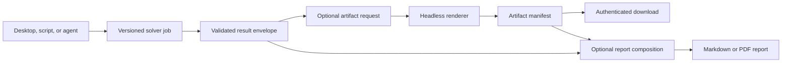

# Result Artifacts And Local Reporting Roadmap

## Purpose

Optees currently exposes versioned mathematical results through the desktop,
REST, and MCP surfaces, while most educational charts and tables are owned by
the desktop presentation layer. This roadmap makes those visual and tabular
outputs available on demand to local clients and agents, then adds a local
report composer that can assemble validated results into Markdown or PDF.

Both features are opt-in. A normal solver job must remain as small and fast as
it is today when no artifacts or reports are requested.

The intended flow is:



## Product Rules

- Solving, rendering, and report composition are separate operations.
- Artifact requests never change the mathematical problem or solver result.
- Binary content is never embedded as Base64 in the primary result envelope.
- Every capability advertises only the artifact types it can actually produce.
- Every shipped capability must expose at least one useful artifact, even when
  its only meaningful visual representation is a solution or diagnostics table.
- Renderers consume domain models and result DTOs, not Qt widgets or screenshots
  of the desktop application.
- Generated files retain provenance: capability ID, contract version, job ID,
  renderer version, locale, and content hash where appropriate.
- A report never upgrades a feasible or locally converged result into a proven
  optimum. Mathematical and independent-validation statuses remain visible.
- Unsupported, rejected, or unvalidated inputs are represented by an explicit
  report block with a reason. They are never silently omitted or rendered as if
  they had been validated.

## Canonical Formats

| Artifact kind | Preferred format | Optional formats | Notes |
| --- | --- | --- | --- |
| Two-dimensional chart | SVG | PNG, data JSON | SVG is scalable; PNG maximizes client compatibility. |
| Three-dimensional scene | OBJ + MTL ZIP | GLB later | MTL carries portable material/color information; plain OBJ alone is insufficient. |
| Three-dimensional views | PNG | SVG where meaningful | Named camera presets: isometric, front, side, and top. |
| Table | JSON | CSV, Markdown, XLSX | JSON remains canonical; presentation formats are derived. |
| Validation summary | JSON | Markdown, HTML | Must preserve check identifiers and status semantics. |
| Report | Markdown | PDF | PDF is produced by an optional local document backend. |

A caller may request a colored 3D model, one or more static views, or both. The
initial contract does not promise arbitrary camera paths, textures, animation,
or interactive browser scenes.

## Proposed Public Contract

Artifact generation belongs to a completed job and is requested separately
from the versioned problem payload:

```json
{
  "requests": [
    {
      "artifact_type": "solution_chart",
      "formats": ["svg", "png"],
      "options": {
        "locale": "en",
        "theme": "light"
      }
    },
    {
      "artifact_type": "solution_table",
      "formats": ["json", "csv"]
    }
  ]
}
```

The response is a manifest rather than the file content:

```json
{
  "job_id": "job-123",
  "artifacts": [
    {
      "artifact_id": "artifact-456",
      "artifact_type": "solution_chart",
      "format": "svg",
      "media_type": "image/svg+xml",
      "size_bytes": 18420,
      "sha256": "...",
      "status": "available",
      "download_url": "/api/v1/artifacts/artifact-456"
    }
  ]
}
```

Capabilities extend discovery with an `available_artifacts` collection. Each
entry declares formats, required result states, supported options, and limits.
This keeps agents from guessing whether a feasible-region plot, decision
boundary, or 3D scene exists for a given problem.

Suggested REST resources:

- `POST /api/v1/jobs/{job_id}/artifacts`;
- `GET /api/v1/jobs/{job_id}/artifacts`;
- `GET /api/v1/artifacts/{artifact_id}`;
- `POST /api/v1/reports`;
- `GET /api/v1/reports/{report_id}`;
- `GET /api/v1/reports/{report_id}/download`.

Suggested MCP tools:

- `optees_list_result_artifacts`;
- `optees_render_result_artifacts`;
- `optees_get_artifact` or a local-resource equivalent;
- `optees_compose_report`;
- `optees_get_report_status`;
- `optees_get_report` or a local-resource equivalent.

The final MCP transfer mechanism must respect client size limits. Large binary
files should be exposed as authenticated local resources or explicit local
downloads rather than copied into the model context.

## Capability Artifact Baseline

The exact inventory must be confirmed against the desktop implementation before
contracts are frozen. The intended minimum is:

| Capability family | Minimum artifacts | Optional richer artifacts |
| --- | --- | --- |
| LP | Variable table, objective summary | Variable bars, feasible region, optimal-face ranges |
| MILP | Variable table, objective and validation summary | Integrality/resource charts where the model permits them |
| Knapsack | Selection table, capacity use | Value/weight chart, resource charts |
| NLP | Candidate table, convergence history | 2D contours or 3D objective surface for supported dimensions |
| Dijkstra | Distance/path table | Highlighted graph and path |
| Regression | Coefficients and metrics table | Fit plot, residual plot, prediction intervals later |
| Classification | Metrics/confusion table | Confusion matrix and supported decision boundary |
| Packing 3D | Placement table | OBJ + MTL bundle and requested static camera views |

## Known Desktop Scalability Gap

The Knapsack solution page scrolls vertically and its table handles many rows,
but the item chart currently divides a fixed visible width by the complete item
count. With dozens of items, bars and labels become too narrow and may overlap.
Artifact extraction must not preserve that behavior.

Before the Knapsack renderer is declared complete:

- [ ] Add a deterministic large-instance presentation policy.
- [ ] Keep the full result available in the table and machine-readable export.
- [ ] Provide a paged or horizontally windowed chart for item-level inspection.
- [ ] Provide an aggregate selected/unselected summary for very large instances.
- [ ] State when a chart displays only a window or top-N subset.
- [ ] Test tens, hundreds, long labels, and localized labels without overlap.
- [ ] Apply the same policy to the desktop view and headless artifact renderer.

## Report Composition Contract

The public feature is a **Report Composer**. Pandoc is an implementation adapter,
not part of the stable API vocabulary.

```json
{
  "version": "1",
  "format": "pdf",
  "locale": "it",
  "title": "Production planning report",
  "sections": [
    {
      "heading": "Executive summary",
      "content_markdown": "The validated plan maximizes..."
    },
    {
      "heading": "Solver result",
      "artifact_ids": ["artifact-456", "artifact-789"]
    }
  ]
}
```

Supported conversion behavior for the first release:

- PNG and SVG assets are embedded with validated captions and dimensions.
- JSON, CSV, and XLSX table artifacts are converted to bounded report tables;
  sheet/range selection must be explicit for user-supplied workbooks.
- OBJ + MTL bundles are converted to the requested named static views before
  document composition.
- Unsupported media, invalid content, failed conversion, or missing provenance
  produces a visible `unsupported_artifact` block containing the reason.
- Optees localizes its template labels in English and Italian. It does not
  claim to translate arbitrary user prose without a language model; the caller
  supplies that prose in the desired language.

Official reports include a restrained blue footer with `Optees · optees.it`.
PDF output uses a clickable link; Markdown uses a final provenance line. The
footer identifies the generating tool, not a certification or guarantee of the
business interpretation. A report may also include the Optees version and
source job IDs in its metadata.

## Security And Resource Limits

- Keep all services bound to the existing authenticated local surfaces.
- Accept artifact IDs or bounded uploads, never arbitrary filesystem paths.
- Reject remote URLs and network-backed assets.
- Do not expose arbitrary Pandoc arguments, filters, templates, includes, raw
  shell commands, or TeX shell escape.
- Sanitize Markdown/HTML according to the selected backend.
- Enforce media type, file signature, dimensions, row count, file size,
  section count, total report size, rendering timeout, and concurrent-job limits.
- Render in an isolated temporary directory and delete expired artifacts.
- Hash generated and imported inputs and preserve provenance in the manifest.
- Treat user-supplied spreadsheets and 3D files as unvalidated until their
  dedicated validator has accepted the subset used by the report.

## Delivery Plan

### Phase 0 - Inventory And Contract Decisions

- [x] Inventory every chart, table, and 3D representation currently shipped in
  the desktop for all public capabilities.
- [x] Separate canonical result data from presentation-only calculations.
- [x] Define artifact IDs, statuses, formats, options, limits, and error codes.
- [x] Decide storage lifetime and cleanup behavior for REST and MCP sessions.
- [x] Freeze the report document schema independently from Pandoc.
- [x] Add architecture diagrams and API examples to the canonical docs.

Phase 0 is frozen in `RESULT_ARTIFACTS_CONTRACT.md`. Implementation changes
must keep that document, capability discovery, and runtime behavior aligned.

### Phase 1 - Headless Artifact Foundation

- [x] Introduce application-owned artifact request and manifest DTOs.
- [x] Add renderer ports that do not import PySide6 or Qt backends.
- [x] Add deterministic theme, locale, dimensions, fonts, and renderer versions.
- [x] Implement bounded local artifact storage with hashes and cleanup.
- [x] Implement authenticated REST generation, listing, and download endpoints.
- [x] Extend capability discovery with `available_artifacts`.
- [x] Add contract, authorization, traversal, size, timeout, and cleanup tests.

The Phase 1 runtime now separates public manifest IDs from internal storage
IDs, validates a complete request before queueing, renders on a bounded worker,
enforces a logical timeout, reuses equivalent available outputs, and exposes
authenticated create, list, and verified-download routes. Downloads are
resolved only by opaque ID and include SHA-256 metadata; neither manifests nor
responses expose filesystem paths. Focused tests cover authorization,
transport validation, request atomicity, timeout sanitization, deduplication,
traversal-shaped IDs, symlink and byte tampering, capacity, expiration,
pinning, and shutdown cleanup.

Every public capability advertises at least one semantic result table through
`available_artifacts`. Dijkstra and the supervised-learning capabilities now
advertise their additional trace, metrics, confusion, and prediction tables.
The shared canonical renderer produces deterministic version 1 JSON, RFC 4180
CSV, and bounded Markdown without importing Qt. Unsupported artifact types or
formats still return `artifact_not_supported`; discovery is the source of truth
and clients must not guess richer outputs.

### Phase 2 - Tables And First Visual Slice

- [x] Implement canonical JSON and CSV table artifacts for every capability.
- [x] Implement Markdown tables with explicit truncation metadata.
- [x] Extract LP visual renderers as the first 2D/3D reference slice.
- [x] Verify SVG and PNG output in headless CI.
- [x] Add golden semantic tests and image non-blank/dimension checks without
  relying only on brittle pixel-perfect snapshots.

The LP reference slice now advertises `feasible_region` for optimal models
with exactly two or three variables. Its Matplotlib Agg adapter renders SVG
and PNG without Qt, uses bounded sampling, localizes the title, applies the
declared light/dark theme, and preserves requested dimensions. Tests inspect
semantic SVG labels plus PNG headers, dimensions, and pixel variance rather
than relying on platform-sensitive golden screenshots.

### Phase 3 - Capability Rollout

- [x] MILP variable charts and Knapsack item/capacity/resource charts,
  including bounded large-instance rendering.
- [x] MILP validation summary and remaining diagnostic table artifacts.
- [x] NLP convergence and bounded 2D/3D objective visualizations.
- [x] Dijkstra graph/path artifacts.
- [x] Regression and classification diagnostics.
- [x] Packing placement/capacity tables, OBJ + MTL export, and named PNG
  camera views.
- [x] Keep desktop rendering behavior aligned with shared headless preparation.

Categorical SVG/PNG rendering is shared by MILP and Knapsack without sharing
their public artifact identifiers. Category-heavy views preserve input order,
default to 40 entries, accept at most 200, and include a visible
shown-versus-total note when truncated. This keeps API output bounded while
leaving complete JSON/CSV/Markdown tables available for analysis.

The analytical renderer completes the NLP, Dijkstra, regression, and binary
classification artifact inventory without importing Qt. Dijkstra exposes the
shortest path, settled-node trace, and a deterministic highlighted graph. NLP
exposes its candidate table, convergence history, and a two-variable objective
landscape selectable as contour or 3D surface. Regression exposes coefficient,
metrics, and prediction tables plus a one-feature fit chart. Classification
exposes coefficient, metrics, confusion, and prediction tables plus a confusion
matrix and a two-feature decision boundary. SVG/PNG rendering, sampling, point
counts, and graph size are bounded; incompatible dimensions produce an
explicit failed artifact rather than a misleading projection.

Packing completes its version 1 artifact inventory with placement and
capacity-utilization tables, named static cameras, and a portable scene model.
The PNG renderer supports isometric, front, side, top, or a four-view contact
sheet without importing Qt. The deterministic model archive contains OBJ, MTL,
and a machine-readable manifest; item colors are stable across PNG and OBJ
outputs. Both renderers preserve the solver coordinates exactly and reject
empty or oversized scenes instead of inventing or truncating placements.

MILP now exposes separate, machine-readable validation and solver-diagnostic
tables. Validation output preserves check codes, statuses, measurements,
violations, tolerances, and limitations; diagnostics preserve mathematical
status, termination reason, warnings, and stable sorted backend fields.

Desktop LP and Knapsack charts now use the same deterministic 40-category
window as headless categorical artifacts. Complete values remain available in
their tables and exports, while the chart explicitly reports truncation.

### Phase 4 - MCP Artifact Access

- [x] Expose artifact discovery and rendering through MCP.
- [x] Prevent large binaries from being injected into model context by default.
- [x] Provide clear tool descriptions and example agent workflows.
- [x] Add automated end-to-end MCP coverage for discovery, render polling,
  metadata inspection, explicit resource transfer, and unsafe-ID rejection.
- [ ] Run the empirical artifact-selection study with one frontier agent and at
  least two local tool-capable models after the Markdown report workflow exists.
- [ ] Record artifact selection accuracy, transfer failures, and token impact in
  that study.

Phase 4 engineering is complete. MCP now exposes three metadata tools and one
explicit resource template. `optees_list_result_artifacts` discovers supported
outputs and prior batches, `optees_render_result_artifacts` requests bounded
generation, and `optees_get_artifact` reports status, media type, byte count,
hash, and a resource URI. None of those tools returns file bytes or filesystem
paths. Content is read only through
`optees-artifact://{artifact_id}`, which delegates to the same bounded,
SHA-256-verifying store used by REST.

The empirical model study remains deliberately scheduled after Phase 5, as
previously agreed, so agents can be evaluated on a useful solve-render-compose
workflow rather than an isolated file download. Existing Claude/Qwen/Granite
evidence establishes general MCP tool compatibility but is not misreported as
artifact-selection accuracy.

### Phase 5 - Markdown Report MVP

- [x] Implement the versioned report schema and validator.
- [x] Compose headings, Markdown content, tables, images, captions, statuses,
  validation summaries, and provenance.
- [x] Add the official `Optees · optees.it` footer.
- [x] Represent rejected or unsupported assets explicitly.
- [x] Produce deterministic Markdown without requiring Pandoc.
- [x] Expose report creation and retrieval through REST and MCP.

Phase 5 engineering is complete. `ReportCompositionService` owns a dedicated
single-worker lifecycle and stores Markdown in a separate bounded,
session-private `LocalArtifactStore`. Report inputs accept only the frozen
version 1 block vocabulary (`markdown`, `job_status`, and `artifact`), reject
raw HTML, unsafe link targets, arbitrary paths, and undeclared fields, and
temporarily pin referenced artifacts during composition. Missing, expired, or
non-embeddable sources remain visible as `unsupported_artifact` blocks.

REST exposes authenticated creation, status polling, and verified download at
`POST /api/v1/reports`, `GET /api/v1/reports/{report_id}`, and
`GET /api/v1/reports/{report_id}/download`. MCP mirrors the same lifecycle with
`optees_compose_report`, `optees_get_report_status`, and
`optees_get_report`; bytes are transferred only through an explicit
`optees-report://{report_id}` resource read. The output contains source IDs,
artifact hashes and media types, independent validation status, and the
official footer. Pandoc and PDF remain intentionally outside this phase.

### Phase 6 - Local PDF Backend

- [x] Add a report-backend port and a Pandoc adapter discovered at runtime.
- [x] Select and document a bounded PDF engine such as Typst before packaging.
- [x] Fail with a capability diagnostic when the PDF backend is unavailable.
- [x] Disable unsafe Pandoc features and enforce fixed bundled templates.
- [x] Define and structurally validate fonts, page breaks, wide tables,
  captions, links, and footers in the fixed template.
- [x] Decide whether Pandoc and the PDF engine remain optional dependencies or
  are bundled per platform only after installer-size and license review.

Phase 6 engineering is complete. `ReportBackendPort` isolates document
production from the application service. The first adapter discovers Pandoc
and Typst at runtime, executes only a fixed command and bundled A4 template in
an isolated private directory, enforces time and output-size limits, and
returns a sanitized capability diagnostic when either executable is absent.
The template defines bounded typography, breakable tables, image captions,
clickable links, and the official page footer. Structural and mocked-runtime
tests cover the contract. A source-environment acceptance run on macOS with
Pandoc 3.7.0.2 and Typst 0.15.1 produced a valid single-page A4 PDF containing
solver status, independent validation, a Markdown table, a PNG chart, artifact
hashes, and the Optees footer. This proves the real adapter path on that
development environment; installed release-candidate acceptance remains part
of the Phase 7 gate.

Pandoc and Typst remain optional for version 1. Markdown reporting is the
dependency-free baseline. Bundling the two executables is deliberately
deferred until installer-size, license, update, and three-platform acceptance
have been reviewed.

### Phase 7 - Conversion And Packaging Hardening

- [x] Convert validated spreadsheet/table assets to bounded report tables.
- [x] Convert OBJ + MTL bundles to selected static views during PDF
  composition.
- [x] Add cancellation and progress reporting for expensive renders/reports.
- [ ] Smoke-test artifact and report creation in macOS, Windows, and Linux
  installed release candidates.
- [x] Document installation, availability diagnostics, and agent examples.
- [ ] Add representative generated reports to agent-effectiveness benchmarks.

Phase 7 engineering is complete. Stored XLSX content is parsed without office
automation, limited by archive, XML, row, column, and cell budgets, and reduced
to its first worksheet. Stored Packing OBJ+MTL bundles are revalidated,
bounded, and rendered only through the four named camera views. Duplicate ZIP
entries, unsafe paths, compression bombs, invalid indices, and non-finite
geometry or colors are rejected.

Artifact and report manifests now expose monotonic progress and terminal
`cancelled` states through REST and MCP. Cancellation prevents late
publication; the optional PDF backend also terminates its process group.
Operational usage is documented in `LOCAL_REPORTING.md`.

The two remaining checkboxes are release and empirical evidence gates. They
cannot be closed by source tests on one machine: each installed release
candidate must complete the documented solve-render-compose-download smoke,
and representative reports must be retained under the agent benchmark
protocol before this initiative's overall completion gate is satisfied.

An additional local-agent acceptance run used `qwen3.5:9b` through the bounded
Ollama harness. The model requested report composition through metadata-only
tools, polled the returned opaque report ID, and reported the authenticated
relative download endpoint. The downloaded PDF was then independently
inspected as a valid single-page A4 document. This is useful compatibility
evidence, but it is one synthetic run rather than the multi-model empirical
study required by Phase 4.

## Completion Gate

This initiative is complete only when:

1. every public capability advertises and produces at least one tested artifact;
2. jobs without artifact requests remain behaviorally and operationally stable;
3. REST and MCP expose the same artifact/report semantics;
4. artifact files are reproducible enough for auditing and carry provenance;
5. Markdown reports work with no external document dependency;
6. PDF reports fail clearly when their local backend is unavailable;
7. unsupported inputs are visible rather than silently dropped;
8. native release candidates pass one end-to-end solve, render, compose, and
   download smoke test on every supported platform.
