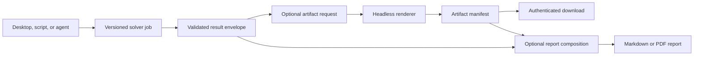

# Result Artifacts And Local Reporting Roadmap

## Purpose

Optees currently exposes versioned mathematical results through the desktop,
REST, and MCP surfaces, while most educational charts and tables are owned by
the desktop presentation layer. This roadmap makes those visual and tabular
outputs available on demand to local clients and agents, then adds a local
report composer that can assemble validated results into Markdown or PDF.

Both features are opt-in. A normal solver job must remain as small and fast as
it is today when no artifacts or reports are requested.

The intended flow is:



## Product Rules

- Solving, rendering, and report composition are separate operations.
- Artifact requests never change the mathematical problem or solver result.
- Binary content is never embedded as Base64 in the primary result envelope.
- Every capability advertises only the artifact types it can actually produce.
- Every shipped capability must expose at least one useful artifact, even when
  its only meaningful visual representation is a solution or diagnostics table.
- Renderers consume domain models and result DTOs, not Qt widgets or screenshots
  of the desktop application.
- Generated files retain provenance: capability ID, contract version, job ID,
  renderer version, locale, and content hash where appropriate.
- A report never upgrades a feasible or locally converged result into a proven
  optimum. Mathematical and independent-validation statuses remain visible.
- Unsupported, rejected, or unvalidated inputs are represented by an explicit
  report block with a reason. They are never silently omitted or rendered as if
  they had been validated.

## Canonical Formats

| Artifact kind | Preferred format | Optional formats | Notes |
| --- | --- | --- | --- |
| Two-dimensional chart | SVG | PNG, data JSON | SVG is scalable; PNG maximizes client compatibility. |
| Three-dimensional scene | OBJ + MTL ZIP | GLB later | MTL carries portable material/color information; plain OBJ alone is insufficient. |
| Three-dimensional views | PNG | SVG where meaningful | Named camera presets: isometric, front, side, and top. |
| Table | JSON | CSV, Markdown, XLSX | JSON remains canonical; presentation formats are derived. |
| Validation summary | JSON | Markdown, HTML | Must preserve check identifiers and status semantics. |
| Report | Markdown | PDF | PDF is produced by an optional local document backend. |

A caller may request a colored 3D model, one or more static views, or both. The
initial contract does not promise arbitrary camera paths, textures, animation,
or interactive browser scenes.

## Proposed Public Contract

Artifact generation belongs to a completed job and is requested separately
from the versioned problem payload:

```json
{
  "requests": [
    {
      "artifact_type": "solution_chart",
      "formats": ["svg", "png"],
      "options": {
        "locale": "en",
        "theme": "light"
      }
    },
    {
      "artifact_type": "solution_table",
      "formats": ["json", "csv"]
    }
  ]
}
```

The response is a manifest rather than the file content:

```json
{
  "job_id": "job-123",
  "artifacts": [
    {
      "artifact_id": "artifact-456",
      "artifact_type": "solution_chart",
      "format": "svg",
      "media_type": "image/svg+xml",
      "size_bytes": 18420,
      "sha256": "...",
      "status": "available",
      "download_url": "/api/v1/artifacts/artifact-456"
    }
  ]
}
```

Capabilities extend discovery with an `available_artifacts` collection. Each
entry declares formats, required result states, supported options, and limits.
This keeps agents from guessing whether a feasible-region plot, decision
boundary, or 3D scene exists for a given problem.

Suggested REST resources:

- `POST /api/v1/jobs/{job_id}/artifacts`;
- `GET /api/v1/jobs/{job_id}/artifacts`;
- `GET /api/v1/artifacts/{artifact_id}`;
- `POST /api/v1/reports`;
- `GET /api/v1/reports/{report_id}`;
- `GET /api/v1/reports/{report_id}/download`.

Suggested MCP tools:

- `optees_list_result_artifacts`;
- `optees_render_result_artifacts`;
- `optees_get_artifact` or a local-resource equivalent;
- `optees_compose_report`;
- `optees_get_report_status`;
- `optees_get_report` or a local-resource equivalent.

The final MCP transfer mechanism must respect client size limits. Large binary
files should be exposed as authenticated local resources or explicit local
downloads rather than copied into the model context.

## Capability Artifact Baseline

The exact inventory must be confirmed against the desktop implementation before
contracts are frozen. The intended minimum is:

| Capability family | Minimum artifacts | Optional richer artifacts |
| --- | --- | --- |
| LP | Variable table, objective summary | Variable bars, feasible region, optimal-face ranges |
| MILP | Variable table, objective and validation summary | Integrality/resource charts where the model permits them |
| Knapsack | Selection table, capacity use | Value/weight chart, resource charts |
| NLP | Candidate table, convergence history | 2D contours or 3D objective surface for supported dimensions |
| Dijkstra | Distance/path table | Highlighted graph and path |
| Regression | Coefficients and metrics table | Fit plot, residual plot, prediction intervals later |
| Classification | Metrics/confusion table | Confusion matrix and supported decision boundary |
| Packing 3D | Placement table | OBJ + MTL bundle and requested static camera views |

## Known Desktop Scalability Gap

The Knapsack solution page scrolls vertically and its table handles many rows,
but the item chart currently divides a fixed visible width by the complete item
count. With dozens of items, bars and labels become too narrow and may overlap.
Artifact extraction must not preserve that behavior.

Before the Knapsack renderer is declared complete:

- [ ] Add a deterministic large-instance presentation policy.
- [ ] Keep the full result available in the table and machine-readable export.
- [ ] Provide a paged or horizontally windowed chart for item-level inspection.
- [ ] Provide an aggregate selected/unselected summary for very large instances.
- [ ] State when a chart displays only a window or top-N subset.
- [ ] Test tens, hundreds, long labels, and localized labels without overlap.
- [ ] Apply the same policy to the desktop view and headless artifact renderer.

## Report Composition Contract

The public feature is a **Report Composer**. Pandoc is an implementation adapter,
not part of the stable API vocabulary.

```json
{
  "version": "1",
  "format": "pdf",
  "locale": "it",
  "title": "Production planning report",
  "sections": [
    {
      "heading": "Executive summary",
      "content_markdown": "The validated plan maximizes..."
    },
    {
      "heading": "Solver result",
      "artifact_ids": ["artifact-456", "artifact-789"]
    }
  ]
}
```

Supported conversion behavior for the first release:

- PNG and SVG assets are embedded with validated captions and dimensions.
- JSON, CSV, and XLSX table artifacts are converted to bounded report tables;
  sheet/range selection must be explicit for user-supplied workbooks.
- OBJ + MTL bundles are converted to the requested named static views before
  document composition.
- Unsupported media, invalid content, failed conversion, or missing provenance
  produces a visible `unsupported_artifact` block containing the reason.
- Optees localizes its template labels in English and Italian. It does not
  claim to translate arbitrary user prose without a language model; the caller
  supplies that prose in the desired language.

Official reports include a restrained blue footer with `Optees · optees.it`.
PDF output uses a clickable link; Markdown uses a final provenance line. The
footer identifies the generating tool, not a certification or guarantee of the
business interpretation. A report may also include the Optees version and
source job IDs in its metadata.

## Security And Resource Limits

- Keep all services bound to the existing authenticated local surfaces.
- Accept artifact IDs or bounded uploads, never arbitrary filesystem paths.
- Reject remote URLs and network-backed assets.
- Do not expose arbitrary Pandoc arguments, filters, templates, includes, raw
  shell commands, or TeX shell escape.
- Sanitize Markdown/HTML according to the selected backend.
- Enforce media type, file signature, dimensions, row count, file size,
  section count, total report size, rendering timeout, and concurrent-job limits.
- Render in an isolated temporary directory and delete expired artifacts.
- Hash generated and imported inputs and preserve provenance in the manifest.
- Treat user-supplied spreadsheets and 3D files as unvalidated until their
  dedicated validator has accepted the subset used by the report.

## Delivery Plan

### Phase 0 - Inventory And Contract Decisions

- [ ] Inventory every chart, table, and 3D representation currently shipped in
  the desktop for all public capabilities.
- [ ] Separate canonical result data from presentation-only calculations.
- [ ] Define artifact IDs, statuses, formats, options, limits, and error codes.
- [ ] Decide storage lifetime and cleanup behavior for REST and MCP sessions.
- [ ] Freeze the report document schema independently from Pandoc.
- [ ] Add architecture diagrams and API examples to the canonical docs.

### Phase 1 - Headless Artifact Foundation

- [ ] Introduce application-owned artifact request and manifest DTOs.
- [ ] Add renderer ports that do not import PySide6 or Qt backends.
- [ ] Add deterministic theme, locale, dimensions, fonts, and renderer versions.
- [ ] Implement bounded local artifact storage with hashes and cleanup.
- [ ] Implement authenticated REST generation, listing, and download endpoints.
- [ ] Extend capability discovery with `available_artifacts`.
- [ ] Add contract, authorization, traversal, size, timeout, and cleanup tests.

### Phase 2 - Tables And First Visual Slice

- [ ] Implement canonical JSON and CSV table artifacts for every capability.
- [ ] Implement Markdown tables with explicit truncation metadata.
- [ ] Extract LP visual renderers as the first 2D/3D reference slice.
- [ ] Verify SVG and PNG output in headless CI.
- [ ] Add golden semantic tests and image non-blank/dimension checks without
  relying only on brittle pixel-perfect snapshots.

### Phase 3 - Capability Rollout

- [ ] MILP and Knapsack artifacts, including the large-instance UX correction.
- [ ] NLP convergence and bounded 2D/3D objective visualizations.
- [ ] Dijkstra graph/path artifacts.
- [ ] Regression and classification diagnostics.
- [ ] Packing placement tables, OBJ + MTL export, and named PNG camera views.
- [ ] Keep desktop rendering behavior aligned with shared headless preparation.

### Phase 4 - MCP Artifact Access

- [ ] Expose artifact discovery and rendering through MCP.
- [ ] Prevent large binaries from being injected into model context by default.
- [ ] Provide clear tool descriptions and example agent workflows.
- [ ] Test one frontier agent and at least two local tool-capable models.
- [ ] Record artifact selection accuracy, transfer failures, and token impact.

### Phase 5 - Markdown Report MVP

- [ ] Implement the versioned report schema and validator.
- [ ] Compose headings, Markdown content, tables, images, captions, statuses,
  validation summaries, and provenance.
- [ ] Add the official `Optees · optees.it` footer.
- [ ] Represent rejected or unsupported assets explicitly.
- [ ] Produce deterministic Markdown without requiring Pandoc.
- [ ] Expose report creation and retrieval through REST and MCP.

### Phase 6 - Local PDF Backend

- [ ] Add a report-backend port and a Pandoc adapter discovered at runtime.
- [ ] Select and document a bounded PDF engine such as Typst before packaging.
- [ ] Fail with a capability diagnostic when the PDF backend is unavailable.
- [ ] Disable unsafe Pandoc features and enforce fixed bundled templates.
- [ ] Validate fonts, page breaks, wide tables, captions, links, and footers.
- [ ] Decide whether Pandoc and the PDF engine remain optional dependencies or
  are bundled per platform only after installer-size and license review.

### Phase 7 - Conversion And Packaging Hardening

- [ ] Convert validated spreadsheet/table assets to bounded report tables.
- [ ] Convert OBJ + MTL bundles to selected static views.
- [ ] Add cancellation and progress reporting for expensive renders/reports.
- [ ] Smoke-test artifact and report creation in macOS, Windows, and Linux
  installed release candidates.
- [ ] Document installation, availability diagnostics, and agent examples.
- [ ] Add representative generated reports to agent-effectiveness benchmarks.

## Completion Gate

This initiative is complete only when:

1. every public capability advertises and produces at least one tested artifact;
2. jobs without artifact requests remain behaviorally and operationally stable;
3. REST and MCP expose the same artifact/report semantics;
4. artifact files are reproducible enough for auditing and carry provenance;
5. Markdown reports work with no external document dependency;
6. PDF reports fail clearly when their local backend is unavailable;
7. unsupported inputs are visible rather than silently dropped;
8. native release candidates pass one end-to-end solve, render, compose, and
   download smoke test on every supported platform.
