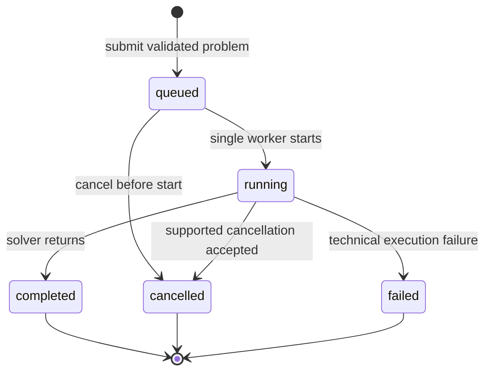

# Local Job Service

`LocalJobService` is the application-level orchestration layer between the
synchronous optimization facade and the future local REST adapter. It does not
open a port and does not import Qt.

## Lifecycle

`job_status` describes execution lifecycle. `mathematical_status` describes the
solver result and is absent until an execution envelope exists. An infeasible
problem is therefore a completed job, while a cancelled packing job may still
carry a feasible incumbent.

## Concurrency And Retention

- One worker executes solver calls, so accepted jobs after the active one are
  explicitly `queued`.
- The in-memory repository has a configurable positive capacity.
- When space is needed, the oldest terminal job is evicted first.
- Running and queued jobs are never evicted. New submissions are rejected when
  active jobs occupy the whole capacity.
- Shutdown stops accepting work and optionally cancels queued work and running
  capabilities that genuinely support cooperative cancellation.

## Cancellation And Limits

Queued jobs can be cancelled without backend support because execution has not
started. Running cancellation is currently available for
`packing.single_container_3d`. Other capabilities return a structured
`cancellation_not_supported` error.

Packing and MILP time limits remain solver options. A feasible incumbent is
retained with `mathematical_status: feasible` and
`termination_reason: time_limit`. Cancellation similarly preserves an
incumbent but never upgrades it to an optimality certificate.
