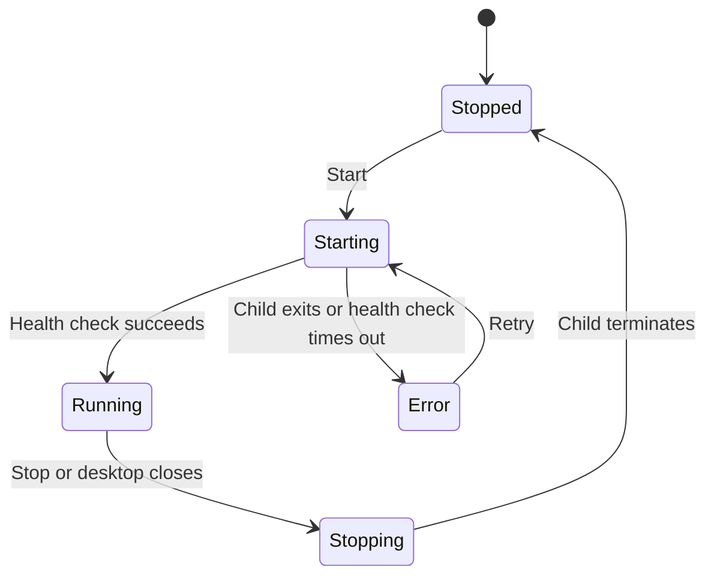

# Local Server Process And Desktop Controls

Optees can expose its versioned solver contracts to local scripts, IDE agents,
and other software running on the same computer. The desktop starts the API in
a separate process, so HTTP work and solver jobs never execute in the Qt event
loop.

## Desktop Workflow

Open **Settings > Local Solver Service** and choose a preferred TCP port. The
default is `8765`.

1. Select **Start service**.
2. Wait for the status to become **Running**.
3. Use **Copy URL** for the loopback address only.
4. Use **Copy connection configuration** when the client also needs the
   private bearer token.
5. Use **Open API schema** to open an authenticated snapshot of the current
   OpenAPI JSON contract.
6. Select **Stop service** when the integration is no longer needed.

If the preferred port is occupied, Optees selects a free loopback port and
shows the actual URL. Closing the desktop application stops its child server.
A restart creates a different token.

The copied connection object has this shape:

```json
{
  "api_version": "v1",
  "authorization": "Bearer <session-token>",
  "base_url": "http://127.0.0.1:8765",
  "openapi_url": "http://127.0.0.1:8765/api/v1/openapi.json"
}
```

Treat the copied object as a temporary secret. Do not commit it, paste it into
public issue reports, or retain it after the service stops.

## Headless Workflow

Source and wheel installations expose the same server entry point used by the
desktop process manager:

```bash
export OPTEES_LOCAL_SERVER_TOKEN="$(python -c 'import secrets; print(secrets.token_urlsafe(32))')"
optees-server --port 8765
```

The packaged desktop executable dispatches the same entry point internally
with `--local-server`; users should normally control packaged builds through
Settings.

## Lifecycle



## Security And Limitations

- The server binds only to `127.0.0.1`; it is not a LAN or hosted service.
- Every endpoint except `/health` requires the session bearer token.
- Hosted agents generally cannot reach a service on the user's localhost.
- Jobs, results, and credentials are in memory and disappear at shutdown.
- The MVP executes one heavy solver job at a time and queues accepted work.
- The API accepts versioned mathematical JSON, not executable source code or
  unrestricted filesystem paths.
- Opening the schema exports a temporary authenticated JSON snapshot; it does
  not expose an unauthenticated Swagger page.

See [Local REST API](local-rest-api.md) for endpoints and request examples.
