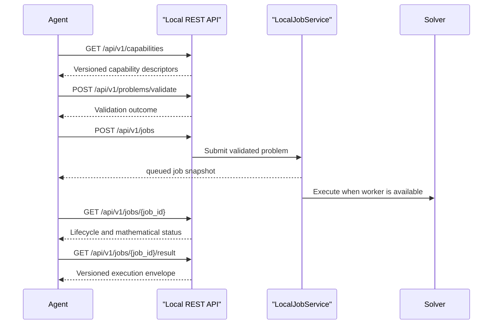

# Local REST API

The local API exposes Optees capability discovery, validation, queued jobs,
results, and cancellation to software agents. It is an optional adapter over
the same application services used by the headless CLI.

## Installation

Install the dedicated dependency extra from a source checkout:

```bash
python -m pip install -e ".[local-service]"
```

The desktop application and `optees-cli` do not import FastAPI when the local
service is unused.

## Security Boundary

- The provided runner accepts only `127.0.0.1` as its bind address.
- Every endpoint except `/health` requires a bearer token containing at least
  32 characters.
- Default public Swagger and ReDoc routes are disabled. OpenAPI is served at
  authenticated `/api/v1/openapi.json`.
- No permissive CORS middleware is installed.
- Mutation requests must use `Content-Type: application/json` and are limited
  to 1 MiB by default.
- Requests accept versioned mathematical JSON objects, never source code or
  unrestricted filesystem paths.
- Jobs and tokens are in-memory session data and are not persisted.

Packaged builds generate and supervise a tokenized child process through the
desktop Settings page. Source and wheel installations can start the same
headless entry point explicitly:

```bash
export OPTEES_TOKEN="$(python -c 'import secrets; print(secrets.token_urlsafe(32))')"
OPTEES_LOCAL_SERVER_TOKEN="${OPTEES_TOKEN}" optees-server --port 8765
```

The default URL is `http://127.0.0.1:8765`.

See [Server Process And Desktop Controls](server-process-and-desktop.md) for
the GUI workflow, copied connection contract, lifecycle, and limitations.

## Workflow



## Example

```bash
curl \
  -H "Authorization: Bearer $OPTEES_TOKEN" \
  http://127.0.0.1:8765/api/v1/capabilities
```

Submit a problem with the capability identifier outside the versioned problem
payload:

```json
{
  "capability_id": "lp.continuous",
  "problem": {
    "version": "1",
    "variables": [{"name": "x", "label": "", "lb": 0, "ub": 1}],
    "objective": {"sense": "max", "coefficients": [1], "offset": 0},
    "constraints": []
  }
}
```

`POST /api/v1/jobs` returns `202` and a job snapshot. Poll the returned job ID,
then retrieve `/api/v1/jobs/{job_id}/result`. Mathematical infeasibility is a
completed job result, not an HTTP execution failure.

## Independent Batch Execution

For repeated independent scenarios, use the batch endpoints:

```text
POST /api/v1/batches/validate
POST /api/v1/batches
GET  /api/v1/batches/{batch_id}
GET  /api/v1/batches/{batch_id}/result
POST /api/v1/batches/{batch_id}/cancel
```

The version 1 request contains 1 to 32 items:

```json
{
  "version": "1",
  "items": [
    {
      "client_item_id": "region-north",
      "capability_id": "ml.regression.linear",
      "problem": {"version": "1"}
    }
  ]
}
```

`problem` must contain the complete capability-specific payload. Client item
IDs must be unique. Validation and submission are all-or-nothing: Optees
creates no jobs if an item is invalid or unavailable, or if the bounded queue
cannot accept the complete batch. The result contains one normal execution
envelope per item plus aggregate status counts. Batch execution is not a
dependency graph; stages whose inputs depend on earlier outputs must be
orchestrated explicitly.

## Optional Result Artifacts

Completed jobs can use the authenticated artifact lifecycle:

```text
POST /api/v1/jobs/{job_id}/artifacts
GET  /api/v1/jobs/{job_id}/artifacts
GET  /api/v1/artifacts/{artifact_id}
```

The POST body is a version 1 batch:

```json
{
  "contract_version": "1",
  "requests": [
    {
      "artifact_type": "solution_table",
      "formats": ["csv"],
      "options": {"locale": "en"}
    }
  ]
}
```

Optees validates the complete request before queueing any output. Poll the job
artifact collection until entries become `available`, `failed`, or `expired`.
Downloads are private, bearer-authenticated responses with SHA-256 metadata;
artifact manifests and result envelopes never contain binary content or local
filesystem paths.

Every current capability exposes one canonical table in `json`, `csv`, and
`markdown`. Markdown accepts a bounded `max_rows` option and reports
truncation explicitly; JSON and CSV retain the complete row set.
Continuous LP also exposes `feasible_region` in `svg` and `png` for optimal
problems with exactly two or three variables. Its options include locale,
light/dark theme, width, and height; use capability discovery for the exact
bounds.
MILP and Knapsack expose capability-specific SVG/PNG bar charts. Charts with
potentially many variables, items, or resources accept `max_items` from 1 to
200 and visibly disclose truncation. Request the canonical table when complete
machine-readable rows are required.
Artifact identifiers are capability-specific, for example `solution_table` for
LP/MILP, `selection_table` for Knapsack, `coefficient_table` for regression and
classification, and `placement_table` for packing. Clients must use discovery
instead of hardcoding this mapping. Requests outside the advertised inventory
return `artifact_not_supported`. See
[Result Artifacts Contract](../RESULT_ARTIFACTS_CONTRACT.md) for formats,
limits, provenance, and lifecycle semantics.
