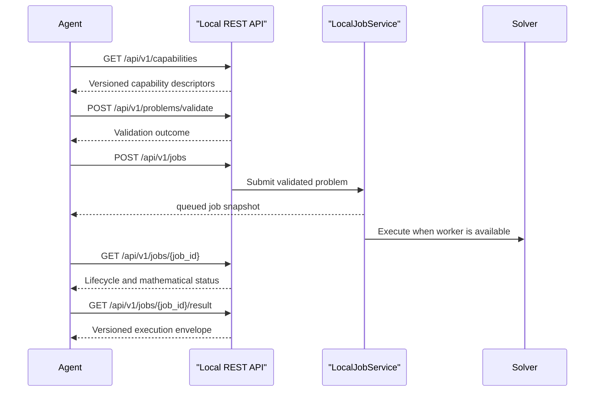

# Local REST API

The local API exposes Optees capability discovery, validation, queued jobs,
results, and cancellation to software agents. It is an optional adapter over
the same application services used by the headless CLI.

## Installation

Install the dedicated dependency extra from a source checkout:

```bash
python -m pip install -e ".[local-service]"
```

The desktop application and `optees-cli` do not import FastAPI when the local
service is unused.

## Security Boundary

- The provided runner accepts only `127.0.0.1` as its bind address.
- Every endpoint except `/health` requires a bearer token containing at least
  32 characters.
- Default public Swagger and ReDoc routes are disabled. OpenAPI is served at
  authenticated `/api/v1/openapi.json`.
- No permissive CORS middleware is installed.
- Mutation requests must use `Content-Type: application/json` and are limited
  to 1 MiB by default.
- Requests accept versioned mathematical JSON objects, never source code or
  unrestricted filesystem paths.
- Jobs and tokens are in-memory session data and are not persisted.

Token generation and process supervision become automatic in Phase 7. For
development, start the adapter explicitly:

```bash
export OPTEES_TOKEN="$(python -c 'import secrets; print(secrets.token_urlsafe(32))')"
python -c 'import os; from optees.interfaces.http import run_local_api; run_local_api(token=os.environ["OPTEES_TOKEN"])'
```

The default URL is `http://127.0.0.1:8765`.

## Workflow



## Example

```bash
curl \
  -H "Authorization: Bearer $OPTEES_TOKEN" \
  http://127.0.0.1:8765/api/v1/capabilities
```

Submit a problem with the capability identifier outside the versioned problem
payload:

```json
{
  "capability_id": "lp.continuous",
  "problem": {
    "version": "1",
    "variables": [{"name": "x", "label": "", "lb": 0, "ub": 1}],
    "objective": {"sense": "max", "coefficients": [1], "offset": 0},
    "constraints": []
  }
}
```

`POST /api/v1/jobs` returns `202` and a job snapshot. Poll the returned job ID,
then retrieve `/api/v1/jobs/{job_id}/result`. Mathematical infeasibility is a
completed job result, not an HTTP execution failure.
