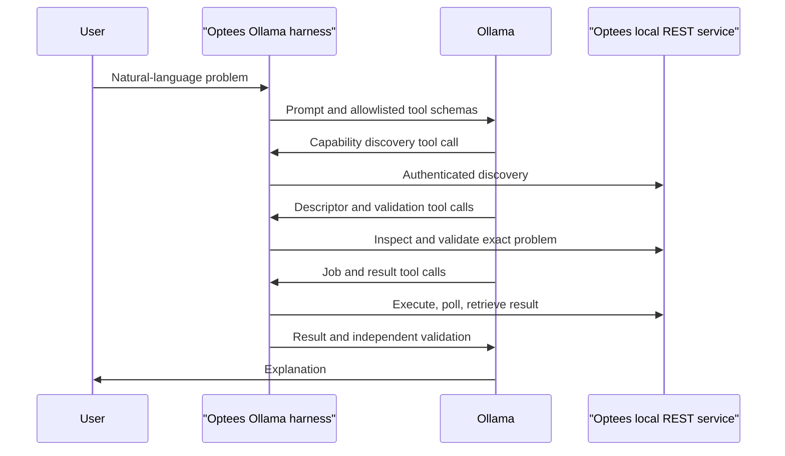

# Ollama D0 Local Agent Harness

The D0 harness is an experimental terminal client that proves a complete local
agent loop before the production MCP integration is complete. It connects a
tool-capable Ollama model to the authenticated Optees REST service:



The standard Ollama chat application is not an Optees client. Selecting a model
with the `tools` capability there does not register the Optees functions. Use
this harness for the D0 experiment.

## Prerequisites

1. Start the Optees local solver service from Settings.
2. Keep it bound to `127.0.0.1`; do not expose it on the network.
3. Run `ollama list` and select an installed model with tool support. The first
   successful native-tool experiment uses `qwen3.5:9b`, digest
   `6488c96fa5faab64bb65cbd30d4289e20e6130ef535a93ef9a49f42eda893ea7`.
4. In Optees, click **Copy authorization** or **Copy connection
   configuration**. The harness accepts either the authorization value, the
   complete JSON object, or only its bearer token through hidden terminal
   input.

From a source checkout:

```bash
cd /absolute/path/to/optees
PYTHONPATH=src python -m optees.ollama_chat --model qwen3.5:9b
```

From a package installed into a Python environment with `pip`:

```bash
optees-ollama-chat --model qwen3.5:9b
```

The `optees-ollama-chat` console entry point is not currently exposed by the
native PyInstaller releases. Users of the macOS, Windows, and Linux desktop
artifacts should not be asked to locate source modules inside the application
bundle. The planned Local Agent desktop module will provide this workflow from
the installed GUI; until then, interactive Ollama testing requires either a
source checkout or a normal Python package installation.

The token is retained by the local tool facade and added only to Optees HTTP
headers. It is not sent to Ollama, included in tool arguments, or written to
transcripts. Restarting the Optees service rotates the session token.

## First Deterministic Prompt

```text
I need to decide which products to manufacture.

Product A generates a profit of 30 and requires 2 hours of machine time.
Product B generates a profit of 45 and requires 3 hours of machine time.
I have at most 18 hours of machine time available. Production quantities may
be fractional and must be non-negative.

Use the available Optees tools. Identify and inspect the appropriate solver,
state your mathematical interpretation, build the versioned problem, validate
the exact payload before solving it, and do not solve if validation fails.
Report the decision variables, objective, mathematical status, and independent
validation status separately. Do not calculate the final answer yourself when
an Optees solver is available, and do not invent unsupported fields.
```

The harness enforces descriptor inspection and successful validation of the
exact problem before job creation. Tool calls and total run time are bounded.
Structured Optees failures are returned to the model unchanged.

Reasoning mode is disabled by default so tool-routing tests finish promptly and
progress is printed before every Ollama turn and tool call. Use `--think` only
when intentionally comparing reasoning-enabled behavior; it can take
substantially longer on local hardware.

## First Compatibility Result

The frozen `qwen2.5-coder:7b` model advertises `tools` in Ollama, but the first
live probes returned a JSON-looking function request as ordinary assistant text
instead of populating Ollama's structured `message.tool_calls` field. The
harness deliberately did not execute that text. This is a model/provider
compatibility result, not evidence that the Optees REST service is unreachable.

Do not add an implicit parser that executes arbitrary assistant text. A future
compatibility mode, if introduced, must be opt-in, accept only one strict
allowlisted call schema, preserve all existing sequencing safeguards, and
record that the call did not originate from native tool-calling output.

## Successful Native Tool Result

`qwen3.5:9b`, digest
`6488c96fa5faab64bb65cbd30d4289e20e6130ef535a93ef9a49f42eda893ea7`,
subsequently completed the entire D0 LP workflow with native
`message.tool_calls`: it discovered and inspected `lp.continuous`, formulated
and validated the versioned payload, created and polled the job, retrieved the
result, and reported mathematical and independent-validation statuses. The
test returned `product_a = 4`, `product_b = 2.5`, and objective `220` for the
bounded production-mix prompt. After the result schema exposed the complete
optimal-face contract, the model also reported a computed zero-dimensional
optimal face with no alternate optimum and correctly concluded that the
solution is unique.

The first successful interactive run did not enable transcript recording, so
its short displayed digest prefix is not a sufficient frozen benchmark record.
Repeat it with `--transcript` before treating the run as reproducible benchmark
evidence. The agent must also report `result.optimal_face`: uniqueness may be
claimed only when its analysis is computed, no alternate optimum is reported,
and its dimension is zero.

## Lightweight Office Model Result

`granite3.3:2b`, digest
`07bd1f170855240f9e162bf54ea494a8bc1c73d8cbd1365d7fccbeb7d2504947`,
was tested with the same production-mix prompt. It produced prose and
JSON-looking tool requests in `message.content`, but no native
`message.tool_calls`. It also selected MIP despite the explicitly fractional
decision quantities and invented a payload outside the published contract.

The harness therefore executed no Optees tool and returned the text as an
untrusted model response. This is a successful safety outcome but a failed
agent-compatibility result. The transcript is stored at
`benchmarks/agents/runs/granite3.3-2b-lp-optimal-face.jsonl`.

## Optional Transcript

Use transcript recording only with synthetic or approved data:

```bash
PYTHONPATH=src python -m optees.ollama_chat \
  --model qwen3.5:9b \
  --transcript benchmarks/agents/runs/local-d0.jsonl
```

The transcript records the model name and digest, prompt, redacted tool events,
contract-bearing results, and final response. Prompts and mathematical problem
data are intentionally preserved for reproducibility and may therefore contain
sensitive business information. Transcript recording is disabled by default.

## Scope

D0 validates local tool orchestration and the existing REST/application
contracts. It does not prove that a model interprets every business problem
correctly, that a hosted agent can reach localhost, or that the later MCP
adapter is compatible with every desktop client.
