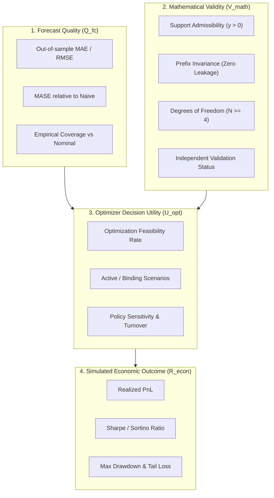
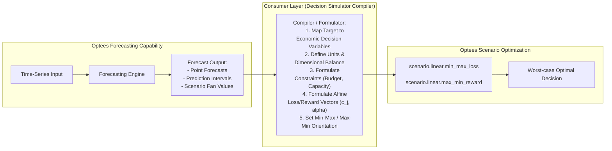

# Decision Simulator Forecasting Evidence Protocol

## Document Status

- **Work Unit:** `OPT-DS-04` (Prerequisite Evidence Protocol)
- **Gate:** `FC-C` — **NOT satisfied** (candidate design reopened; implementation blocked)
- **Status:** authoritative evidence protocol governing downstream Decision Simulator proposals
- **Owner:** Optees Architecture / Case-Study Track
- **Downstream Consumer:** Decision Simulator (`DS-06`)
- **Related Documents:**
  - [Targeted Forecasting Expansion Plan](05-targeted-forecasting-expansion.md)
  - [Candidate Decisions and Review](../../contracts/targeted-forecasting-contract.md)
  - [Decision Probes](../../../tests/utility/test_targeted_forecasting_contract_decision_probes.py)
  - [Case Study Roadmap](ROADMAP.md)

---

## 1. Existing Capability Matrix (`ml.forecasting.univariate`)

Before proposing any expansion, the Decision Simulator must evaluate against Optees' currently shipped and verified univariate forecasting capability.

### 1.1 Specification and Interfaces

| Dimension | Existing Implementation in Optees | Source Reference |
| :--- | :--- | :--- |
| **Capability ID** | `ml.forecasting.univariate` | `src/optees/application/contracts/capability_ids.py` |
| **Schemas** | Problem schema version `1`, type `univariate_forecasting`; Result schema version `1` | `src/optees/application/codecs/forecasting_problem_codec.py`, `src/optees/application/codecs/forecasting_result_codec.py` |
| **Methods** | `naive`, `seasonal_naive`, `holt_winters_additive` | `src/optees/domain/value_objects/forecasting/forecasting_method.py` |
| **Frequencies** | `hourly`, `daily`, `weekly`, `monthly`, `quarterly`, `yearly` (with drift-free calendar advance) | `src/optees/domain/value_objects/forecasting/forecasting_frequency.py` |
| **Missing Policy** | `reject` (strictly enforces continuous chronological spacing) | `src/optees/domain/models/forecasting/forecasting_model.py` |
| **Evaluation** | `none`, `holdout` (`holdout_size`), `rolling_origin` (`origin_count`, `step`, `evaluation_horizon`, `minimum_training_size`) | `src/optees/domain/models/forecasting/forecasting_model.py` |
| **Metrics** | MAE, RMSE, MAPE, MASE (scaled by in-sample naive/seasonal-naive MAE) | `src/optees/domain/entities/forecasting/solution.py` |
| **Outputs** | Point forecasts partitioned into `fitted`, `holdout`, and `future` segments; residual tracking; parameter values; diagnostic codes | `src/optees/domain/entities/forecasting/solution.py` |
| **Intervals** | `PredictionInterval(lower, upper, coverage)` exists in DTOs but is currently marked unavailable (`None`) for baseline methods | `src/optees/application/codecs/forecasting_result_codec.py` |

### 1.2 Independent Validation Scope

The registered validator `ForecastingIndependentSolutionValidator` (`src/optees/application/validation/forecasting_solution_validator.py`) enforces:
1. **`forecast.temporal_structure`**: Verifies that historical timestamps, fitted segments, evaluation origins, fold windows, and future prediction horizons match the model's chronological grid without omission or overlap.
2. **`forecast.arithmetic`**: Cross-checks historical points against input observations, confirms that $e_t = y_t - \hat{y}_t$, and independently recalculates MAE, RMSE, MAPE, and MASE from the published fold residuals.
3. **`forecast.method_invariants`**:
   - For `naive`: verifies that $\hat{y}_{T+h} = y_T$ and that evaluation fold predictions match the historical value at the fold origin.
   - For `seasonal_naive`: verifies that $\hat{y}_{T+h} = y_{T+h-s}$ and that parameters are empty.
   - For `holt_winters_additive`: validates smoothing parameter bounds ($0 \le \alpha, \beta, \gamma \le 1$).

> [!NOTE]
> **Deliberate Partial Validation:** For `holt_winters_additive`, the validator deliberately does **not** re-fit the non-linear optimization routine. It flags the validation outcome as `partial: True` with the explicit limitation:
> *"Independent validation does not refit the Holt-Winters estimator."*

### 1.3 Why the Simulator Cannot Rely Solely on the Existing Capability

The Decision Simulator requires time-series forecasting to guide capital allocation, risk management, and scenario-based decision making. The existing `ml.forecasting.univariate` capability is insufficient for these specific needs because:
1. **Absence of Trend with Drift:** The `naive` method assumes a zero-slope random walk ($\hat{y}_{T+h} = y_T$), while `holt_winters_additive` requires periodic seasonality and is prone to divergence or uncalibrated extrapolation over long horizons when fitted to financial asset prices.
2. **Domain Support Violations:** Asset prices and physical quantities must remain strictly positive. Existing level-space linear models can project negative values under additive shocks.
3. **Absence of Return Transforms:** Financial econometrics models geometric returns ($r_t = \ln(y_t / y_{t-1})$) or percentage changes rather than non-stationary price levels directly. Optees currently lacks domain-neutral transform and forward-inversion pipelines.
4. **No Uncertainty or Volatility Quantities:** Existing solvers provide point forecasts only. Downstream risk-averse optimizers (e.g., QP mean-variance or robust scenario optimization) require variance/volatility scales or uncertainty sets, which are currently unavailable.
5. **No Discretized Scenario Fans:** Existing codecs produce deterministic point vectors, which cannot directly parameterize multi-scenario models in `scenario.linear.*`.

### 1.4 What is Redundant to Re-request from Optees

Proposals from the Simulator must **not** duplicate features already provided:
- Do **not** request custom backtesting or walk-forward split loops: Optees already implements strictly chronological `holdout` and `rolling_origin` evaluation without future data leakage.
- Do **not** request custom metric re-computations: MAE, RMSE, MAPE, and MASE are already computed and independently validated.
- Do **not** re-implement baseline benchmarks: Naive and seasonal naive baselines are already verified.
- Do **not** request trading-specific calendar or intraday irregular time structures: Domain-neutral regular intervals (`hourly`, `daily`, `weekly`, `monthly`) are supported; asset-specific market holidays and tick-level bars remain consumer-side responsibilities.

---

## 2. Decision Simulator Evidence Protocol

To justify expanding Optees' forecasting capabilities and to reopen Gate `FC-C`, the Decision Simulator must submit a reproducible **Evidence Package**.

### 2.1 Provenance and Reproducibility Metadata

Every evidence claim must explicitly specify:
- `optees_commit`: The exact Git commit hash of Optees used during execution.
- `simulator_commit`: The exact Git commit hash of the Decision Simulator repository.
- `dataset_id`: An immutable, versioned identifier for the raw dataset (e.g., `ds-commodity-wti-2018-2024-d1`).
- `dataset_sha256`: The hex-encoded SHA-256 hash of the uncompressed data snapshot file.
- `episode_ids`: The list of simulated test episodes evaluated (e.g., `[EP-2022-Q1, EP-2022-Q2, EP-2023-Q4]`).
- `decision_horizons`: The decision horizon $H_{\text{dec}}$ and observation-to-decision cadence.
- `calendar_frequency`: Declared time-series frequency (e.g., `daily`) and alignment rules.
- `policy_version`: Identifier and hash of the simulated decision policy.

### 2.2 Origin-by-Origin Chronological Evaluation

The Simulator must demonstrate that decisions were made under strict chronological separation:
1. **Cutoff Timestamp ($T_{\text{cutoff}}$):** At decision point $t$, the information set available to the model is strictly limited to:
   $$\mathcal{I}_t = \{ (s_\tau, y_\tau) \mid \tau \le T_{\text{cutoff}} \}$$
2. **Zero Forward Leakage:**
   - Any preprocessing, scaling, missing-value imputation, transform parameter calculation (e.g., drift $\hat{c}$, mean return $\bar{r}$), and volatility seeding must use **only** observations in $\mathcal{I}_t$.
   - The Simulator must prove that changing or permuting observations after $T_{\text{cutoff}}$ produces identical point predictions and scenario sets at $t$.
3. **Walk-Forward Accounting:** Rolling origins must advance sequentially without expanding windows retrospectively.

### 2.3 Four-Way Separation of Concerns

The evidence package must report results broken down into four independent, non-fungible categories:

1. **Forecast Quality ($Q_{\text{fc}}$):**
   - Out-of-sample error: $\text{MAE}$, $\text{RMSE}$, and $\text{MASE} = \frac{\text{MAE}_{\text{model}}}{\text{MAE}_{\text{naive}}}$.
   - Directional hit rate: Percentage of periods where $\text{sign}(\hat{y}_{t+h} - y_t) = \text{sign}(y_{t+h} - y_t)$.
   - Interval calibration: Empirical coverage rate $\hat{C} = \frac{1}{K} \sum_{k=1}^K \mathbf{1}(y_{t+h} \in [l_{t+h}, u_{t+h}])$ measured against nominal target $1 - \alpha$.
2. **Mathematical Validity ($V_{\text{math}}$):**
   - Domain bounds: Zero violations of physical/economic support (e.g., strictly positive prices $y_t > 0$ under log transforms).
   - Zero future leakage: Confirmed prefix invariance across rolling origins.
   - Theoretical degrees of freedom: Adherence to sample size lower bounds ($N \ge 3$ for level drift; $N \ge 4$ original levels for return drift variance).
   - Independent validator execution: Solution validation report generated without unhandled error codes.
3. **Optimizer Decision Utility ($U_{\text{opt}}$):**
   - Solvability: Rate of feasible solutions achieved when compiled into Optees optimization capabilities (`qp.continuous`, `scenario.linear.*`).
   - Binding scenarios: Proof that generated scenarios are not redundant; evidence that distinct scenarios become binding under changing market regimes.
   - Rational sensitivity: Policy adjustments must be monotonically aligned with changes in forecast parameters.
4. **Simulated Economic Outcome ($R_{\text{econ}}$):**
   - Realized financial returns: Cumulative PnL, annualized Sharpe ratio, maximum peak-to-trough drawdown, transaction costs, and portfolio turnover.

### 2.4 Fundamental Invariant: The PnL Independence Rule

> [!CAUTION]
> **Fundamental Invariant Rule:**
> **A superior simulated economic outcome (higher PnL or Sharpe ratio) ALONE DOES NOT PROVE that a forecasting model is superior, calibrated, or mathematically sound.**
>
> A model with lookahead leakage, uncalibrated variance, or arbitrary directional bias can inadvertently produce superior backtest returns due to regime luck or implicit data snooping. Conversely, a mathematically rigorous, well-calibrated forecast may yield negative PnL if downstream execution is unhedged or transaction costs dominate.
>
> **Gate Re-opening Criterion:** No forecasting candidate will be approved based on economic returns ($R_{\text{econ}}$) unless it simultaneously satisfies rigorous Forecast Quality ($Q_{\text{fc}}$) and flawless Mathematical Validity ($V_{\text{math}}$).

---

## 3. Decision Matrix of Candidate Increments

The following 8 candidates are evaluated. Each requires an explicit threshold of evidence before Optees will consider freezing a capability contract.

### 3.1 Candidate Overview Matrix

| # | Candidate Increment | Primary Observable Limitation in Simulator | Minimum Required Evidence | Mathematical & Leakage Risk | Complexity | Recommendation |
| :- | :--- | :--- | :--- | :--- | :--- | :--- |
| **1** | **Level Random Walk with Drift** | Naive baseline fails to capture persistent linear drift; flat forecast $\hat{y}_{T+h} = y_T$. | $\ge 30$ rolling origins showing out-of-sample $\text{MASE} < 0.90$ with statistical significance ($p < 0.05$). | Multi-step variance must be $s^2 [h + h^2/(N-1)]$; requires $N \ge 3$. End-point sensitive. | Low | **High-priority candidate** |
| **2** | **Log-Return Random Walk with Drift** | Asset prices must remain positive ($y > 0$); level model generates negative prices or additive error. | Multiplicative asset episodes showing level drift fails support tests while log-returns are stationary. | Multi-step cumulative variance is $s^2 [\sum j^2 + \dots]$ ($5s^2$ at $h=2$). Geometric median $\ne$ arithmetic mean. $N \ge 4$. | Medium | **High-priority candidate** |
| **3** | **Relative Change / % Change** | Desire to model growth percentages without logarithmic transformation. | Demonstration that log-returns fail domain requirements, with exact distribution of $\prod (1 + g_t)$. | Product of random variables has heavy tails and no simple additive variance. High risk of division by zero. | High | **Reject / No-Go** (Log-returns dominate) |
| **4** | **Rolling Volatility** | Constant sample variance ignores local volatility clustering and regime shifts. | Rejection of homoskedasticity (Engle ARCH test $p < 0.01$); out-of-sample coverage failure of static variance. | Rectangular window $W$ must be causal $[t-W+1, t]$. "Ghosting" effect when shocks leave window. | Low-Med | **Medium-priority candidate** |
| **5** | **Causal EWMA Volatility** | Rolling window suffers from abrupt exit of shocks and equal weighting of distant points. | Proof that exponential decay $\lambda \in (0, 1)$ tracks conditional variance with lower forecast error on $r^2$. | Full-sample variance initialization leaks future data! Must use causal $v_1 = r_1^2$. Zero-mean second moment. | Medium | **High-priority candidate** |
| **6** | **Prediction Intervals (Quantiles)** | Point forecasts do not allow risk-buffered decisions or margin constraint formulation. | Empirical coverage backtest across $\ge 50$ origins showing $|\hat{C} - (1-\alpha)| \le 0.05$. | Gaussian multiplier $z_{1-\alpha/2}$ ignores small-sample parameter estimation error (Student-$t$ needed). Quantile crossing. | Medium | **High-priority candidate** |
| **7** | **Finite Scenario Fan Discretization** | Robust/stochastic optimizers (`scenario.linear.*`) require discrete realization sets. | Comparative policy test proving robust multi-scenario policy mitigates tail drawdown vs point forecast. | Marginal quantiles $\ne$ joint multi-step paths. Rounded percent IDs collide. Scenarios do not carry probabilities for min-max. | Med-High | **Conditional candidate** (requires consumer compiler) |
| **8** | **Bounded AR / ARIMA** | Significant serial correlation in return series; random walk residuals fail white-noise test. | Ljung-Box test rejecting white noise on random walk residuals; out-of-sample MAE improvement with fixed low order. | Automatic order search (Auto-ARIMA) easily overfits or encounters convergence failure across rolling origins. | High | **Deferred** (maintain strict low order if ever pursued) |

---

### 3.2 Candidate Deep-Dives

#### Candidate 1: Random Walk with Drift in Levels (`random_walk_with_drift_level`)
- **Observable Limitation:** Naive baseline produces $\hat{y}_{T+h} = y_T$, accumulating systematic under-prediction on series with steady deterministic drift.
- **Minimum Evidence:** Simulator episode demonstrating persistent drift where naive $\text{MASE} > 1.0$ and random walk with drift achieves statistically significant MAE reduction out-of-sample across $\ge 30$ rolling origins.
- **Potential Benefits:**
  - *Optees:* Exact closed-form stochastic trend baseline; zero numerical solver convergence issues.
  - *Simulator:* Trending point forecasts and analytical multi-step standard errors.
- **Mathematical Risks:**
  - Estimating drift $\hat{c} = (y_N - y_1)/(N-1)$ consumes 1 degree of freedom; residual variance requires $N - 2$ d.o.f., dictating $N \ge 3$.
  - Drift estimate depends only on series endpoints, making it highly sensitive to endpoint anomalies.
  - Multi-step forecast error variance is $s^2 [h + h^2/(N-1)]$, **not** $s^2 h$.
- **Stop / No-Go Criteria:** Rejection if series is mean-reverting (drift overshoots), if $N < 3$, or if series requires non-negative support and drift produces negative projections.

#### Candidate 2: Log-Return Forecasting with Exact Inversion (`log_return_random_walk_with_drift`)
- **Observable Limitation:** Level random walk projects negative values on asset prices and assumes constant variance across price scales.
- **Minimum Evidence:** Episodes with financial prices showing non-stationary levels ($I(1)$) but stationary log-returns ($I(0)$), with proof of strictly positive observations ($y_t > 0$).
- **Potential Benefits:**
  - *Optees:* Mathematically rigorous foundation for financial time series without violating domain neutrality.
  - *Simulator:* Natural geometric compounding; guaranteed positivity of reconstructed level forecasts.
- **Mathematical Risks:**
  - Requires $y_t > 0$ strictly for all observations.
  - Sample size: $N$ original levels yield $N-1$ returns; estimating drift and variance on returns requires $(N-1) - 2 \ge 1 \implies N \ge 4$ original levels.
  - Multi-step cumulative variance: For $h$ steps, errors compound as $\sum_{j=1}^h (h - j + 1) \varepsilon_j$. For $h=2$, innovation shock weight is $5s^2$ (from $2^2 + 1^2$), **never** $2s^2$.
  - Arithmetic Mean vs Geometric Median: $\exp(\sum \hat{r})$ yields the conditional geometric median. The arithmetic expectation under log-normality is $\hat{y}_{T+h} = y_T \exp(\sum \hat{r} + \frac{1}{2} \sigma_{\text{cum}, h}^2)$. The choice must be explicit.
- **Stop / No-Go Criteria:** Any non-positive observation ($y_t \le 0$); physical count or additive volume series where geometric compounding is nonsensical.

#### Candidate 3: Relative Change / Percentage Change (`relative_change_forecasting`)
- **Observable Limitation:** Preference for working with percentage growth rates $g_t = (y_t - y_{t-1})/y_{t-1}$.
- **Minimum Evidence:** Demonstration that log-returns fail consumer requirements, accompanied by an exact analytical derivation of multi-step product distributions.
- **Mathematical Risks:**
  - Reconstructing future levels requires products of random variables: $y_{T+h} = y_T \prod_{i=1}^h (1 + g_{T+i})$. Products of normal variables are not normal and have heavy, asymmetric tails.
  - Division by zero if $y_{t-1} = 0$.
- **Stop / No-Go Criteria:** **REJECT.** Log-returns $r_t = \ln(1 + g_t)$ provide an analytically tractable, additive structure with exact forward inversion. Relative differences add mathematical pathology without operational benefit.

#### Candidate 4: Rolling Volatility (`rolling_volatility`)
- **Observable Limitation:** Constant unconditional variance under-estimates risk during stress regimes and over-estimates risk during calm regimes.
- **Minimum Evidence:** Engle ARCH test rejecting homoskedasticity ($p < 0.01$) on residuals; empirical failure of static intervals.
- **Potential Benefits:** Transparent, non-parametric local variance estimate.
- **Mathematical Risks:**
  - Window $W$ must be strictly causal: sample variance over $[t-W+1, t]$ with degrees of freedom $W-1$.
  - "Ghosting" effect: an isolated shock produces elevated volatility for exactly $W$ periods, then abruptly drops.
- **Stop / No-Go Criteria:** Sample size $N < 2W$; homoskedastic series where rolling window introduces unnecessary sampling noise.

#### Candidate 5: Causal EWMA Volatility (`causal_ewma_volatility`)
- **Observable Limitation:** Rolling window reacts with a delay and treats old observations with equal weight until they abruptly exit.
- **Minimum Evidence:** Demonstration that an exponentially weighted moving average with decay $\lambda \in (0, 1)$ achieves lower mean squared error on realized squared returns.
- **Potential Benefits:** Smooth adaptation to recent shocks; RiskMetrics industry standard.
- **Mathematical Risks:**
  - **Lookahead Leakage:** Initializing the variance with the full-sample variance $\sigma_{\text{sample}}^2$ leaks future observations into historical estimates!
  - **Strictly Causal Formulation:** Must initialize causally at $v_1 = r_1^2$ with recurrence $v_t = \lambda v_{t-1} + (1 - \lambda) r_t^2$.
  - Uncentered estimator: Assumes zero mean return. If $\bar{r} \ne 0$, $r_t^2$ overstates variance.
- **Stop / No-Go Criteria:** Rejection if $\lambda$ is tuned globally across test periods (data leakage); rejection if returns exhibit large non-zero drift without explicit de-meaning.

#### Candidate 6: Prediction Intervals (`prediction_intervals`)
- **Observable Limitation:** Point forecasts give no measure of dispersion, forcing downstream decision makers to guess arbitrary risk buffers.
- **Minimum Evidence:** Empirical backtest showing that $(1-\alpha)$ intervals achieve coverage within $[(1-\alpha) - 0.05, (1-\alpha) + 0.05]$ out-of-sample across rolling origins.
- **Potential Benefits:** Populates the existing `PredictionInterval` slot in `ForecastingSolution`.
- **Mathematical Risks:**
  - Gaussian assumptions ($z_{1-\alpha/2}$) under-estimate tail risk when innovations are fat-tailed (leptokurtic).
  - Multi-step intervals must use cumulative error variance, not marginal one-step variance.
- **Stop / No-Go Criteria:** Rejection if empirical coverage deviates by $> 10\%$ from nominal rate without diagnostic warnings.

#### Candidate 7: Finite Scenario Fan Discretization (`finite_scenario_generation`)
- **Observable Limitation:** Min-max optimizers require discrete scenario sets rather than continuous density distributions.
- **Minimum Evidence:** Comparative simulation showing a robust policy parameterized by scenario fans outperforms a naive point-forecast policy under stress.
- **Potential Benefits:** Provides explicit inputs for downstream scenario modeling.
- **Mathematical Risks:**
  - **Path Conflation:** Marginal quantiles $\{q_{0.1}, q_{0.5}, q_{0.9}\}$ computed independently at $t+1$ and $t+2$ **do not** define joint sample paths. Connecting $q_{0.10}$ across horizons represents extreme persistence, not an empirical trajectory.
  - **Identifier Collisions:** Rounded percentage strings (e.g., `scen_q10`) collide for nearby quantiles (e.g., $q = 0.101$ vs $q = 0.104$). Identifiers must be collision-free.
  - **Probability Confusion:** Robust min-max does not use scenario probabilities. Assigning weights must not lead users to expect expected-value behavior from `scenario.linear.*`.
- **Stop / No-Go Criteria:** Rejection if the consumer assumes scenario fans can be passed directly into `scenario.linear.*` without a compiler defining decision variables and constraints.

#### Candidate 8: Bounded AR / ARIMA (`bounded_ar_arima`)
- **Observable Limitation:** Autocorrelated residuals indicating unmodeled cyclical dynamics.
- **Minimum Evidence:** Statistically significant out-of-sample forecast accuracy gain ($p < 0.01$) over random walk with drift using fixed low-order $\text{AR}(1)$ or $\text{AR}(2)$.
- **Potential Benefits:** Models mean-reverting dynamics.
- **Mathematical Risks:**
  - High risk of overfitting with automated order selection (Auto-ARIMA).
  - Numerical convergence failures during rolling-origin estimation.
- **Stop / No-Go Criteria:** **DEFERRED.** High implementation and maintenance complexity. Re-evaluate only after Candidates 1, 2, 5, and 6 are stabilized and proven insufficient.

---

## 4. Boundary Between Forecasting and Scenario Optimization

A persistent misconception in premature planning was treating a forecast output as directly convertible into a robust optimization problem.

### 4.1 Strict Separation of Authority

1. **Forecasting Engine Scope:**
   - Evaluates historical time-series observations $(t, y_t)$.
   - Produces statistical estimates: point predictions $\hat{y}_{t+h}$, variance $\hat{\sigma}_h^2$, and discrete realization values $y_{k, h}$.
   - Optees forecasting is domain-neutral and unaware of decisions, portfolios, orders, costs, or utility functions.
2. **Robust Optimization Scope (`scenario.linear.*`):**
   - Solves the mathematical program:
     $$\min_{x \in \mathcal{X}} \max_{k \in \mathcal{K}} \left( \sum_{j=1}^n c_j^{(k)} x_j + \alpha_k \right) \quad \text{or} \quad \max_{x \in \mathcal{X}} \min_{k \in \mathcal{K}} \left( \sum_{j=1}^n c_j^{(k)} x_j + \alpha_k \right)$$
   - Requires decision variables $x_j$, linear constraints $A x \le b$, bounds $l_j \le x_j \le u_j$, affine coefficients $c_j^{(k)}$, and constants $\alpha_k$.
   - **Does not consume probabilities:** The robust min-max solver finds the optimal action under the absolute worst-case scenario. Assigning probability weights $p_k$ to scenarios has zero effect on the min-max solution.

### 4.2 Consumer Compiler Obligations

Before any forecast output can be passed to `scenario.linear.*`, the Decision Simulator must execute an explicit compilation step:
- **Decision Variables ($x_j$):** Define the action space (e.g., quantities to purchase, production levels, inventory allocations).
- **Dimensional Homogeneity:** Convert dimensionless forecast ratios or price-level estimates into monetary objective values ($c_j^{(k)} \in \mathbb{R}$).
- **Admissibility & Constraints:** Specify budget limits, capacity bounds, and physical conservation laws ($Ax \le b$).
- **Objective Coefficients ($c_j^{(k)}, \alpha_k$):**
  - For `scenario.linear.min_max_loss`: define loss coefficients such that higher values represent worse outcomes.
  - For `scenario.linear.max_min_reward`: define reward coefficients such that higher values represent better outcomes.
- **Temporal Cadence:** Reconcile multi-step forecast horizons ($h = 1 \dots H$) with the decision execution horizon (e.g., single-period immediate action vs multi-period commitment).

---

## 5. Mathematical Invariants Confirmed by Independent Review

The following 7 mathematical corrections from commit `2df4f11` are permanently frozen as required invariants for all future forecasting work units:

### 5.1 Level Space vs Return Space Distinction
A random walk in levels:
$$y_t = y_{t-1} + c + \varepsilon_t, \quad \varepsilon_t \sim \text{iid}(0, \sigma^2)$$
is fundamentally different from a random walk fitted to returns:
$$r_t = r_{t-1} + c + \varepsilon_t$$
The latter models momentum in returns (non-stationary returns), whereas standard financial modeling assumes returns are stationary around a mean drift: $r_t = c + \varepsilon_t$. The target stochastic process must be explicitly stated.

### 5.2 Degrees of Freedom and Minimum Sample Size
- When estimating drift in level space: $\hat{c} = (y_N - y_1)/(N-1)$. Residual variance estimation has $N-2$ degrees of freedom, requiring $N \ge 3$.
- When modeling returns: $N$ original level observations yield $N-1$ returns. Estimating drift and variance on returns requires $(N-1) - 2 \ge 1$, which strictly necessitates:
  $$N \ge 4 \text{ original level observations}$$
  at every rolling-origin evaluation fold.

### 5.3 Multi-Step Cumulative Error Variance
- In level space with estimated drift, the $h$-step forecast error variance is:
  $$\text{Var}(e_{T+h}) = s^2 \left[ h + \frac{h^2}{N - 1} \right]$$
- When forecasting log-returns and reconstructing cumulative levels:
  $$\ln(y_{T+h}) = \ln(y_T) + \sum_{i=1}^h r_{T+i}$$
  The forecast errors in return space accumulate. For independent innovation shocks with estimated drift, the cumulative variance is:
  $$\text{Var}\left(\sum_{i=1}^h e_{T+i}\right) = s^2 \left[ \sum_{j=1}^h j^2 + \frac{\left(\frac{h(h+1)}{2}\right)^2}{N - 1} \right]$$
  For $h=2$, the innovation variance term is $1^2 + 2^2 = 5s^2$, **never** $2s^2$.

### 5.4 Geometric Median vs Arithmetic Mean (Jensen's Inequality)
By Jensen's Inequality, for any non-degenerate random variable $X$:
$$\mathbb{E}[\exp(X)] > \exp(\mathbb{E}[X])$$
If log-returns are normally distributed $R \sim \mathcal{N}(\mu, \sigma^2)$, then:
$$\text{Median}(Y) = \exp(\mu), \quad \text{while} \quad \mathbb{E}[Y] = \exp\left(\mu + \frac{1}{2}\sigma^2\right)$$
Direct exponentiation of cumulative log-return forecasts $\hat{y}_{T+h} = y_T \exp(\sum \hat{r})$ yields the **conditional geometric median**, not the arithmetic expected value. Any model claiming to produce mean predictions must include the convexity adjustment $\frac{1}{2}\sigma_{\text{cum}}^2$.

### 5.5 Strictly Causal EWMA Volatility
To guarantee zero future data leakage, exponentially weighted moving average variance must not be seeded with whole-sample variance. It must be causally initialized:
$$v_1 = r_1^2, \quad v_t = \lambda v_{t-1} + (1 - \lambda) r_t^2 \quad \text{for } t \ge 2, \; 0 < \lambda < 1$$
This is a zero-mean second-moment estimator.

### 5.6 Collision-Free Scenario Identifiers
Scenario identifiers must never be generated by rounding floating-point percentages to two digits (e.g., `scen_q10`), which causes collisions between distinct quantiles (e.g., $q = 0.101$ and $q = 0.104$). Identifiers must use exact strings or collision-free indices:
$$\text{ID}(q) = \text{f"scen\_q\{q:.4f\}"} \quad \text{or} \quad \text{f"scen\_\{rank\}"}$$

### 5.7 Telescoping Identity is Pure Arithmetic
The identity:
$$\sum_{t=2}^T \ln\left(\frac{y_t}{y_{t-1}}\right) = \ln(y_T) - \ln(y_1)$$
is an exact algebraic telescoping sum. It proves the arithmetic correctness of log transforms, but **does not constitute evidence of forecasting accuracy, statistical calibration, or predictive power**.

---

## 6. Execution Roadmap Status and Authorization Boundary

- **Gate `FC-C`:** Remains **NOT satisfied**. No public DTO schema or capability ID is frozen.
- **Gate `OPT-DS-04B`:** Remains **BLOCKED**. No production domain code, solver engine, codec, or validator implementation is authorized.
- **Next Authorized Step:** Await the submission of a compliant Evidence Package from the Decision Simulator fulfilling the requirements of Section 2.
