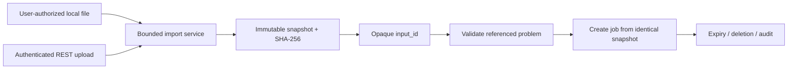

# Large Local Inputs Roadmap

## Document Status

- **State:** planned
- **Workstream:** `INPUT-REF`
- **Evidence source:** agent-driven Classification runs whose datasets exceed
  practical MCP argument size and the REST mutation limit
- **Current limitation:** MCP tools require inline problem objects; REST
  mutation requests default to 1 MiB; only the CLI reads a problem file
  directly
- **Security authority:** `docs/contracts/threat-model.md`
- **Related roadmap:** `local-agent-platform.md`
- **Implementation authorization:** none; storage and threat contracts must be
  accepted first

## Goal

Allow local software and agents to solve large, versioned problems without
embedding every row in a tool call, while preventing arbitrary filesystem
access, time-of-check/time-of-use substitution, unbounded memory or disk use,
and accidental return of datasets into model context.

## Rejected Shortcut

Optees must not expose an unrestricted MCP tool accepting any local path. The
MCP process has the user's filesystem permissions, while a model-generated tool
call is not equivalent to deliberate authorization to read every accessible
file.

Merely increasing the REST body limit is also insufficient: it retains repeated
JSON parsing and memory costs, provides no immutable identity for replay, and
does not solve MCP context limits.

## Target Flow

The stored object is a complete versioned Optees problem payload in the first
release. Capability-specific CSV or columnar dataset ingestion is a later
adapter concern and must not be hidden inside the generic reference contract.

## Phase 0 — Threat And Contract Decision (`INPUT-C`)

- [ ] Define the trusted actors for desktop selection, CLI import, REST upload,
  and MCP import.
- [ ] Freeze maximum file size, stored bytes, item count, lifetime, filename
  handling, accepted encoding, JSON depth, and parse budget.
- [ ] Define an explicitly configured import root for agent-initiated local
  paths; reject absolute escape, traversal, symlinks, devices, sockets, and
  non-regular files.
- [ ] Define opaque `input_id`, SHA-256, byte count, creation/expiry times,
  capability binding, schema version, and lifecycle statuses.
- [ ] Decide whether an imported object is session-scoped or may be promoted
  into durable workflow evidence; default to session scope.
- [ ] Bind validation and job creation to the identical immutable snapshot.
- [ ] Define deletion, expiry, capacity pressure, cancellation, and process-
  shutdown behavior.
- [ ] Update the threat model before implementing transport endpoints.

**Gate `INPUT-C`:** the storage, authorization, lifecycle, and replay contract
has an independent security review.

## Phase 1 — Application-Owned Input Store (`INPUT-S`)

- [ ] Define application ports for bounded import storage and verified reads.
- [ ] Implement a private session directory with restrictive permissions,
  atomic writes, size accounting, retention limits, and deterministic eviction.
- [ ] Hash bytes while importing and verify size and digest on every read.
- [ ] Parse and validate only after the bounded snapshot exists; invalid input
  is removed without leaving partial state.
- [ ] Prevent replacement between validation and solve by retaining immutable
  bytes rather than reopening the source path.
- [ ] Keep filesystem paths out of public manifests and result envelopes.
- [ ] Add corruption, symlink, traversal, race, exhaustion, expiry, and cleanup
  tests.

**Gate `INPUT-S`:** application services can validate and solve one immutable
referenced problem without importing HTTP, MCP, Qt, or capability-specific UI.

## Phase 2 — REST Upload And Reference (`INPUT-REST`)

- [ ] Add an authenticated bounded upload/import endpoint with explicit media
  type and streaming byte enforcement.
- [ ] Return metadata and an opaque identifier, never a server filesystem path.
- [ ] Add validate and submit shapes that reference `input_id` without allowing
  ambiguous simultaneous inline and referenced problems.
- [ ] Preserve the existing inline JSON contract and 1 MiB default for ordinary
  requests.
- [ ] Expose a bounded server configuration for permitted upload size without
  permitting an unbounded value.
- [ ] Define status and HTTP mappings for expired, missing, corrupt, wrong-
  capability, oversized, and capacity-exhausted inputs.
- [ ] Test chunked uploads, false content length, disconnects, authentication,
  concurrent expiry, and job submission after validation.

**Gate `INPUT-REST`:** a large problem completes through REST by reference
without weakening existing request guards or duplicating solver logic.

## Phase 3 — MCP Metadata-First Import (`INPUT-MCP`)

- [ ] Add discovery for input-import limits and the configured import root.
- [ ] Accept only a relative path resolved inside that root, or an existing
  opaque `input_id`; never accept arbitrary absolute paths.
- [ ] Return import metadata only. Dataset bytes must not enter an incidental
  MCP tool response.
- [ ] Require capability inspection and referenced-problem validation before
  job creation, preserving the existing stateful MCP sequence.
- [ ] Bind the validation receipt to capability ID, normalized problem bytes,
  input hash, and contract versions.
- [ ] Add tests for model-supplied traversal, symlink escape, changed source
  files, stale IDs, cross-capability reuse, and response-size bounds.
- [ ] Verify native MCP companion behavior and clean shutdown on every platform.

**Gate `INPUT-MCP`:** an agent can import, validate, and solve a large local
problem without seeing its rows in tool output and without gaining general
filesystem-read authority.

## Phase 4 — Desktop, CLI, Replay, And Handoff (`INPUT-H`)

- [ ] Allow the desktop user to select a problem file explicitly and review
  metadata before import.
- [ ] Preserve the CLI's direct file workflow; optionally expose import/status/
  delete commands only if they add value for a long-lived server session.
- [ ] Record input digest and contract provenance in job and workflow evidence.
- [ ] Define how a durable registered workflow references a promoted immutable
  input without depending on an expired session ID.
- [ ] Document operational size guidance and recommend native CLI files when a
  retained server-side reference is unnecessary.
- [ ] Run bounded large-row acceptance fixtures without committing confidential
  or unnecessarily large datasets.

**Gate `INPUT-H`:** every surface offers an explicit, documented path for large
problems and replay never silently resolves an ID to changed bytes.

## Stop Conditions

Stop if the design exposes unrestricted paths, trusts caller-supplied hashes,
reopens mutable files after validation, returns raw datasets through MCP
metadata calls, allows unbounded configuration, persists confidential input by
default, or cannot cleanly distinguish missing, expired, corrupt, and invalid
objects.

## Completion Standard

This roadmap is complete when large local problems can be imported once and
referenced safely through REST and MCP, the same immutable bytes are validated
and solved, lifecycle and limits are observable, hostile path and storage cases
are covered, and CLI file input remains the simpler recommended route when
session storage is unnecessary.
